##  This section will give you information about AWS Educate Cloud computing
The software and hardware for cloud computing are developed and maintained by the cloud computing company, such as Amazon Web Services.
 `Cloud Computing` is the on-demand delivery of IT resourves over the internet with pay-as-you-go pricing
#### Components of Cloud computing

+    `Servers` 
    A server is a computer or program that manages user access to a central resource or service in a network. Cloud computing systems can launch virtual servers using tools like Amazon EC2.
+    `Data Storage`
   The multiple server sites have the ability to collect,store, and analyze any amount of data from anywhere. AWS has a global infrastructure similar to multiple server sites known as Availability Zones and Regions. 
+   `Virtual        Desktop and Software Platform`
    Software is hosted online by the cloud computing company. Virtual desktops allow users to access the software from any device.
+   `Mobile devices`
    End users can access the cloud computinf system apps and data from any mobile devices with internet access.
+   `End Users`
    End users are the clients and users of the cloud computing system. They purchase storage apace and speed from the cloud computing company.
+ `Desktop Computers`  
    End users can access the cloud computing system apps and data from any computer with an internet connection.
+   `Applications`
 Cloud computing companies offer multiple application options, such as file storage, games, website creation, and blogs.
+    `Download speed`
    Cloud computing systems have fas download speeds and automatic updates without users having to download software or purchase new hardware.
    

####    Benefits of Cloud Computing  
+   `Scale`
  Cloud computing systems are wide reaching. Systems such as Amazon Web Services give you the flexibilitu to reach a large audience for a lower cost.
+   ` Agility`
  You can try new features for your applications quickly and easily with cloud computing systems. Simply click button to add a feature, take a feature away, and share your changes with users around the world.
+ `Global access`
    Cloud computing systems allow you to share your apps around the world with the simple click of a button.
+   `Costs`
  Cloud Computing allows users to access and pay for technology resources like a utility, and cloud computing systems can be expanded easily at a lower cost. No more purchasing an extra computer, backup memory drive, or flash drive.    
    

#### Traditional and Cloud system  

#### Testing knowledgs

####    Computing methods
+   Instances
+   Containers
+   Serverless
+   Hybrid

####    AWS computing services
+   Amazon EC2
 

+   AWS Lambda

+   Amazon ECS

+   Amazon EKS

+   AWS Fargate

+   AWS Elastic Beanstalk

#### Introduction to Amazon EC2
 It provides resizable compute capacity in the cloud.

##### EC2 instance types
compute instances=virtual servers

Instance types are composed of 
+   CPU
+   memory
+   storage 
+   networking capacity

Amazon EC2 are
+   Scalable
+   Relaiable
+   High availablity
+   Cost effective

#### Amazon EC2 purchasing options
+   On-Demand Instances
+   Savings Plans
+   Dedicated Hosts
+   Spot instances

####    Problems solve by Amazon EC2

####    Overview of Amazon EC2

#### Amazon EC2 benefits
+   Elastic computing

+   Complete control

+   Flexible hosting services

+   Integrated

+   Reliable

+   Secure

+   Inexpensive

+   Get started quickly

#### Amazon EC2 architecture

+   Components of EC2 architecture

#### Amazon EC2 usecase

####  Instance costs
 

 +   Instance purchasing option
 

 +   Tenancy

 
 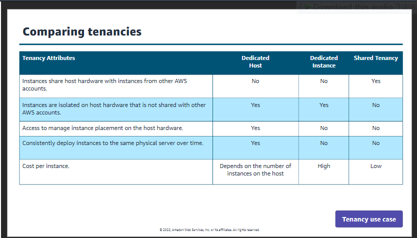

[`Click to learn`](https://awseducate.instructure.com/courses/817/pages/getting-started-with-compute?module_item_id=14091)

### USing Amazon EC2

#####   Steps
+   ` Instance name and tags`

    +   Tag features
        1.  Manage tags : 
        +   add, remove or edit tags.
        +   The tag limit per Amazon EC2 resources is 50 tags.
        +    Naming and tagging resources is optional

        
        2.   search and filter
        +   search for resources by key or by value.
        +   Filter and search for resources by a combination of tag key and values.

     ##### Benefits of using tags

     +  Resource organization
     +  Cost management
     +  Automation
     +  Access control   

+ ` Amazon Machine Image`

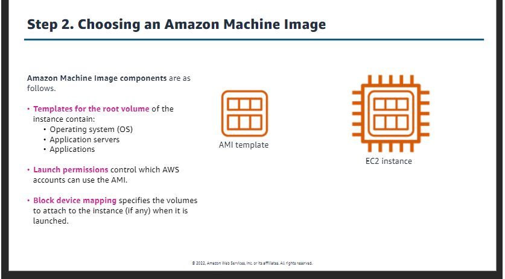

##### Where do we get an AMI?
 

+   ######  Pre-built:
 Amazon offers a number of pre-built AMIs to launch your instances. These AMIs include Linux and Windows options, with various suboptions to tailor your setup.

+   ######  AWS MArketplace : 
It offers a digital catalog with thousands of software solutions listed. These AMIs can offer specific use cases to help you get started quickly.

+   ######  Create your own : 
When Amazon EC2 stops the instance, snapshots its root volume, and finally registers the snapshot as an AMI.

+   ######  Community AMIs:
 People all over the globe create community AMIs.

###### Benefits of AMI
+   Repeatability
+   Reusability
+   Recoverability
+   Marketplace solutions
+   Backups

+   ######  Instance type

Instance type families

 +   T family
 +  M family
 +  C family
 +  P family
 +  R family 

##### Categories of Instances
+   General Purpose
+   Compute Optimize
+   Memory optimized
+   Accelerated computing
+   Storage optimized

+   ` Key pair`
    +   private key that AWS stores
    +   public key file that you stores

+  `  Network settings`
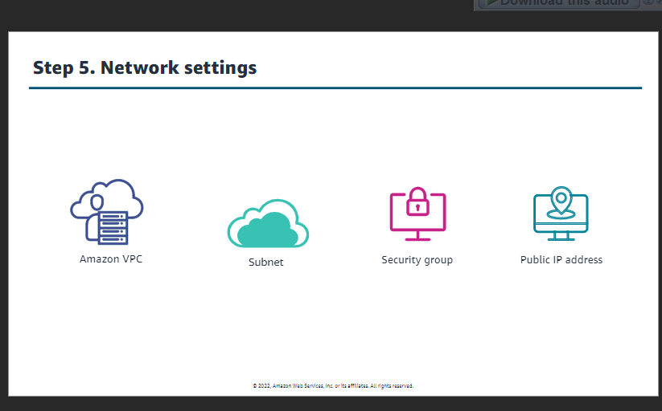

+   `Configure storage`
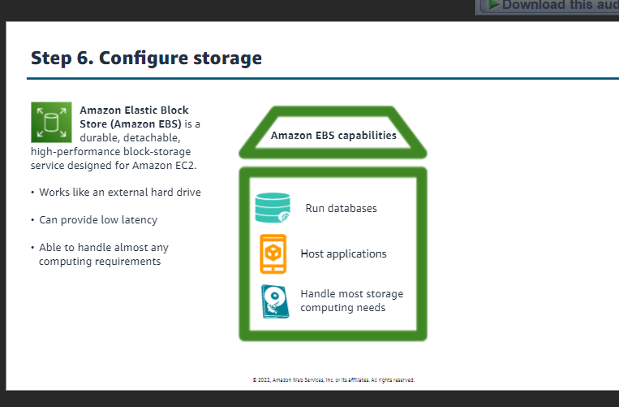

+   `Advance details`
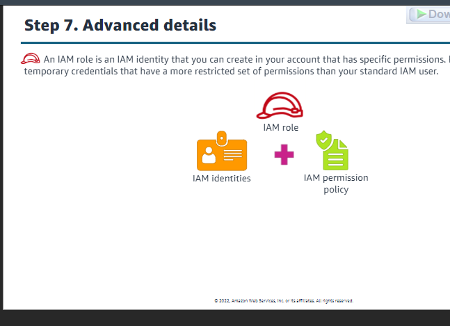

######     Managing roles
An instance profile is a container for an IAM role. From the instance profile, you can select a role to associate with the instance.

+   Include the role when launching the instance
+   Add a role after the instance is launched
+   Remove the role from an instance
+   Update a role's policy to affect permissions immediately

### User data

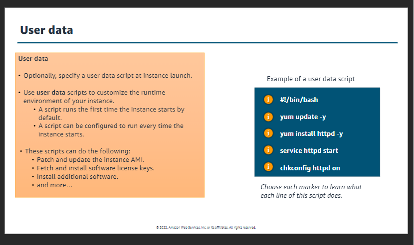

######  Additional advance settings options
+   Request spot instances
+   Shutdown behaviour
+   Termination
+   Detailed monitoring
+   Tenancy

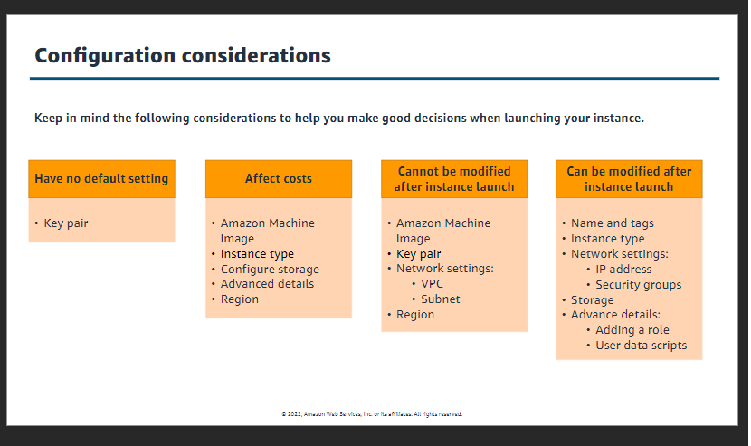

### Managing Amazon EC2
Options for launching EC2 instances
+   AWS management console
+   AWS command line interface
+   AWS software Development kit
+   Through other AWS services
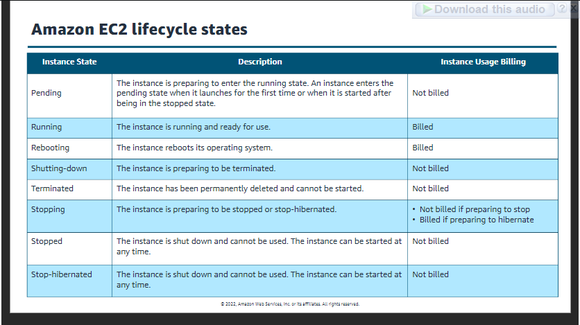

####    EC2 instance lifecycle state flows

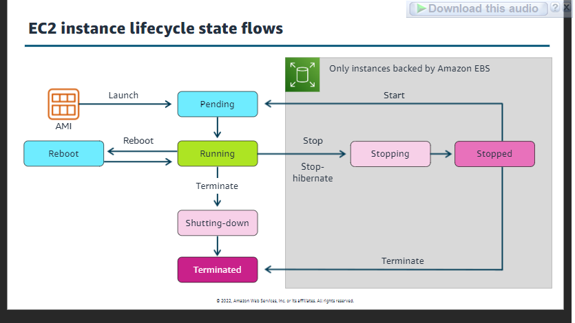

####    Horizontal scaling

###### use case of horizontal scaling

####    Vertical scaling

###### use case of vertical scaling

####    Auto scaling

###### otions
+   scheduled scaling
+   dynamic scaling
+   predective scaling

##  Elastic Load Balancing

###### ELB options
+   Application Load Balancer
+   Network Load Balancer
+   Gateaway Load Balancer

######  Additional options
+   EC2 instance connect
+   Session Manager
+   SSH Manager
+   EC2 serial console

#### Optimizing instance costs
+   using the right size instance
+   increasing elasticity
+   choosing optimal pricing models
+   optimizing storage choices

### Lab: Getting Started with Amazon EC2

####    Objectives
After completing this lab, you will know how to do the following:

+   Launch an EC2 instance with termination protection turned on.

+   Monitor your EC2 instance.

+   Modify the security group that your web server is using to allow HTTP access.

+   Connect to your EC2 instance using the AWS Systems Manager Fleet Manager.

+   Manage the state of an EC2 instance.

+   Change your  EC2 instance type.

+   Test termination protection.

+   Explore Amazon EC2 limits.

####    Task 1: Launching your EC2 instance

In the AWS Management Console on the Services menu, enter EC2. From the search results, choose EC2.

In the left navigation pane, choose EC2 Dashboard to ensure that you are on the dashboard page.

In the Launch instance section, choose the Launch instance dropdown list, and then choose Launch instance.

######  Step 1: Name your EC2 instance
 
+   In the Name and tags pane, in the Name text box, enter Web-Server
+   Choose the Add additional tags link.
+   From the Resource types dropdown list, select Instances and Volumes.
 

######  Step 2: Choose an AMI

+   Locate the Application and OS Images (Amazon Machine Image) section. It is just below the Name and tags section.
+   In the search box, enter Windows Server 2019 Base and press Enter.
+   Next to Microsoft Windows Server 2019 Base, choose Select.
+   Choose Confirm Changes.
 

######  Step 3: Choose an instance type

+   In the Instance type section, keep the default instance type, t2.micro.
 

######  Step 4: Configure a key pair

+   In the Key pair (login) section, from the Key pair name - required dropdown list, choose Proceed without a key pair (not recommended).
 

######  Step 5: Configure the network settings

+   In the Network settings section, choose Edit.

+   From the VPC - required dropdown list, choose Lab VPC.

+   For Security group name - required, enter Web Server security group

+   To delete the existing RDP rule,  next to Security group rule 1, choose Remove.
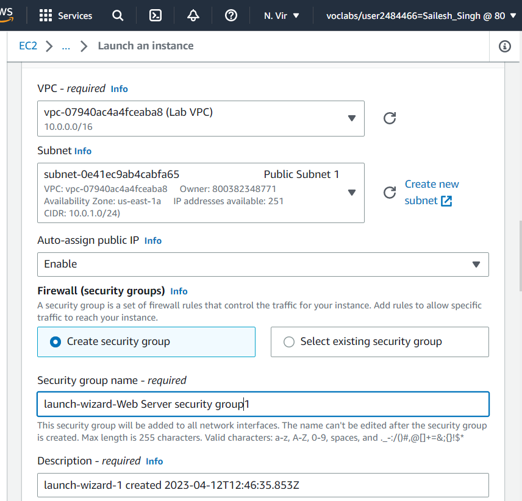

######  Step 6: Add storage

+   In the Configure storage section, keep the default storage configuration.
 

######  Step 7: Configure advanced details
 

+   Expand the Advanced details section.

+   For IAM instance profile, choose the role that has LabInstanceProfile in the name.

+   From the Termination protection dropdown list, choose Enable.

  

+   Copy the [following commands](https://awseducate.instructure.com/courses/817/modules/items/14095), and paste them into the User data text box.

The script does the following:

+   Installs a Microsoft Internet Information
+    Services (IIS) web server
+   Creates a simple web site
+   Sets the password for the Administrator user
 

######  Step 8: Launch an EC2 instance

 

+   In the Summary section, choose Launch instance.

+   Choose View all instances

+   Next to your Web-Server, select the  check box. The Details tab displays detailed information about your instance
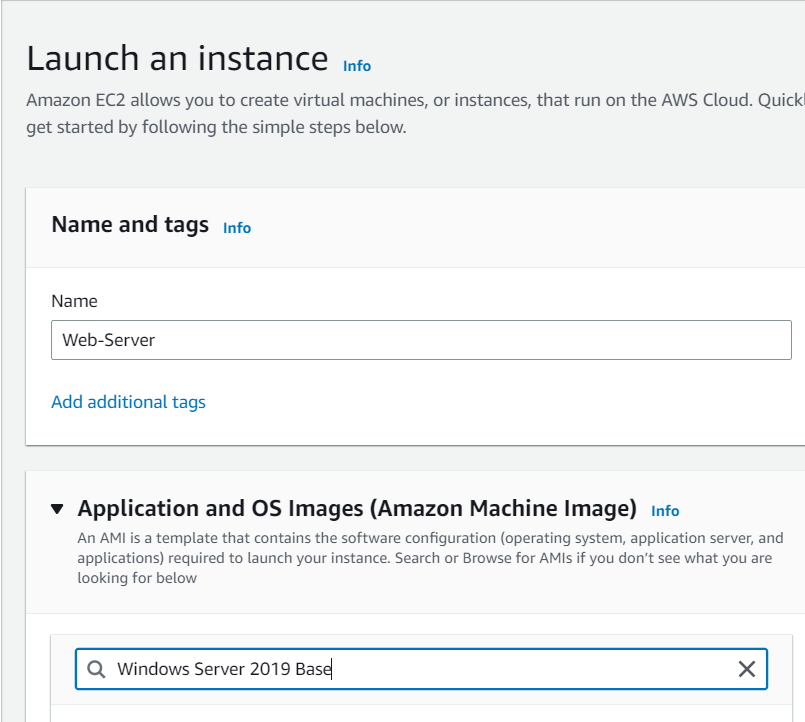

### Task 2: Monitor your instance

+   Choose the Status checks tab.

+   At the top of the page, choose the Actions  dropdown menu. Select Monitor and troubleshoot  Get system log.

+   Scroll through the log and review the messages in the output.

+   To return to the Amazon EC2 dashboard, choose Cancel.

+   With your Web-Server selected, choose the Actions  dropdown menu, and select Monitor and troubleshoot  Get instance screenshot.

+   At the bottom of the page, choose Cancel.

 

### Task 3: Updating your security group and accessing the web server

+   Select the check box next to the Amazon EC2 Web-Server that you created, and then choose the Details tab.

+   Copy the Public IPv4 address of your instance to your clipboard.

+   Keep the browser tab open, but return to the EC2 Management Console tab.

+   In the left navigation pane, choose Security Groups.

+   Next to Web Server security group, select the  check box.

+   Choose the Inbound rules tab.

The security group currently has no rules.

+   Choose Edit inbound rules, and then choose Add rule, and configure the following options:

Type: Choose HTTP.
Source: Choose Anywhere-IPv4.
Note: Notice the "Rules with source of 0.0.0.0/0 allow all IP addresses to access your instance. We recommend setting security group rules to allow access from known IP addresses only." While this is true and common best practice, this lab allows access from any IP address (Anywhere) to simplify both the security group configuration and testing of the website running on your EC2 instance.
 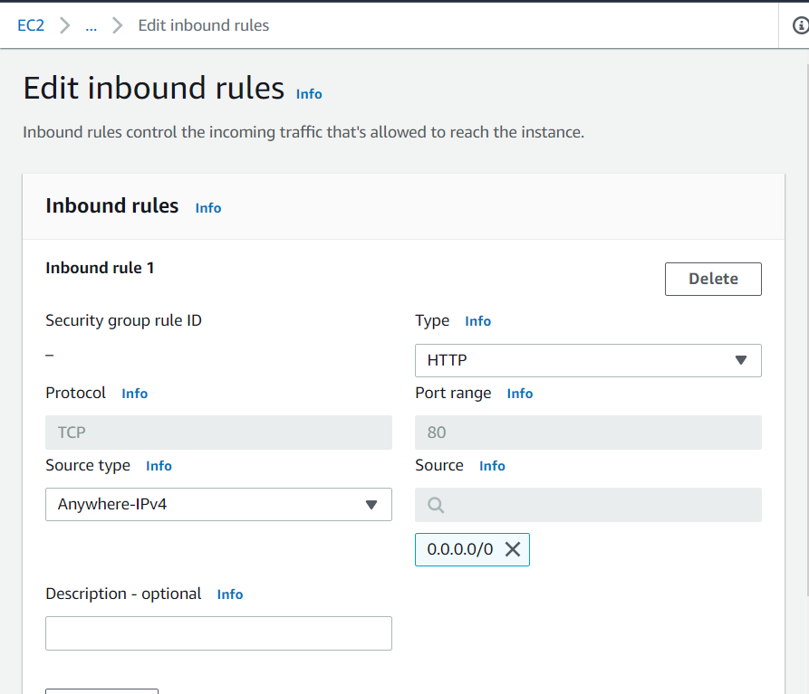
 

+   Choose Save rules

+   Return to the web server browser tab with the public IPv4 address that you previously opened, and choose  to refresh the page.
 

### Task 4: Connecting to your instance using AWS Systems Manager Fleet Manager

+   In the AWS Management Console on the Services menu, search for and select Systems Manager.

+   In the left nagivation pane, select Fleet Manager.

+   Under Managed nodes, select  your Web-Server EC2 instance. 

+   From the Node actions dropdown list, choose Connect with Remote Desktop.

A new tab opens.

+   Enter the following values:

Username: Administrator
Password: P@ssW0rD!
+   Choose Connect.

+   To disconnect from your Web-Server instance, choose End session. 

+   In the pop-up window, choose End session again .
 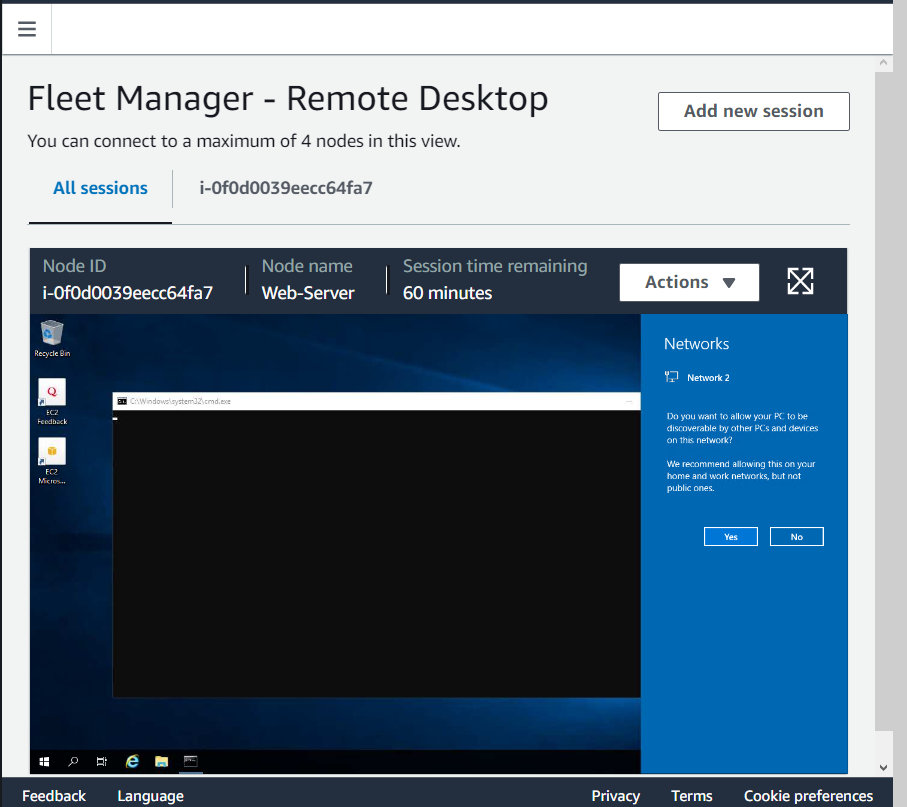
 

### Task 5: Resizing your instance

+   From the AWS Management Console on the Services menu, choose EC2

+   On the EC2 Management Console, in the left navigation pane, choose Instances.

+   Select the check box next to your Web-Server instance. At the top of the page, choose the Instance state  dropdown menu, and choose Stop instance.

+   In the Stop instance? pop-up window, choose Stop.

Your instance performs a normal shutdown and then stops running.

+   Wait for the Instance state to display Stopped.

 

#####   Change the instance type
+   Select the check box next to your Web-Server. From the Actions  dropdown menu, select Instance settings  Change instance type, and then configure the following option:

Instance type: Select t2.nano.

+   Choose Apply

Note: You are restricted from using other instance types in this lab.

#####   Start the resized instance
When the instance is started again, it is a t2.nano instance. You now start the instance again, which has less memory but more disk space.

 +   In left navigation pane, choose Instances. Next to your Web-Server, select the  check box.

+   From the Instance state  dropdown menu, choose Start instance.

+   Once the instance is restarted, the Instance state displays Running.

 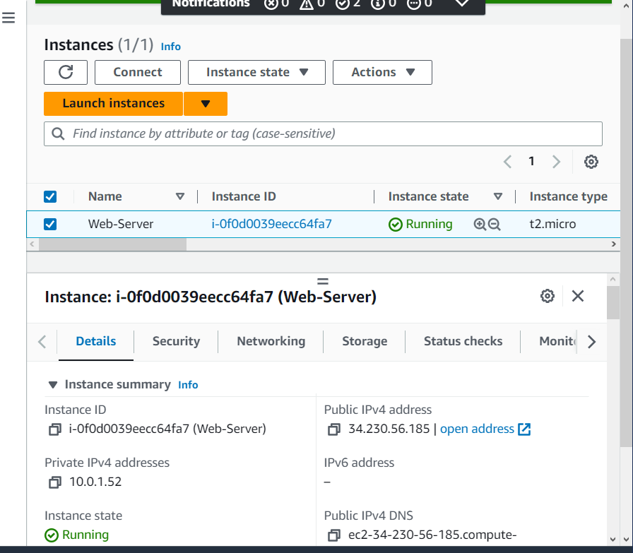

### Task 6: Testing termination protection 

+   Select the check box next to your Web-Server instance. From the Instance state  dropdown menu, choose Terminate instance.

+       Notice the message next to the Terminate instance option: Termination protection is enabled for one or more of the selected instances. 

+   From the Actions dropdown menu, choose Instance settings, and then choose Change termination protection.

+   Clear the check box for  Enable.

+   Choose Save.

+   Now, try to terminate the instance again.

The instance state will now successfully be terminated.

 

### Task 7: Exploring EC2 limits 

+   In the left navigation pane, choose Limits.

######  Lab complete 
 