# Getting Started with Cloud Operations
### This is the begining of cloud practitioner journey.
We begin our journey from AWS educate course. Click [Getting Started with Cloud Operations](https://awseducate.instructure.com/courses/889) to start learning.

## Objectives
By the end of this course you will be able to do the following:

+      Describe cloud operation fundamental concepts.

+      Explain the Amazon Well-Architected Framework.

+      Describe AWS cost and free tier structures.

+      Describe the AWS cost management tools that are available.

+      Identify support plans and explain the differences between them.

+      Discuss AWS cloud operations services that are available to you, including AWS Trusted Advisor, AWS Health  Dashboard, Amazon CloudWatch, AWS CloudTrail, AWS Organizations, AWS Systems Manager, and AWS Config.

## Getting Started learning pathway
This is a course that’s a part of a series of courses designed to give you foundational knowledge about cloud computing.  
Each of the courses are focused on a specific domain of cloud computing.

Although you can take any of the courses at any time, we suggest that you take the courses in the following order:

1. Getting Started with Storage
2. Getting Started with Compute
3. Getting Started with Networking 
4. Getting Started with Databases 
5. Getting Started with Cloud Operations 
6. Getting Started with Security 
7. Getting Started with Serverless   

## Learning
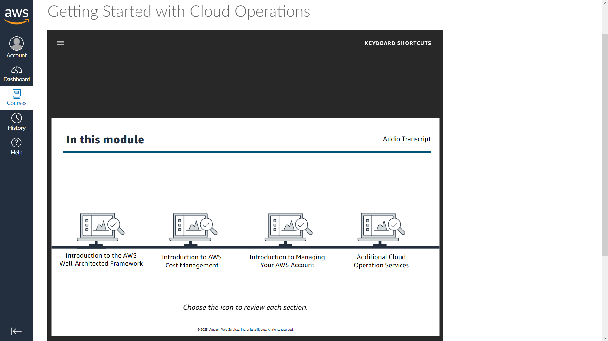

## Getting Started with Cloud Operations Lab  
This hands-on lab guides you through the steps to estimate Amazon Web Services (AWS) costs for a sample workload. The workload that you evaluate is for a three-tier web application that consists of :  
+       An Application Load Balancer  
+       An Amazon Elastic Compute Cloud (Amazon EC2) instance  
+       An Amazon Relational Database Service (Amazon RDS) instance 

The skills will help you to use AWS Pricing Calculator to estimate costs for your workloads.

###     Introduction to the Well-Architected Framework
<b>Cloud Environment</b>

+   Security
+   Operation
+   Performance
+   Scalability
+   Cost

### What is cloud operations?
+   Innovation
+   Cost
+   Compliance
+   Security

### Benefits of Cloud Operations
+       Innovation
    AWS helps you use the cloud to turn ideas into opportunities, creating new ways to grow, increase efficiency, and serve customers better. AWS has industry leading cloud services to help customers solve problems and explore possibilities.

+       Scale
    AWS management and governance services are built to manage highly dynamic cloud resources at massive scale.

+       Simplicity
    AWS reduces complexity, offering a single control plane for customers to manage and govern their resources on AWS and on-premises.

+       Cost savings
    Customers can use AWS management and governance services to assess their resource utilization and identify ways to reduce costs.

### AWS WA Framework Introduction
Foundation should be strong    

### WA Framework pillars
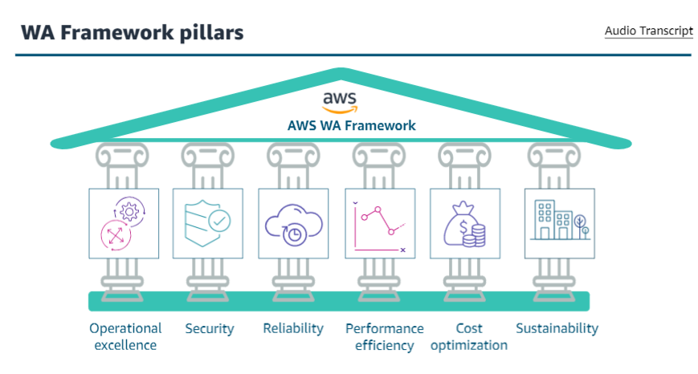

### AWS WA Framework: six pillars
+       Operational excellence
    The operational excellence pillar focuses on running and monitoring systems and continually improving processes and procedures. Key topics include automating changes, responding to events, and defining standards to manage daily operations.
    
+       Security
    The security pillar focuses on protecting information and systems. Key topics include confidentiality and integrity of data, managing user permissions, and establishing controls to detect security events.

+       Reliability
    The reliability pillar focuses on workloads performing their intended function and how to recover quickly from failure to meet demands. Key topics include distributed system design, recovery planning, and adapting to changing requirements.

+       Performance efficiency
    This pillar focuses on structured and streamlined allocation of IT and computing resources. Key topics include selecting resource types and sizes optimized for workload requirements, monitoring performance, and maintaining efficiency as business need evolve.

+       Cost optimization
    The cost optimization pillar focuses on avoiding unnecessary costs. Key topics include understanding spending over time and controlling fund allocation, selecting resources of the right type and quantity, and scaling to meet business needs without overspending.

+       Sustainability
    It focuses on minimizing the environmental impacts of running cloud workloads. key topics include a shared responsibility model for sustainability, understanding impact, and maximizing utilization to minimize required resources and reduce downstream impacts.

### AWS WA Tool

### Introduction to AWS Cost Management

(Access, Organize, Understand, Control, Optimize) the costs

### AWS payment models
+       pay-as-you-go
    It allows you to easily adapt to changing business needs without overcommitting budgets and improves your responsiveness to changes.

+        save when you commit
    It is a flexible pricing model that provides significant savings on your AWS usage.
    You can sign up for Savings Plans for a 1 or 3 year team and easily manage your plans by taking advantages of recommendations, performance reporting, and budget alert in AWS Cost Explorer.

+       pay less by using more
    With AWS, you can get volume-based discounts and realize important savings as your usage increases. As your AWS usage needs increase you benefit from the economies of scale that allow you to increase adoption and keep costs under control.
    To optimize your savings, choose the right combinations of storage solutions that help you reduce costs while preserving performance and security.

### AWS Free Tier
    It offers a free usage tier for up to 1 year
    Save money as you learn and experiment with AWS Free Tier.    

### Total costs of ownership(TCO)
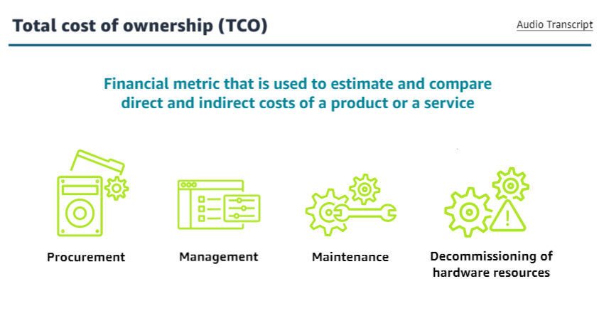  

TCO tools help to manage TCO, AWS offers pricing tools like the AWS Pricing Calculator and the AWS Migration Evaluator

### AWS Pricing Calculator

### AWS Migration Evaluator

### AWS Cost Management tools
+       AWS Billing console
    Resources to manage your ongoing payments and payment methods registered to your AWS account.

+       AWS Cost Management console
    Features for budgeting and forecasting costs and methods for you to optimize your pricing to reduce your AWS bill.

### AWS Cost Explorer benefits
+       View cost charts
    You can view charts to see how your costs are being accumulated.

+       13 month review of costs
    You can review costs from the past 13 months to evaluate trends.

+       Forecast costs
    You can forecast what your costs will be over the next 3 months based on current configurations and estimated usage data.

+       Discover patterns
    You can use AWS Cost Explorer to discover how much you're spending on AWS resources over time and identity cost problem areas.

+       Favorite services
    With AWS Cost Explorer, you can identity the services that you use the most and their associated costs.

+       View metrics
    AWS Cost Explorer gives you access to metrics like which Availability Zones have the most traffic or which linked AWS account is used the most.

### AWS Budgets
Improve planning and cost control with flexible budgeting and forecasting.
+   Create a budget
+   Get altered
+   Respond with actions.

### AWS Billing Dashboard
+   View the status of your month-to-date AWS expenditure.
+   Identify the services that account for the majority of your overall expenditure. 
+   Understand at a high level how costs are trending.

<b>Spend Summary Example</b>

### AWS Billing Dashboard examples
+   Amazon EC2
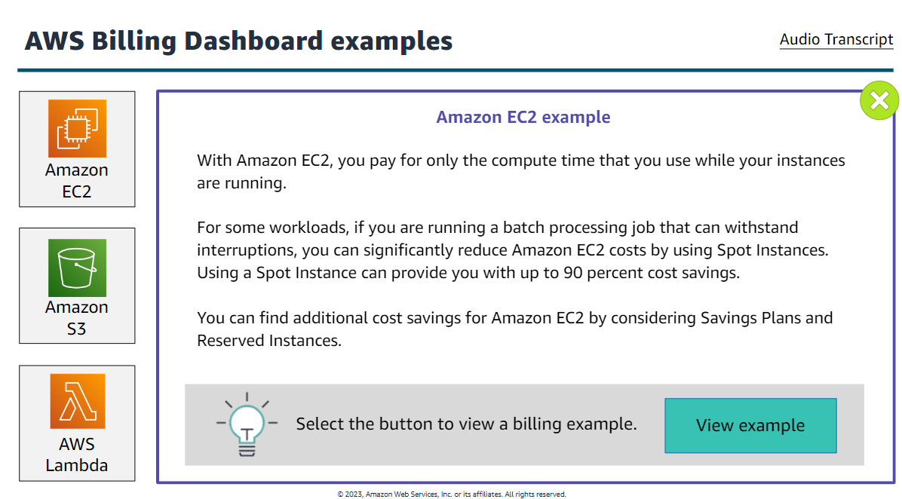
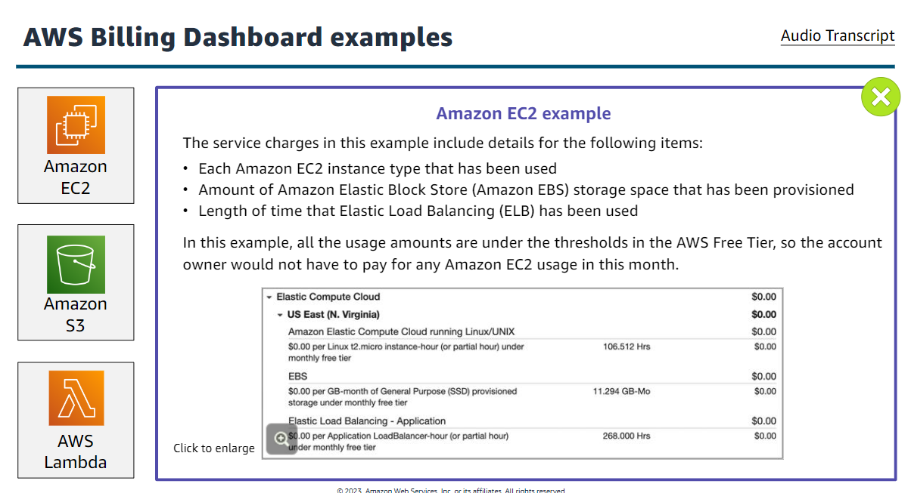

+   Amazon S3
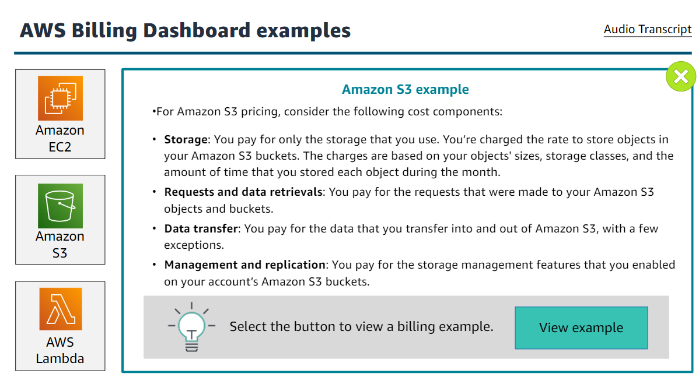
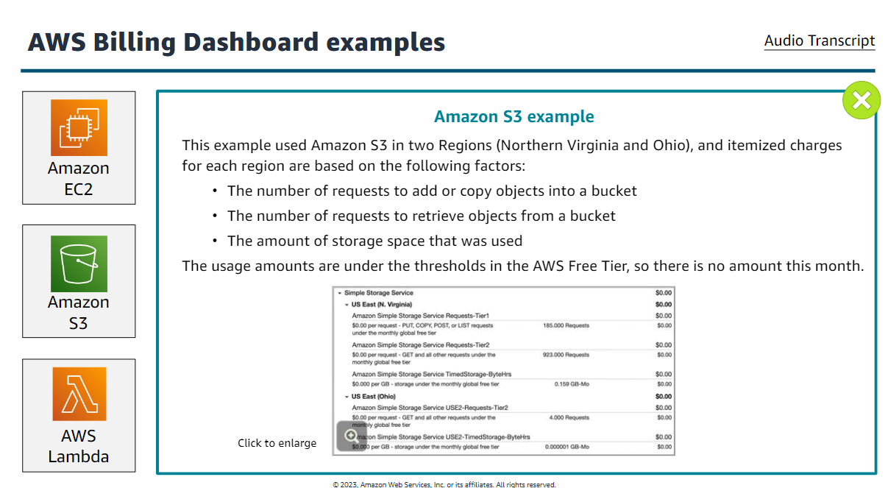

+   AWS Lambda
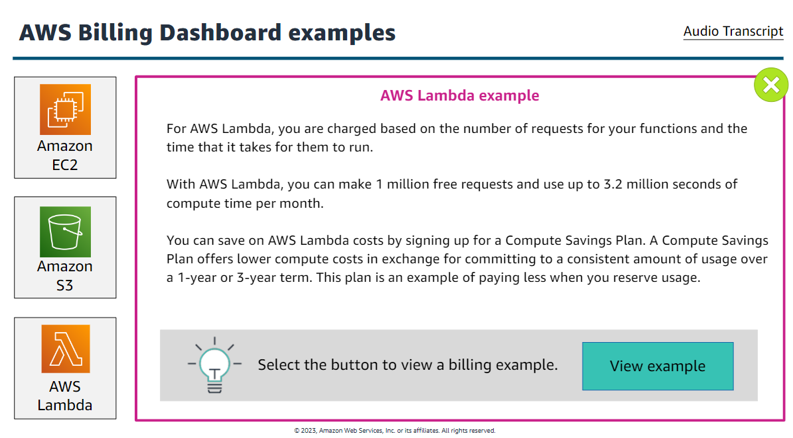
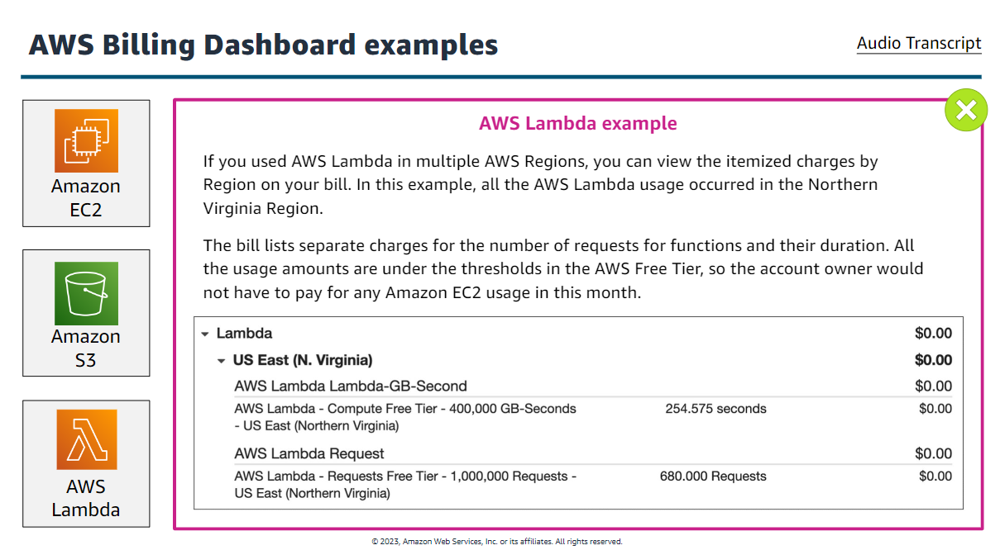

### Introduction to Managing Your AWS Account
+   Performance
+   Manage Risk
+   Cost

### AWS Support Plans
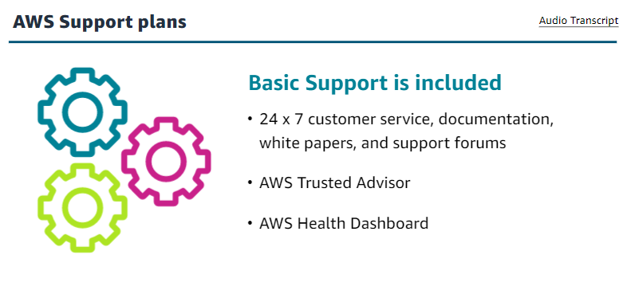
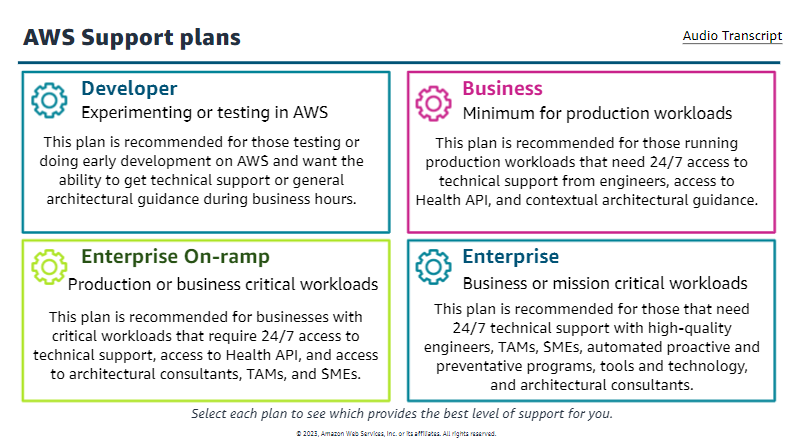

### AWS Support Benefits
Designed to proactively help you optimize performance, lower costs, and innovate faster.
+       Move faster with AWS
    Use AWS experts to quickly build up knowledge and expertise. It helps you stay agile with architectural guidance as you build applications and solutions.

+       Automate management of your environment
    Proactively monitor your environment and automate remediation. AWS Support provides tools such as AWS Personal Health Dashboard and AWS Trusted Advisor to help you keep your environment running optimally.

+       Focus on what matters
You can put your energy where it belong: with your customers and your business. We will take care of the infrastructure for you and help you to keep it running efficiently, securely and in a manner your business demands.

+       Manage and mitigate risks
    It can help you maintain strict security standards and proactively alert you to issues. We can help you plan to meet the demands of your customers with architectural and operational guidance to optimize performance.

+       Highly-trained engineers, large network of subject-matter experts
    AWS has cloud support Engineers well versed in DevOps Technologies, automation, infrastructure, configuration management and continuous integration, and subject-matter experts ranging from Solutions Architects to product managers.

+       Engineer empowered to help you achieve your goals
    AWS engineers stay with AWS support cases from the start to resolution. This eliminates the need for customers to interact with multiple support engineers, which can slow down the time to resolution, and helps you continue your cloud journey.

### AWS Service Quotes
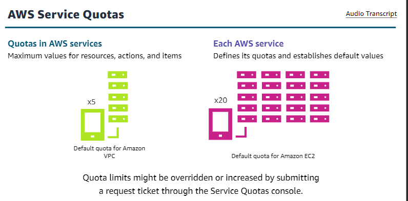

### Tagging
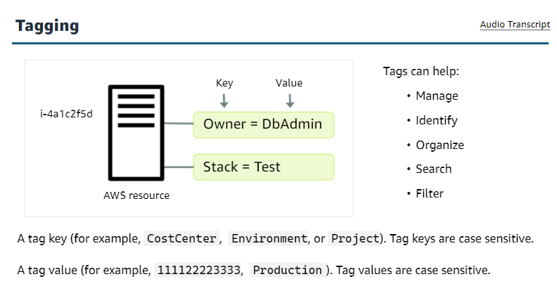

### Common Tagging Strategies

+   Resource organization
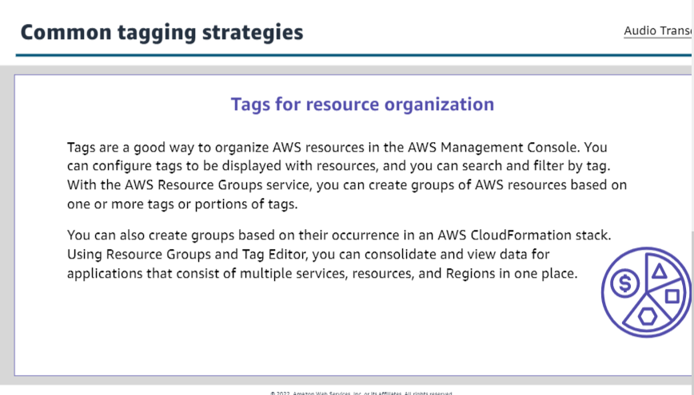

+   Cost allocation
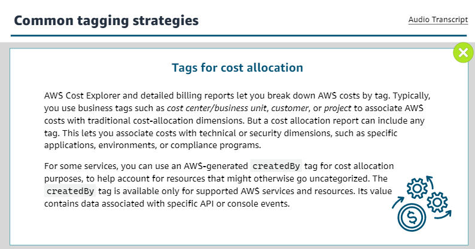

+   Automation
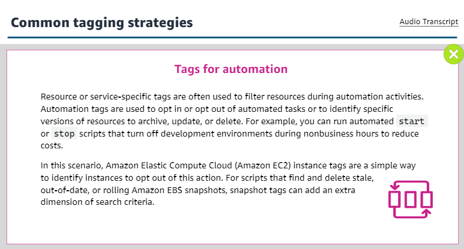

+   Access Control

### AWS Trust Advisor
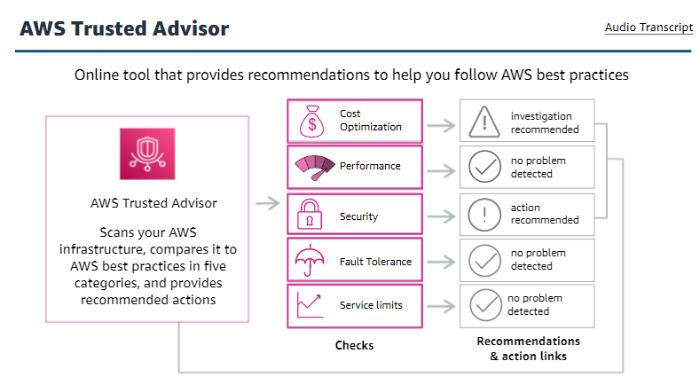

### Benefits of AWS Trusted Advisor
+   Cost optimization

+   Performance
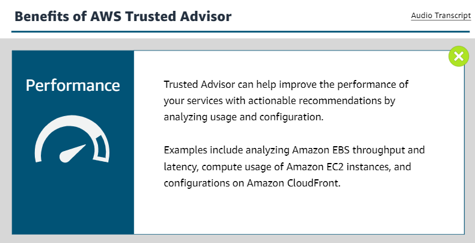

+   Security
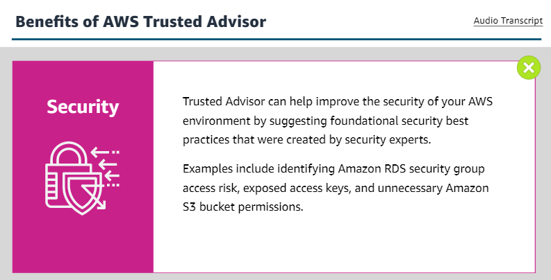

+   Fault Tolerance

+   Service quotas

### Trusted Advisor's five checks

### AWS Health Dashboard
+       Personalize view
    When you sign into the Health Dashboard, you have a personalized view of the AWS service status that powers your application. Use the Health Dashboard to learn about specific operational issues that affect your account.

+       Proactive notifications
    In addition to enabling emails to receive important Health events, you can configure AWS Health Aware to receive information in your slack channel or other operational tooling.

+       Troubleshooting
    When you get a Health event, it includes remediation details and specific guidance so that you can take action for events that affect your resources. For example, if a hardware issue affects one of your Amazon EBS volumes, the alert includes a list of affected resources, recommendations, and help links o restore your volume from a snapshot. This helps you reduce the amount of time it takes to resolve issues.

+       Integration and automation
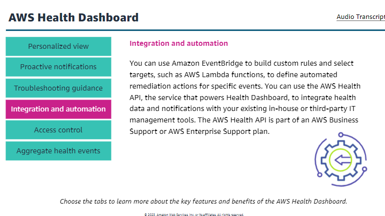
    
+       Access control

+       Aggregate health events
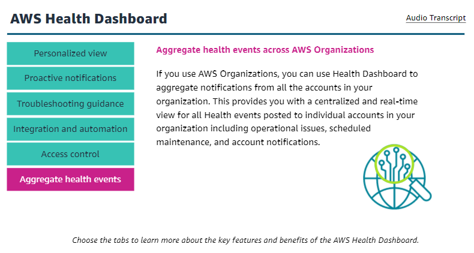

### Additional Cloud peration Services
+   Change management
+   Application management
+   Storage, analysis, and remediation
+   Event-driven application

### Amazon CloudWatch

### CloudWatch use cases
+       Monitor application performace
    Visualize performance data, create alarms, and correlate data to understand and resolve the root cause of performance issues in your AWS resources

+       Perform root cause analysis
    Analyze metrics, logs, logs analytics, and user requests to speed up debugging and reduce overall mean time to resolution.

+       Optimize resources proactively
    Automate resource planning and lower costs by setting actions to occur when thresholds are met based on your specifications or machine learning models.

+       Test website impacts
    Find out exactly when your website is impacted and for how ling by viewing sceenshots, logs, and web requests at any point in time.

### How CLoudWatch works with other AWS services

+   Amazon Simple Notification Service(Amazon SNS) 

+   Amazon EC2 Auto Scaling

+   AWS CloudTrail

+   AWS Identity and Access Management (IAM)    
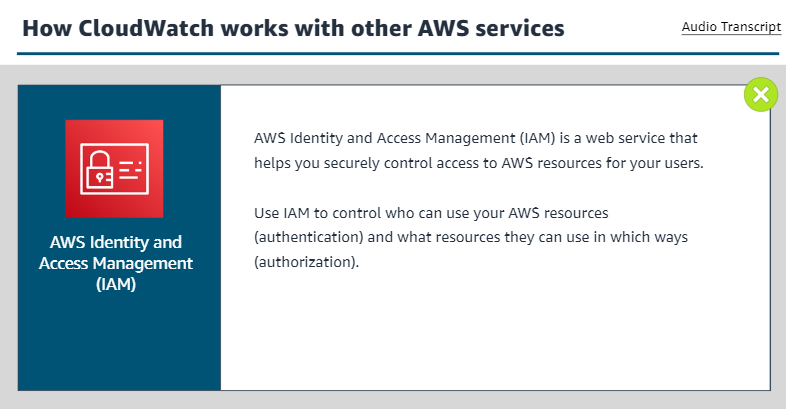

## LAB:
### Getting Started with Cost Estimation
#### 1. AWS Pricing Calculator
+ Launch [AWS Pricing Calculator](https://calculator.aws/#/) and begin to <strong>Create an estimate.</strong>  
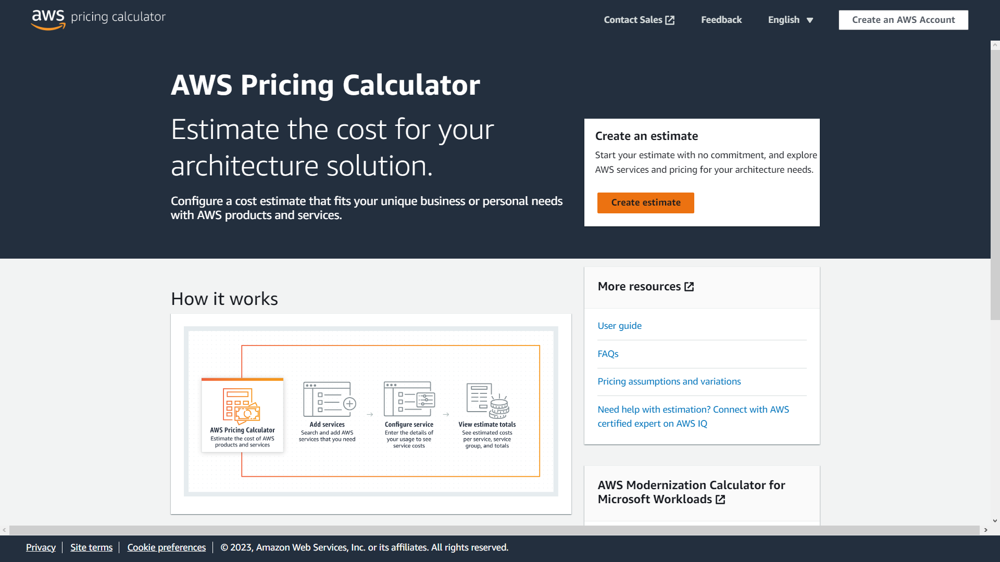

#### 2. Add and configure services in AWS Pricing Calculator 
+   <b><u>Add the load balancer to the estimate</u></b>  
    a.  On the Select service page, in the Find Service search box, enter `Elastic Load Balancing` and configure it. <small><u><i>[Learn to configure](https://awseducate.instructure.com/courses/889/modules/items/15053)</i></u></small>.

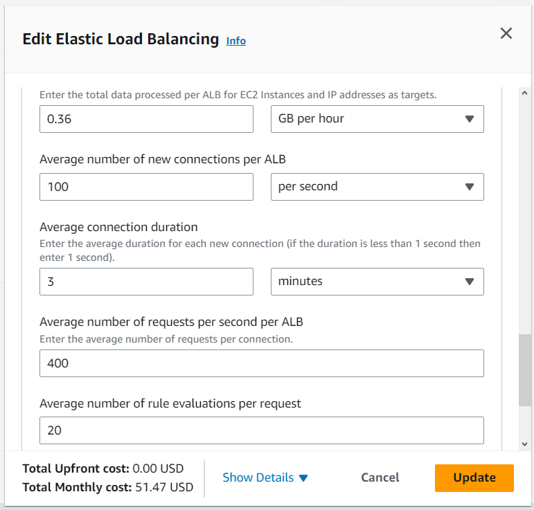

+   <b><u>Add the EC2 instance to the estimate</u></b>  
    a.  On the Select service page, in the Find Service search box, enter `EC2` and configure it. <small><u><i>[Learn to configure](https://awseducate.instructure.com/courses/889/modules/items/15053)</i></u></small>.

+   <b><u>Add the RDS instance to the estimate</u></b>  
    a.  On the Select service page, in the Find Service search box, enter `RDS` and configure it. <small><u><i>[Learn to configure](https://awseducate.instructure.com/courses/889/modules/items/15053)</i></u></small>.

#### 3. Review and download the estimate

+   <b><u>Choose View summary.</u></b>  
    a.  Review the overall costs that AWS Pricing Calculator generated for the services from the My Estimate page. enter `Review Summary` and configure it. <small><u><i>[Learn to configure](https://awseducate.instructure.com/courses/889/modules/items/15053)</i></u></small>.

    

  
    ##### Note: The prices found in your estimate may vary as prices occasionally change. 

    + Choose Export, and then choose CSV.
    + In the Export My Estimate to csv dialog box, choose OK.
    + Use your local file explorer to save the file.  

#### 4. Save and share the estimate
+ Choose Share.

+ In the Save estimate dialog box, choose Agree and continue.

+ To copy the link for your estimate, choose Copy public link.

+ To share the estimate, send the link to others using a communication tool such as email.

Note: When you share an estimate, AWS Pricing Calculator automatically saves it and generates a URL to access it. AWS Pricing Calculator saves your estimate for 3 years.

<i>[Learn more ...](https://awseducate.instructure.com/courses/889/modules/items/15053)</i>

##### `LAB COMPLETE and Quiz starts`
#### End of Cloud Operations

