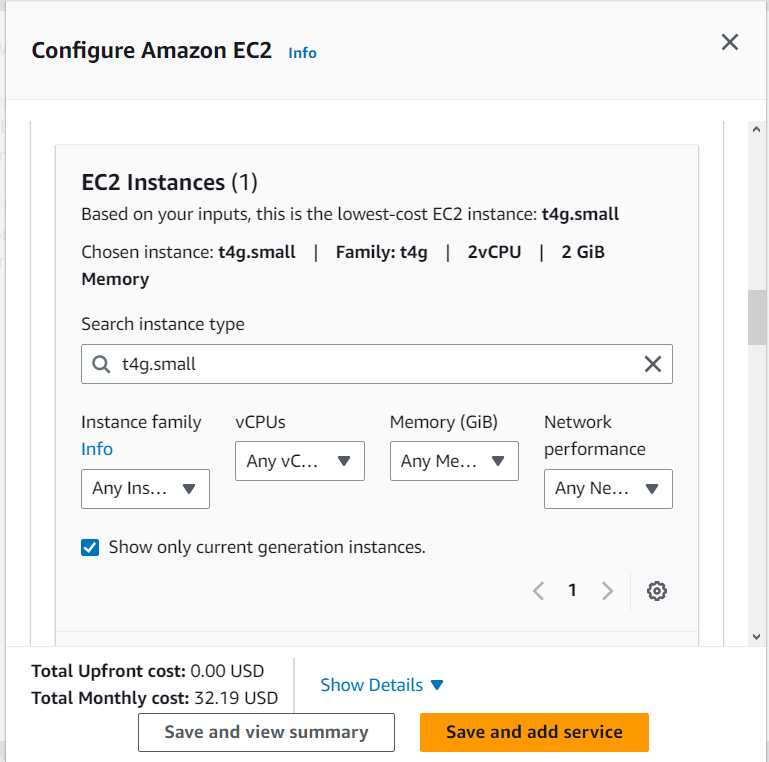
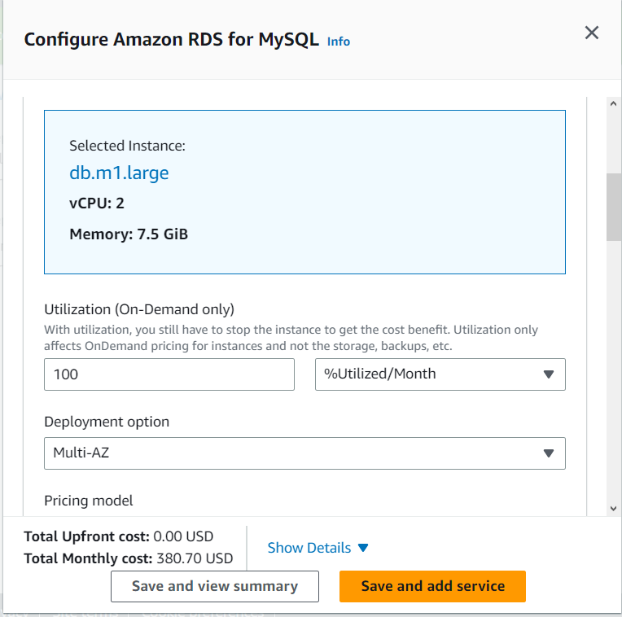
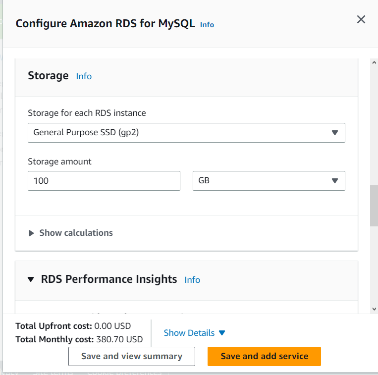
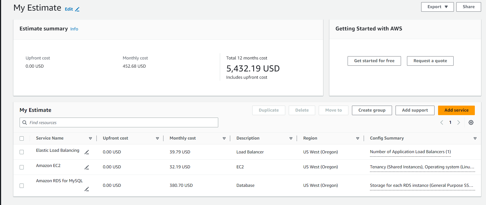

# Getting Started with Cloud Operations
### This is the begining of cloud practitioner journey.
We begin our journey from AWS educate course. Click [Getting Started with Cloud Operations](https://awseducate.instructure.com/courses/889) to start learning.

## Objectives
By the end of this course you will be able to do the following:

+      Describe cloud operation fundamental concepts.

+      Explain the Amazon Well-Architected Framework.

+      Describe AWS cost and free tier structures.

+      Describe the AWS cost management tools that are available.

+      Identify support plans and explain the differences between them.

+      Discuss AWS cloud operations services that are available to you, including AWS Trusted Advisor, AWS Health  Dashboard, Amazon CloudWatch, AWS CloudTrail, AWS Organizations, AWS Systems Manager, and AWS Config.

## Getting Started learning pathway
This is a course that’s a part of a series of courses designed to give you foundational knowledge about cloud computing.  
Each of the courses are focused on a specific domain of cloud computing.

Although you can take any of the courses at any time, we suggest that you take the courses in the following order:

1. Getting Started with Storage
2. Getting Started with Compute
3. Getting Started with Networking 
4. Getting Started with Databases 
5. Getting Started with Cloud Operations 
6. Getting Started with Security 
7. Getting Started with Serverless (Coming soon!)  

## Learning

## Getting Started with Cloud Operations Lab  
This hands-on lab guides you through the steps to estimate Amazon Web Services (AWS) costs for a sample workload. The workload that you evaluate is for a three-tier web application that consists of :  
+       An Application Load Balancer  
+       An Amazon Elastic Compute Cloud (Amazon EC2) instance  
+       An Amazon Relational Database Service (Amazon RDS) instance 

The skills will help you to use AWS Pricing Calculator to estimate costs for your workloads.

## LAB:
### Getting Started with Cost Estimation
#### 1. AWS Pricing Calculator
+ Launch [AWS Pricing Calculator](https://calculator.aws/#/) and begin to <strong>Create an estimate.</strong>  

#### 2. Add and configure services in AWS Pricing Calculator 
+   <b><u>Add the load balancer to the estimate</u></b>  
    a.  On the Select service page, in the Find Service search box, enter `Elastic Load Balancing` and configure it. <small><u><i>[Learn to configure](https://awseducate.instructure.com/courses/889/modules/items/15053)</i></u></small>.

+   <b><u>Add the EC2 instance to the estimate</u></b>  
    a.  On the Select service page, in the Find Service search box, enter `EC2` and configure it. <small><u><i>[Learn to configure](https://awseducate.instructure.com/courses/889/modules/items/15053)</i></u></small>.

+   <b><u>Add the RDS instance to the estimate</u></b>  
    a.  On the Select service page, in the Find Service search box, enter `RDS` and configure it. <small><u><i>[Learn to configure](https://awseducate.instructure.com/courses/889/modules/items/15053)</i></u></small>.

#### 3. Review and download the estimate

+   <b><u>Choose View summary.</u></b>  
    a.  Review the overall costs that AWS Pricing Calculator generated for the services from the My Estimate page. enter `Review Summary` and configure it. <small><u><i>[Learn to configure](https://awseducate.instructure.com/courses/889/modules/items/15053)</i></u></small>.

    

  
    ##### Note: The prices found in your estimate may vary as prices occasionally change. 

    + Choose Export, and then choose CSV.
    + In the Export My Estimate to csv dialog box, choose OK.
    + Use your local file explorer to save the file.  

#### 4. Save and share the estimate
+ Choose Share.

+ In the Save estimate dialog box, choose Agree and continue.

+ To copy the link for your estimate, choose Copy public link.

+ To share the estimate, send the link to others using a communication tool such as email.

Note: When you share an estimate, AWS Pricing Calculator automatically saves it and generates a URL to access it. AWS Pricing Calculator saves your estimate for 3 years.

<i>[Learn more ...](https://awseducate.instructure.com/courses/889/modules/items/15053)</i>

##### `LAB COMPLETE and Quiz starts`
#### End of Cloud Operations

