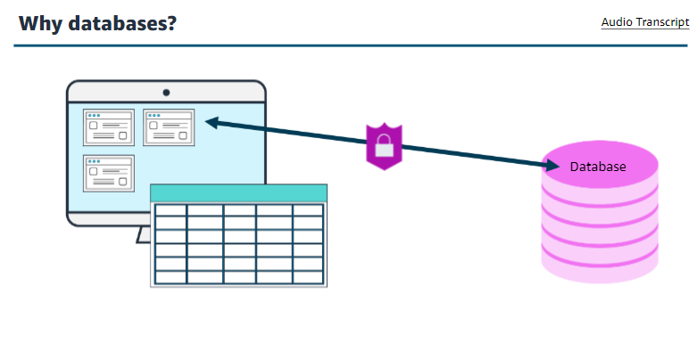
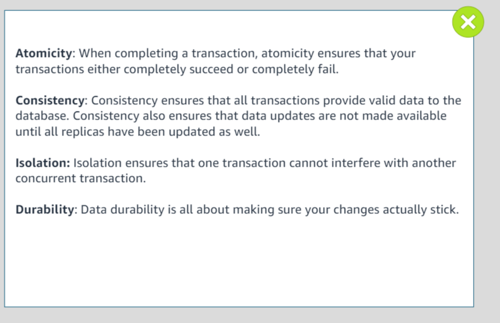
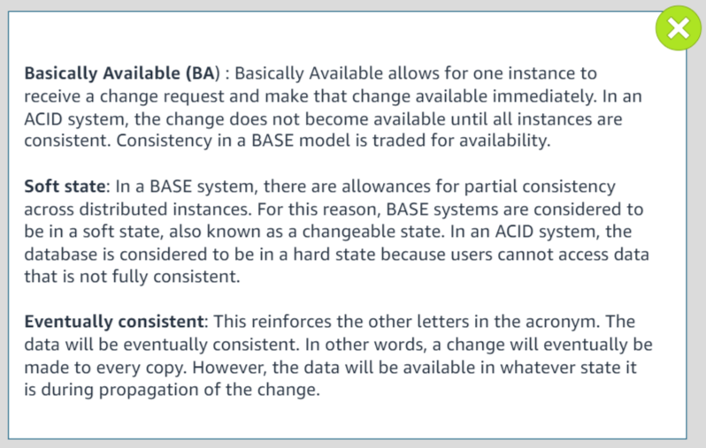
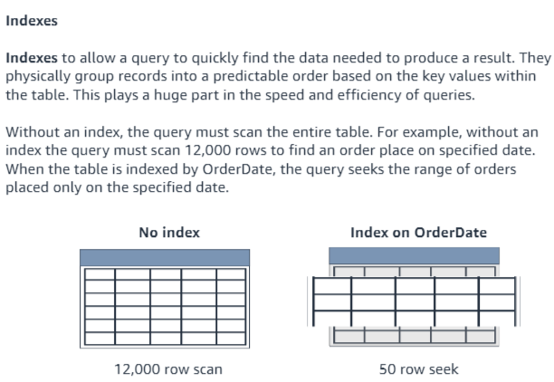
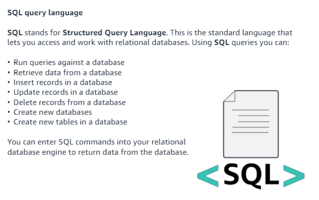
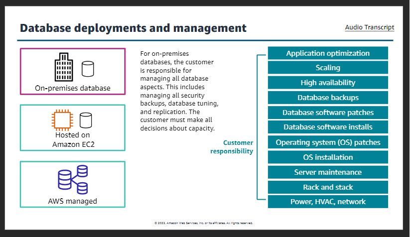
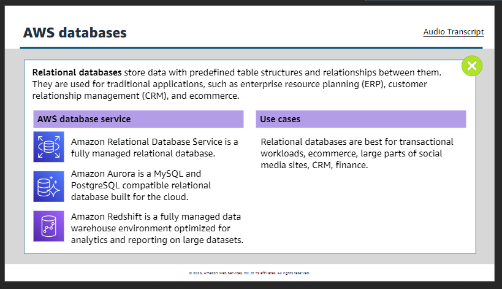
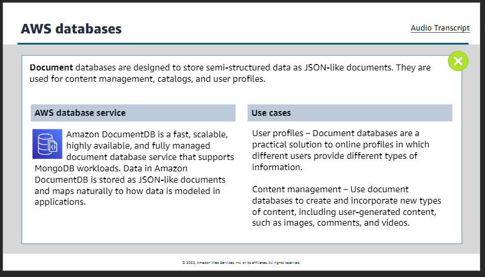
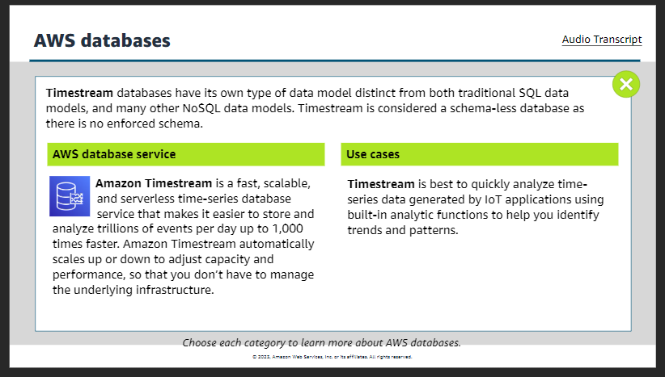

### Databases

####    Why databases?
    A computer need to store the information, before that the information can be reference or changed . A computer also need to find the right information at the right time A database is logically organized collection of information designed in such a way the information with them can be accessed for later used by a computer program.
    

####    Data models and structure   
    Data model is the logical structure of the database and determine the rules for how information can be organized an used. The data model you choose is influenced by the structure of your data. Data strucuture in three different ways:
1.      Structured data:
    It is stored as a series of data values in related tables. This data is highly structured. This means it is formatted so that it owner can be made accessible for most effective processing and analysis. The data is also able to be used for highly complex queries.

2.      Unstructured database  
    +   Stored as files
    +   Lacks predefined structured
    +   Special tools to catalog and query

3.      Semistuctured data
    +   Highly flexible
    +   Changed as needed
    +   Analyzed    

   

####    Database terms and concepts
1.      Schema
    A databse schema is the blueprint of the database. The schema outlines the relationships within the database and the constraints of the database.
    There are two main types of schemas: schema-less and semi-structured or fixed schema.
    +   A schema-less database maanges information without the need for a blueprint.
    +   Semi-structured data doesnot follow the format of a tabular data model or relational databases because it does not have fixed schema.

2.      Read/Write
    Reading and writing to a database is just what it sounds like.
    +   When you complete actions that read from the database you are accessing the data for a particular purpose.
    +   When complete actions that write to the databse you are putting new data into the database or changing data that is already existing.
    knowing if you workload will have more read operations or write operations will help you to design a database that is optimized for speed and efficiency.  

3.      Input/output operations per second
    IOPS is the measure of performance of reads and writes to a storage location like a database.
    Databases are IOPS intensive because they are continuously reading from the database and modifyinf the pages. Given this aspect of database, it is important to consider the impact of your performance when selecting IOPS.
    To improve latency and rea/write throughput, provision more IOPS when configuring the databse. Limiting the IOPS may cause the database to hit the threshold and reduce performance. Over provisioning of IOPS will result in higher costs for the instance.

4.      ACID and BASE compliance
 

 

 

5.      OLTP/OLAP
     

6.      Indexes
     

7.      SQL query language
     

####    Types of database
1.  Relational database
+   Structured data

2.  Nonrelational database
+   Unstructured and semistructured data

  

####    Relational database tables
  

####    Relational databases benefits
+   Ease of use for structure data
+   Data integrity controls and accuracy
+   Common shared query language
+   Reducing redundancy and overall data storage.

 

####    Use case of Relational database
 

####    Nonrelational database
 

####    Non relational database benefits
+   flexibility
+   Scalability
+   High performance
+   Highly funcional APIs

####    Non relational database use case
 

####    Why AWS database
+       purpose built
    AWS database service are purpose-buil to suppoet what your application is designed to do. Choose databse service that best matches your workload.

+       performance at scale
    AWS offers databases hat are three to five times faster than popular alternatives, or non-relational databases that give you microsecond to sub-millisecond latency.

+       fully managed
    AWS manages database tasks such as server provisioning, patching, configuration, and backups so you can focus on developing your application.

+       secure and highly available
    AWS database are built for business-critical, enterprise workloads. They offer high availability, reliability, and security with multi-region and end-to-end encryption support.

####    Database deployments and management
+   On-premises database
 

+   Hosted on Amazon EC2
 

+   AWS managed    
 

####    AWS databases
 

+   Relational
 

+   key-value
 

+   Document
 

+   Timestream
