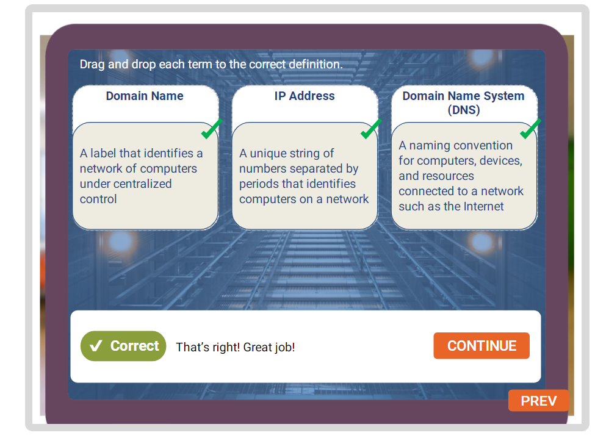
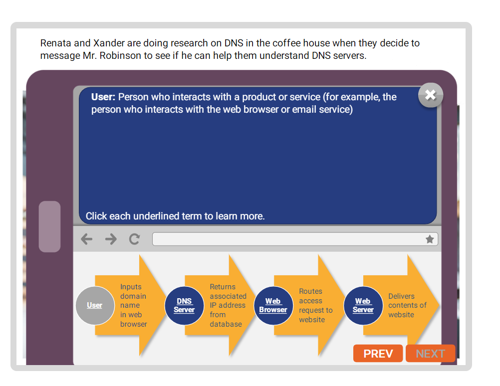
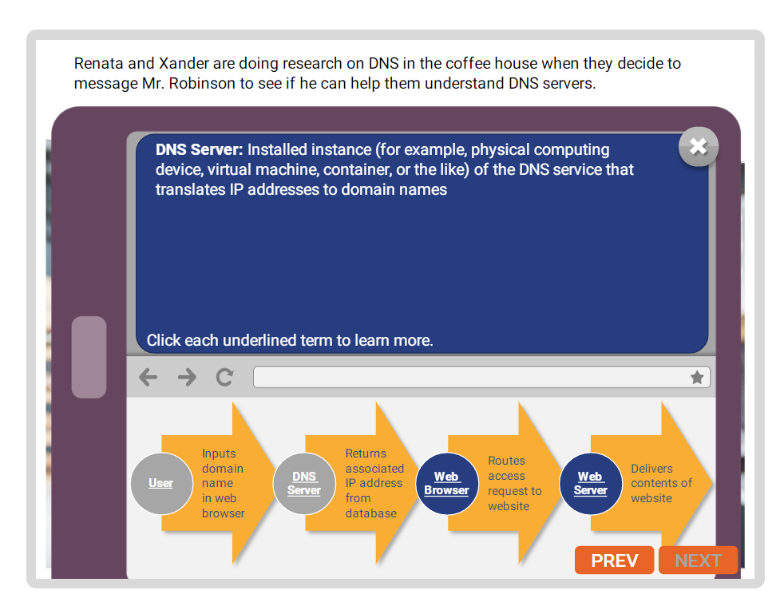
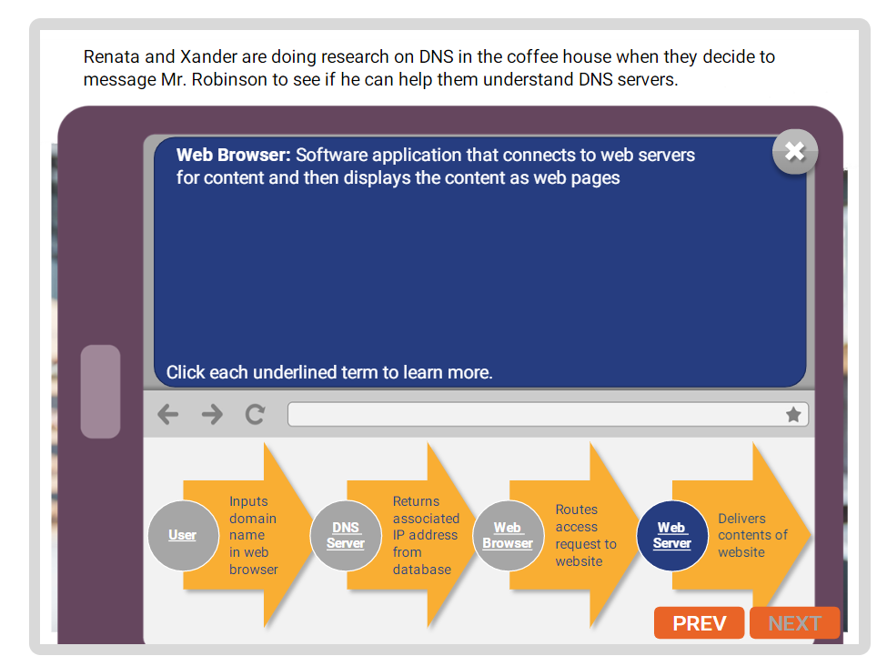
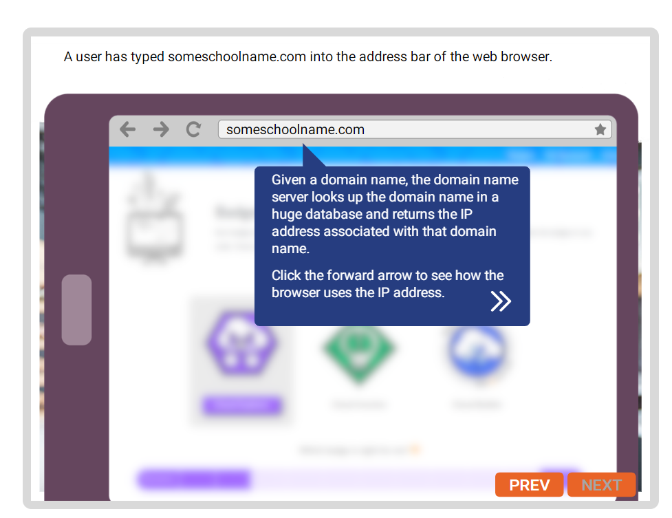
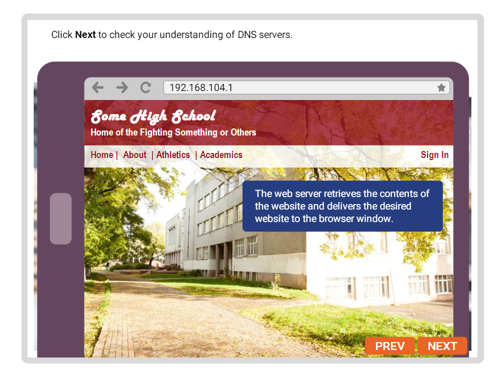
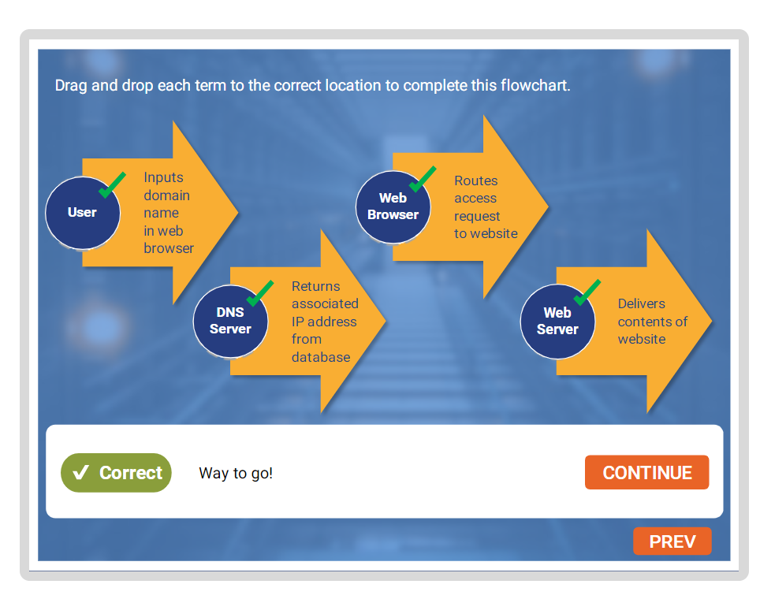
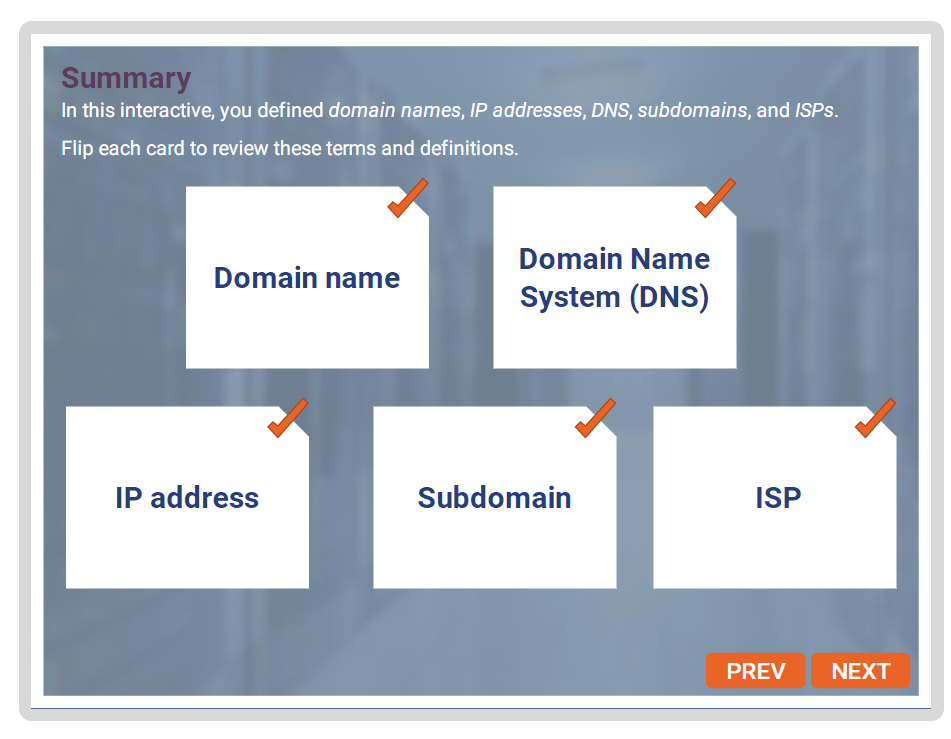
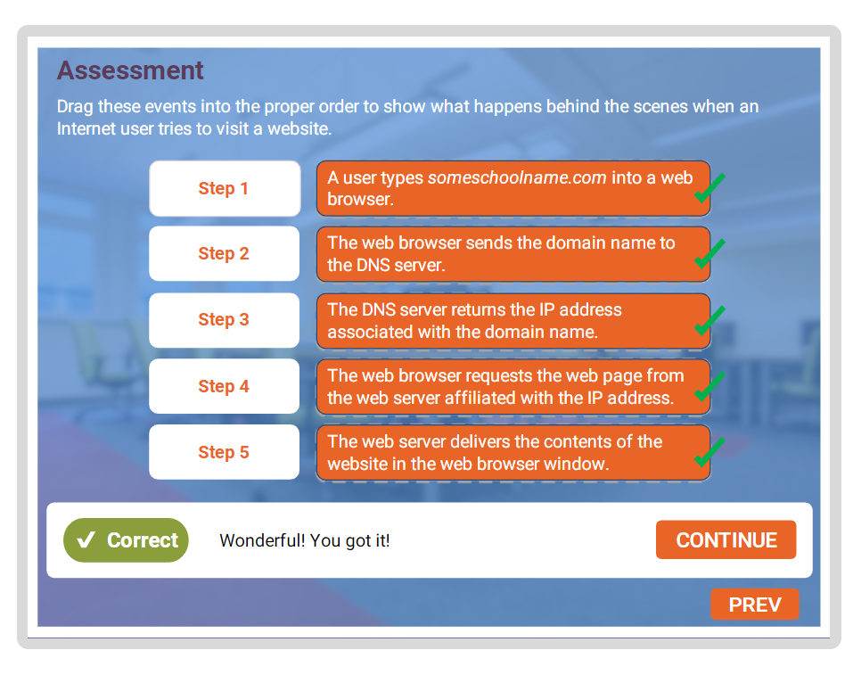
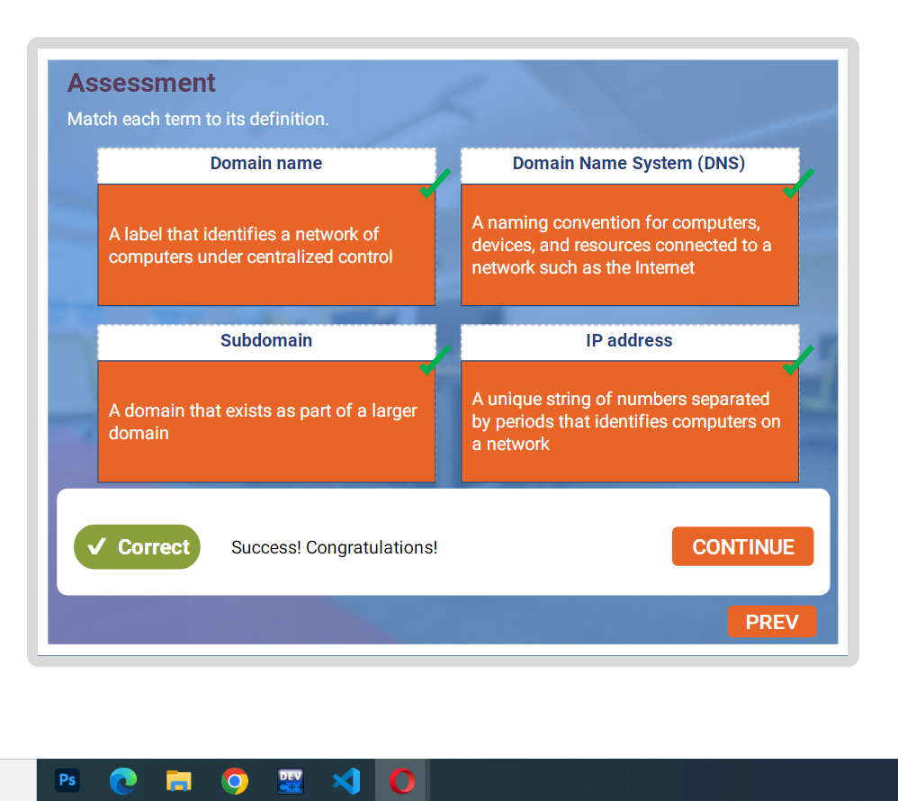

##  INTERNET BASICS

`Definition`:
+   Domain Name
+   IP Address
+   Domain Name Server(DNS)

 

 `Example to correct term`

 

`DNS Server`
 
 

 
 

 
 

` Searching in browser`

   

   

`Placing term in right order`

   

####    Summary
  

  ####  Assessement
  
  