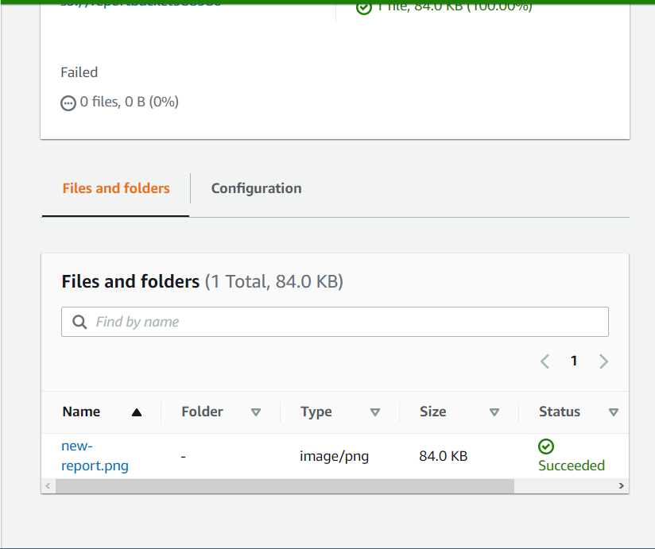
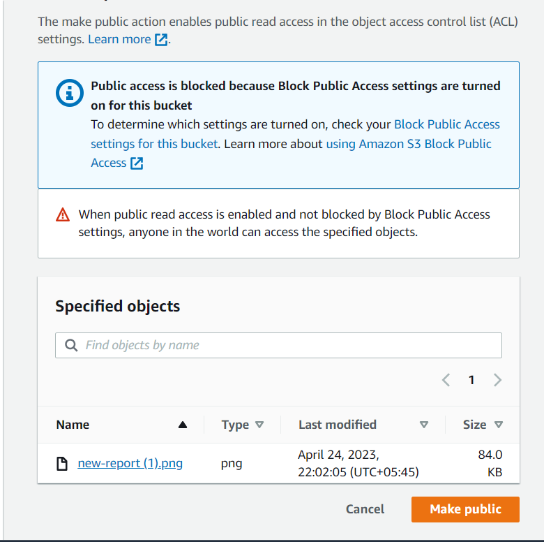
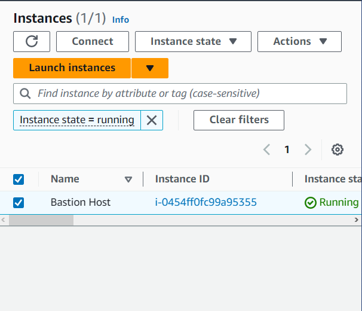
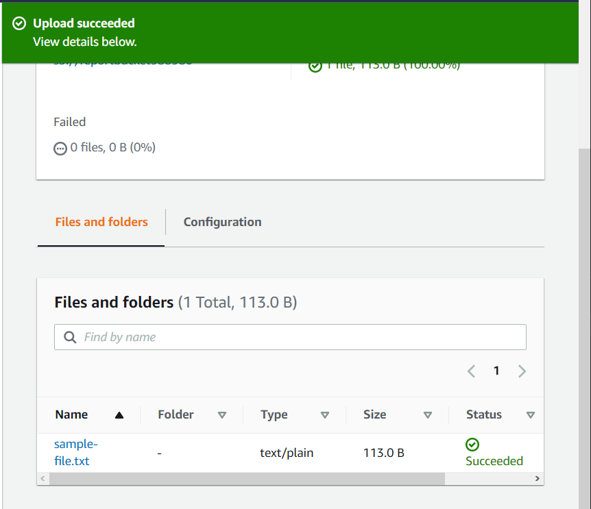

####    Lab 1: Introduction to Amazon Simple Storage Service (Amazon S3)

After completing this lab, we will know how to:

+   Create a bucket in Amazon S3
+   Add an object to a bucket
+   Manage access permissions on an object and a bucket
+   Create a bucket policy
+   Use bucket versioning
 ion of these instructions.

#####   Task 1: Creating a bucket

+   At the upper left of the AWS Management Console, on the Services menu, choose S3.
+   Choose Create bucket
+   In the General configuration section, enter the following as the Bucket name: reportbucket(NUMBER)
    Example bucket name: reportbucket987987
+   Leave Region at its default value.

#####   Task 2: Uploading an object to the bucket
+   Right-click the following link: new-report.png. Choose Save link as, and save the file to your desktop.
+   In the S3 Management Console, find and select the bucket name that starts with reportbucket.
+   Choose Upload
+   Choose Add files
+   Browse to and select the new-report.png file that you downloaded previously.
+   At the bottom of the page, choose Upload
+   Oue file is successfully uploaded when the green bar indicating Upload succeeded appears.

+   In the Upload: status section in the upper right, choose Close

#####   Task 3: Making an object public
+   In the reportbucket overview page, on the Objects tab, locate the new-report.png object, and choose the new-report.png file name.
The new-report.png overview page opens. The navigation in the upper left updates with a link to return to the bucket overview page.

+   In the Object overview section, locate and copy the Object URL link.

The link should look similar to the following: https://reportbucket987987.s3-us-west-2.amazonaws.com/new-report.png

+   Open a new browser tab and paste the object URL link into the address field, and then press Enter.
You receive an Access Denied error because objects in Amazon S3 are private by default.

Now that you've confirmed that the default security of Amazon S3 is private, you test how to make the object publicly accessible.

+   Keep the browser with the Access Denied error open, and return to the web browser tab with the S3 Management Console.
+   We should still be on the new-report.png Object overview tab.
+   In the upper right, choose the Object actions dropdown menu, you will notice that Make public via ACL is greyed out.
+   In the upper left of the page, choose the reportbucket name in the navigation to go back to the main reportbucket overview page.
+   Choose the Permissions tab.
+   We need to allow the use of ACLs first. Under Object Ownership choose Edit.
+   Choose ACLs enabled.
+   Choose Bucket owner preferred.

+   Choose the  check box next to I acknowledge that ACLs will be restored.
+   Choose Save Changes
+   Under Block public access (bucket settings), choose Edit to change the settings.
+   Clear the check box for the Block all public access option, and then leave all other options cleared.
+   Choose Save changes
+   A dialogue box opens asking you to confirm your changes. Enter confirm in the field, and then choose Confirm

A message that says Successfully edited Block Public Access settings for this bucket. displays at the top of the window.

+   Choose the Objects tab.
+   Choose the new-report.png file name.
+   At the upper right on the new-report.png overview page,choose the Object actions dropdown menu, and select Make public.
 Notice the warning: When public read access is enabled and not blocked by Block Public Access settings, anyone in the world can access the specified objects. This warning reminds you that if you make the object public, then everyone in the world will be able to read the object. 

+   Choose Make public and you should see the green banner Successfully edited public access at the top of the window.
+   In the upper right, choose Close to return to the new-report.png object overview.
+   Return to the browser tab that displayed Access Denied for the new-report.png object, and refresh the page.

+   Close the web browser tab that displays your new-report.png image, and return to the tab with the Amazon S3 Management Console.

#####   Task 4: Testing connectivity from the EC2 instance

+   On the Services menu, choose EC2.
+   On the EC2 Dashboard, under the Resources section, choose Instances (running).
+   Select the  check box for Bastion Host and choose Connect

+   In the Connect to instance window, select the Session Manager tab for the connection method.
+   Choose Connect
+   In the bastion host session, enter the following command to change to the home directory (/home/ssm-user/):
`cd ~`

The output returns you to the command prompt.

+   Enter the following command to verify that you are in the home directory:
`pwd`
The output should be as follows:
`/home/ssm-user`

+   Enter the following command to list all of your S3 buckets. 
`aws s3 ls`
  The output should look similar to the following:

  `2020-11-11 22:34:46 reportbucket987987`

+ In the following command, change (NUMBER) at the end of the reportbucket name to the name of the bucket you created. Enter your adjusted command to list all the objects in your reportbucket. 
`aws s3 ls s3://reportbucket(NUMBER)`

+   The command looks similar to the following: aws s3 ls <b>s3://reportbucket987987</b>

The output should look like the following:

`2020-11-11 15:46:34      86065 new-report.png`

+  Enter the following command to change directories into the reports directory.

`cd reports`
The output returns you to the command prompt.

+   Enter the following command to list the contents of the directory.
`ls`

The output shows some files created in your reports directory to test the application.

`dolphins.jpg files.zip report-test.txt  report-test1.txt report-test2.txt report-test3.txt  whale.jpg`

+   In the following command, change (NUMBER) at the end of the reportbucket name to the name of the bucket you created. Enter your adjusted command to see if you can copy a file to the S3 bucket.

`aws s3 cp report-test1.txt s3://reportbucket(NUMBER)`

The command looks similar to this: <b>aws s3 cp report-test1.txt s3://reportbucket987987</b>

The output indicates an upload failed error. This error occurs because you have read-only rights to the bucket and do not have the permissions to perform the PutObject action.

+   Leave this window open. and go back to browser tab with the AWS console.
In the next task, you create a bucket policy to add the PutObject permission.

#####   Task 5: Creating a bucket policy

+   Right-click the following link: sample-file.txt. Choose Save link as, and save the file to your desktop.
+   Return to the AWS Management Console, go to the Services menu, and select S3.
+   In the S3 Management Console tab, select the name of your bucket.
+   To upload the sample-file.txt file, choose Upload and use the same upload process that you used in task 2.

+   On the reportbucket overview page, choose the <b>sample-file.txt</b>file name. The <b>sample-file.txt </b>overview page opens.
+   Under the Object overview section, locate and copy the Object URL link.

+   In a new browser tab, paste the link into the address field, and then press Enter.

Once again, your browser displays an Access Denied message. You need to configure a bucket policy to grant access to all objects in the bucket without having to specify permissions on each object individually.
+   Keep this browser tab open, but return to the tab with the S3 Management Console.
+   Select Services and select IAM. In the left navigation, choose Roles.
+   In the Search field, enter      `EC2InstanceProfileRole `
+   This is the role that the EC2 instance uses to connect to Amazon S3.
+   Select EC2InstanceProfileRole. In the Summary section, copy the Role ARN to a text file to use in a later step.
It should look similar to the following: arn:aws:iam::596123517671:`role/EC2InstanceProfileRole`
+   Choose Services and S3, and return to the S3 Management Console.
+   Choose the reportbucket.

+   Choose the Permissions tab.
+   In the Permissions tab, scroll to the Bucket policy section, and choose Edit
+   Below the Policy examples and Policy generator buttons, find the Bucket ARN. Copy the Bucket ARN to a text file to use in a later step. 
+   It looks like the following:

`Bucket ARN
arn:aws:s3:::reportbucket987987`
+   Choose Policy generator
+   For Select Type of Policy, select S3 Bucket Policy.
+   For Effect, select Allow.
+   For Principal, paste the EC2 Role ARN that you copied to a text file in a previous step.
+   For AWS Service, keep the default setting of Amazon S3.
+   For Actions, select GetObject and PutObject.
+   For Amazon Resource Name (ARN), enter *
+   Choose Add Statement. The details of the statement you configured are added to a table below the button. You can add multiple statements to a policy.
+   Choose Generate Policy.

A new window displays the generated policy in JSON format. It should look similar to the following:
`{
    "Version": "2012-10-17",
    "Id": "Policy1604361694227",
    "Statement": [
        {
            "Sid": "Stmt1604361692117",
            "Effect": "Allow",
            "Principal": 
            {
                "AWS": "arn:aws:iam::416159072693:role/EC2InstanceProfileRole"
            },
            "Action": [
                "s3:GetObject",
                "s3:PutObject"
                ],
            "Resource": "*"
        }
    ]
}`

+   Copy the policy that you created to your clipboard.
+   Close the web browser tab, and return to the S3 Management Console tab with the Bucket policy editor.
+   Paste the bucket policy that you created into the Bucket policy editor.
+   In the Bucket policy editor, update the Resource value replacing * with the Bucket ARN you saved earlier followed by /*:
The updated Resource line in the lab policy should be similar to the following example:

`"Resource": "arn:aws:s3:::reportbucket987987/*"`
+   Choose Save changes.
+   Return to the AWS Systems Manager (Systems Manager) window. If your session has timed out, reconnect to Systems Manager using the previous steps in the lab.

Enter the following command to verify that you are in the /home/ssm-user/reports directory.
`pwd`
The output should be as follows:

`/home/ssm-user/reports`
+   In the command below, replace (NUMBER) with the number you used to create your bucket. Enter your adjusted command to list all objects in your reportbucket. 
`aws s3 ls s3://reportbucket(NUMBER)`

The command should look similar to the following: aws s3 ls s3://reportbucket987987

 The output should look similar to the following:
 sh-4.2$ aws s3 ls s3://reportbucket987987
`2020-11-02 23:20:27      86065 new-report.png`
2020-11-02 23:57:03         90 sample-file.txt
+   Enter the following command to list the contents of the reports directory.
`ls`

+   In the command below, replace (NUMBER) with the number you used to create your bucket. Enter your adjusted command to try copying the report-test1.txt file to the S3 bucket.
`aws s3 cp report-test1.txt s3://reportbucket(NUMBER)`
The command should look like the following: <b>aws s3 cp report-test1.txt s3://reportbucket987987</b>

The output returns the following:

`upload: ./report-test1.txt to s3://reportbucket987987/report-test1.txt`

+   `In the command below, replace (NUMBER) with the number you used to create your bucket. Enter your adjusted command to see if the file successfully uploaded to Amazon S3.

`aws s3 ls s3://reportbucket(NUMBER)`
The output should look similar to the following:

`2020-11-11 18:20:23      86065 new-report.png
2020-11-11 18:32:18         31 report-test1.txt
2020-11-11 18:20:22         90 sample-file.txt`
You have successfully uploaded (PutObject) a file from the EC2 instance to your S3 bucket.

+   In the command below, replace (NUMBER) with the number you used to create your bucket. Enter your adjusted command to retrieve (GetObject) a file from Amazon S3 to the EC2 instance.
`aws s3 cp s3://reportbucket(NUMBER)/sample-file.txt sample-file.txt`

 The output should look similar to the following:

`download: s3://reportbucket987987/sample-file.txt to ./sample-file.txt`
+   Enter the following command to see if the file is now in the /reports directory.
`ls`

The output should look similar to the following:

`dolphins.jpg  files.zip  report-test1.txt  report-test2.txt  report-test3.txt  sample-file.txt`
You now see the sample-file.txt in your file list. Congratulations! You have successfully uploaded and retrieved a file from Amazon EC2 to the S3 bucket.

+   Return to the browser tab that displayed the Access Denied error for the sample-file.txt, and refresh  the page.

+   Go to the AWS Policy Generator, and add another statement to the bucket policy allowing everyone (*) read access (GetObject). Take a moment to  generate this policy. This policy allows the EC2InstanceProfileRole to have access to the bucket while giving everyone access to read the objects via the browser.
`{
            "Sid": "Stmt1604428842806",
            "Effect": "Allow",
            "Principal": "*",
            "Action": "s3:GetObject",
            "Resource": "arn:aws:s3:::reportbucket987987/*"
}`

To test if your policy works, go to your browser with the Access Denied error and refresh it. If you can read the text, then congratulations! Your policy was successful. 
If not, look at the following policy for help. The modified policy should look like the following policy. Notice that there are two statements: one with the EC2InstanceProfileRole and one where the principal is "*" for everyone.

If you had trouble generating the policy on your own, you can copy he policy below and paste it into the BucketPolicy Editor. Remember to replace the existing EC2InstanceProfileRole ARN in the policy below with the EC2InstanceProfileRole ARN you copied in a previous step. Ensure that you replace the reportbucket example ARN with the bucket you created and the /* appears at the end of the Bucket ARN. See the last line of the policy as an example.

`{
    "Version": "2012-10-17",
    "Id": "Policy1604428844058",
    "Statement": [
        {
            "Sid": "Stmt1604428821481",
            "Effect": "Allow",
            "Principal": {
                "AWS": "arn:aws:iam::285058481724:role/EC2InstanceProfileRole"
            },
            "Action": [
                "s3:GetObject",
                "s3:PutObject"
            ],
            "Resource": "arn:aws:s3:::reportbucket987987/*"
        },
        {
            "Sid": "Stmt1604428842806",
            "Effect": "Allow",
            "Principal":
            "*",
            "Action": "s3:GetObject",
            "Resource": "arn:aws:s3:::reportbucket987987/*"
        }
         ]
}`
Leave the tab open with the sample-file.txt displayed. You return to this tab in the next task.
In this task, you created a bucket policy to allow specific access rights to your bucket. In the next section, you explore how to keep copies of files to prevent against accidental deletion.

#####   Task 6: Exploring versioning
+   We should be on the S3 bucket Permissions tab from the previous task. If you are not, choose the link to the bucket at the upper left of the screen to return to the bucket overview page.
+   On the reportbucket overview page, choose the Properties tab.
+   Under the Bucket Versioning section, click Edit select Enable then click Save changes.
+   Right-click this link, and save the text file to your computer using the same name as the text file in the previous task: sample-file.txt
+   In the Amazon S3 Management Console, on the reportbucket, choose the Objects tab.
Under the Objects section, find  Show versions.
+   Choose Upload and use the same upload process that you used in tasks 2 and 5 to upload the new sample-file.txt file.
+   Go to the browser tab that has the contents of the sample-file.txt file.
+   Make a note of the contents on the page, and then refresh  the page.
+   Close the web browser tab with the contents of the text file.
+   In the Amazon S3 Management Console, choose the sample-file.txt file name. The sample-file.txt overview page opens.
+   Choose the Versions tab, and then select the check box for the bottom version, which reads null. (This is not the latest version.)
+   Click Open.
You should now see the original version of the file using the Amazon S3 Management Console.

However, if you try to access the older version of the sample-file.txt file using the object URL link, you will receive an access denied message. This message is expected because the bucket policy you created in the previous task allows permission to access only the latest version of the object. In order to access a previous version of the object, you need to update your bucket policy to include the s3:GetObjectVersion permission. The following bucket policy example includes the additional s3:GetObjectVersion action that allows you to access the older version using the link. You do not need to update your bucket policy with this example to complete this lab. You can try to do this on your own after you complete the task.
`{
    "Id": "Policy1557511288767",
    "Version": "2012-10-17",
    "Statement": [
    {
        "Sid": "Stmt1557511286634",
        "Action": [
        "s3:GetObject",
        "s3:GetObjectVersion"
        ],
        "Effect": "Allow",
        "Resource": "arn:aws:s3:::reportbucket987987/*",
        "Principal": "*"
    }
    ]
}`
+   Return to the AWS Management Console tab, and choose the link for the bucket name at the upper left to return to the bucket overview tab.
+   Locate the  Show versions option, and toggle the button to on  to show the versions.
+   Next to Show versions, toggle the button to off  to return to the default object view.
+   Select the check box to the left of the sample-file.txt.
With the object selected, choose Delete
+   The Delete objects page appears.
+   At the bottom, in the Delete objects? section, enter delete and choose the Delete objects button to confirm deletion of the object.
+   In the upper right of the page, choose Close to return to the bucket overview.
The sample-file.txt object is no longer displayed in the bucket. 
However, if the object is deleted by mistake, you can use versioning to recover it.

+   Locate the  Show versions option, and toggle the button to on  to show the versions.

Notice that the sample-file.txt object is displayed again, but the most recent version is a Delete marker. The two previous versions are also listed. If versioning has been enabled on the bucket, objects are not immediately deleted. Instead, Amazon S3 inserts a delete marker, which becomes the current object version. The previous versions of the object are not removed. Refer to the Additional resources section at the end of the lab for links to more information about versioning.

+   Select the check box for the version of the sample-file.txt object with the Delete marker.
+   With the object selected, choose Delete
+   The Delete objects window appears.
+   At the bottom in the Permanently delete objects? section, enter permanently delete and choose the Delete objects button to confirm deletion of the object.
+   On the upper right of the page, choose Close to return to the bucket overview.
+   Next to Show versions, toggle the button to off  to return to the default object view.

Notice that the sample-file.txt object has been restored to the bucket. Removing the delete marker has effectively restored the object to its previous state. Refer to the Additional resources section at the end of the lab for links to more information about undeleting S3 objects.

+   To delete a specific version of the object, locate the  Show versions option, and toggle the button to on  to show the versions.
You should see two versions of the sample-file.txt object.

+   Select the check box for the latest version of the sample-file.txt object.
+   With the object selected, choose Delete
+   The Delete objects window appears.
+   At the bottom in the Permanently delete objects? section, enter permanently delete and choose the Delete objects button.
+   On the upper right of the page, choose Close to return to the bucket overview.

Notice that there is now only one version of the sample-file.txt file. When deleting a specific version of an object, no delete marker is created. The object is permanently deleted. Refer to the Additional resources section at the end of the lab for links to more information about deleting object versions in Amazon S3.

+   Next to Show versions, toggle the button to off  to return to the default object view.
+   Choose the sample-file.txt file name. The sample-file.txt overview page opens.
+   Copy the Object URL link displayed at the bottom of the window.
+   In a new browser tab, paste the link into the address field and then press Enter.
The browser page displays the text of the original version of the sample-file.txt object.

#####   Summary
You have successfully created an S3 bucket for your company to use to store report data from your EC2 instance. You created a bucket policy so that the EC2 instance can PutObjects and GetObject from the reportbucket, and you successfully tested uploading and downloading files from the EC2 instance to test the bucket policy. You have enabled versioning on the S3 bucket to protect against accidental object deletion. You have successfully completed the configuration for your EC2 reportbucket. Congratulations!