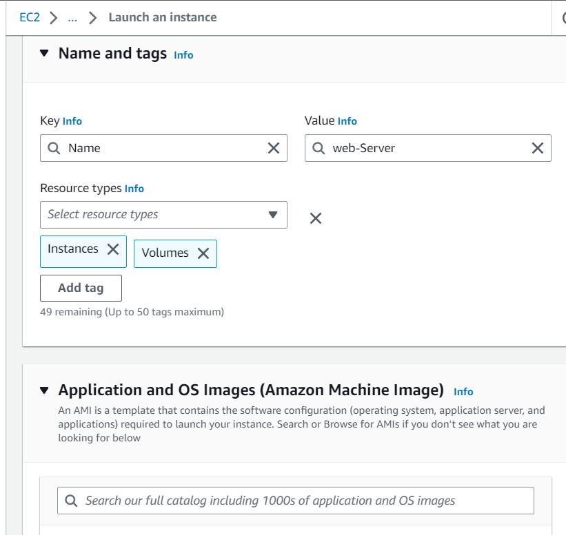
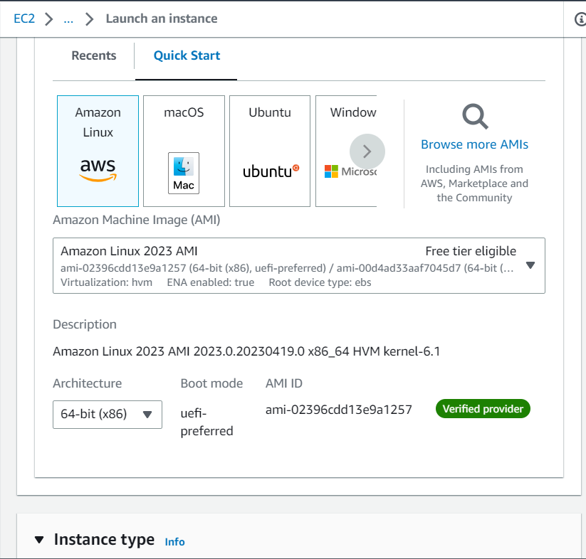
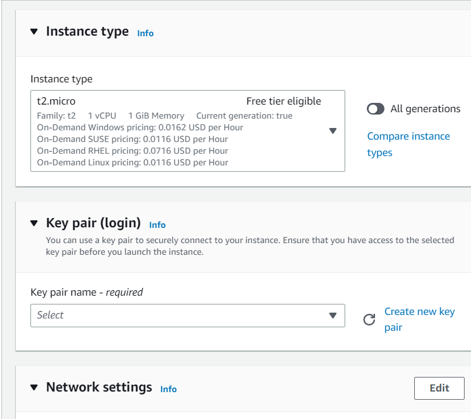
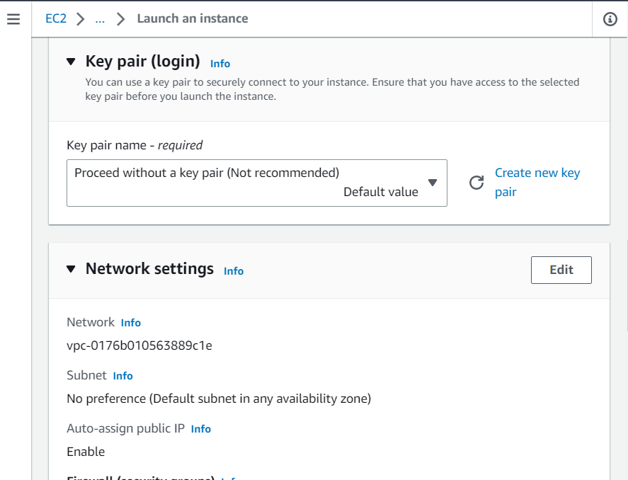
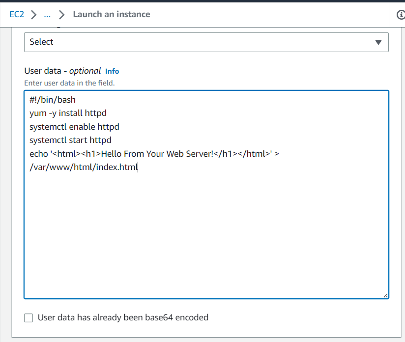
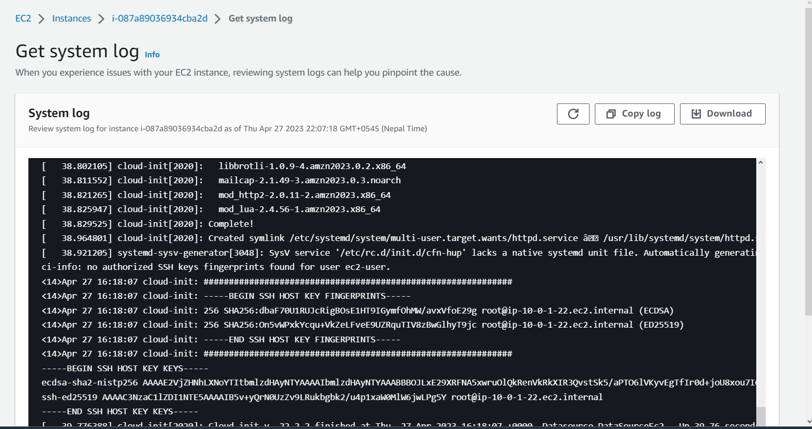
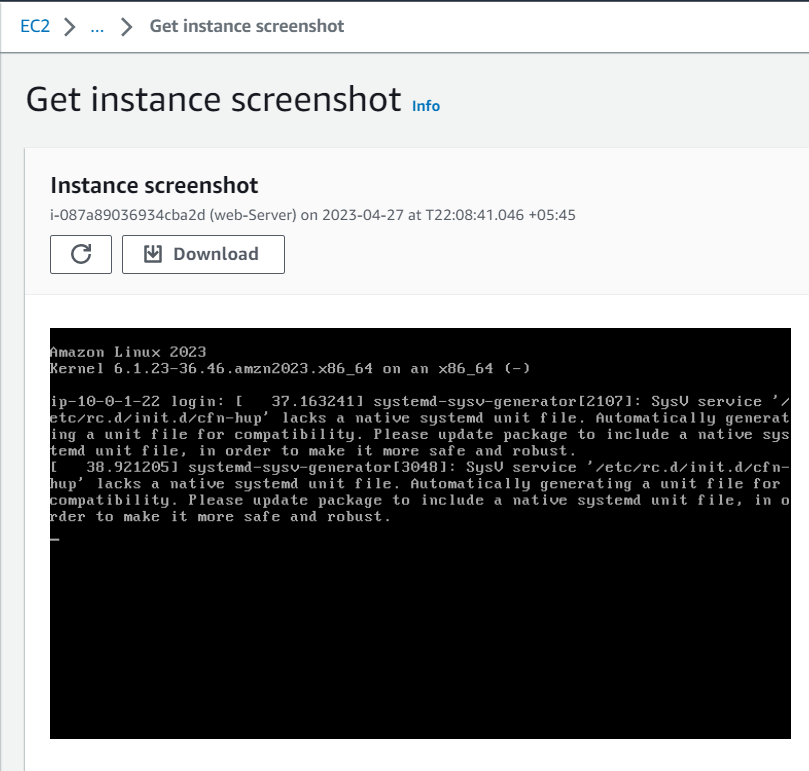
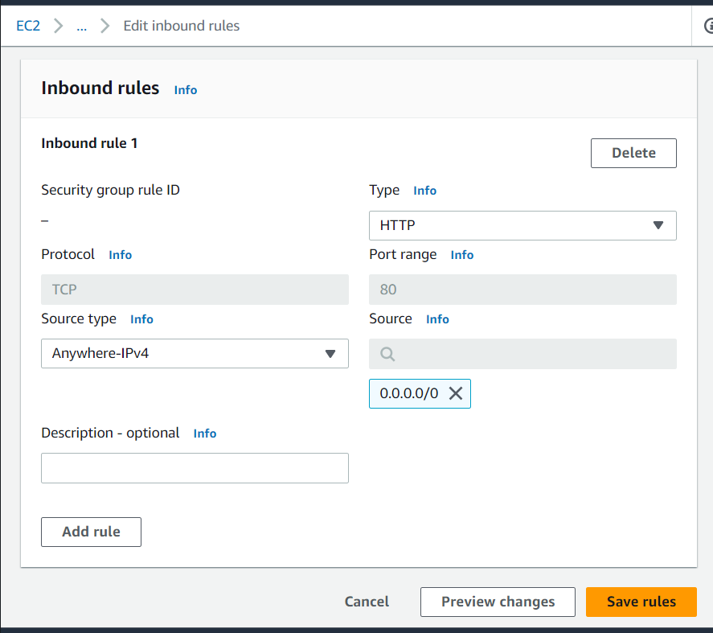
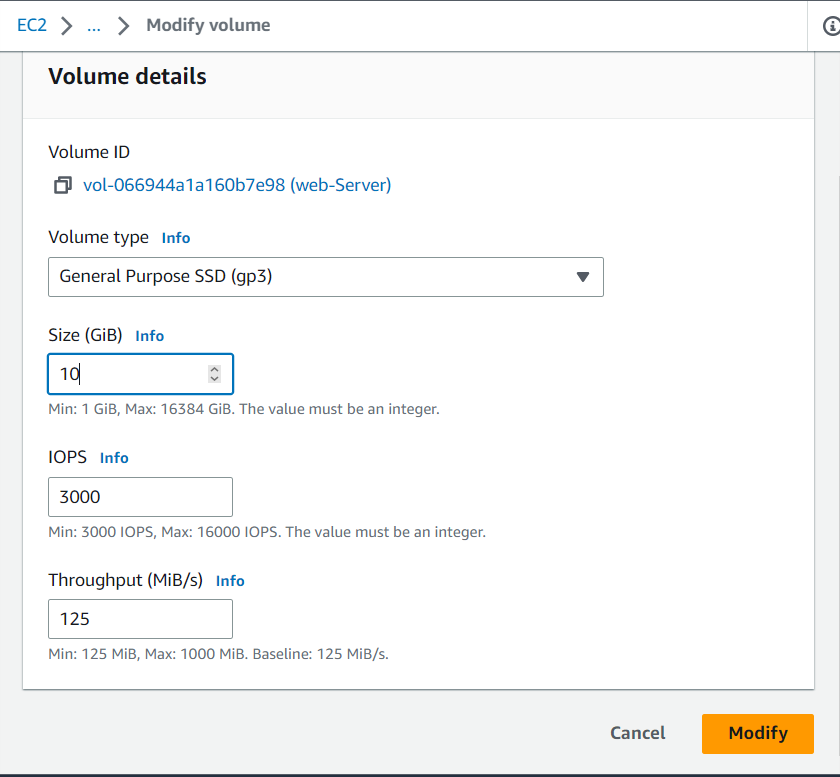

### Lab 2: Introduction to Amazon EC2

####    Task 1: Launching your EC2 instance

+   In the AWS Management Console on the Services menu, choose EC2.
+   In the left navigation pane, choose EC2 Dashboard to ensure that you are on the dashboard page.
+   Choose Launch instance, and then select Launch instance.

#####   Step 1: Name your EC2 instance
+   In the Name and tags section, for Name, enter Web-Server
+   Choose the Add additional tags link.
+   From the Resource types dropdown list, ensure that both Instances and Volumes are selected.

#####   Step 2: Choose an Amazon Machine Image (AMI)
An Amazon Machine Image (AMI) provides the information required to launch an instance, which is a virtual server in the cloud. An AMI includes the following:

+   A template for the root volume for the instance (for example, an operating system or an application server with applications)
+   Launch permissions that control which AWS accounts can use the AMI to launch instances
+   A block device mapping that specifies the volumes to attach to the instance when it is launched.

The Quick Start list contains the most commonly used AMIs. You can also create your own AMI or select an AMI from the AWS Marketplace, an online store where you can sell or buy software that runs on AWS.
+   Locate the Application and OS Images (Amazon Machine Image) section. It is just below the Name and tags section.
+   In the AMI Machine Image (AMI) box, notice that Amazon Linux 2 AMI is selected by default. Keep this setting.

#####   Step 3: Choose an instance type
Amazon EC2 provides a wide selection of instance types that are optimized to fit different use cases. Instance types comprise varying combinations of CPU, memory, storage, and networking capacity and give you the flexibility to choose the appropriate mix of resources for your applications. Each instance type includes one or more instance sizes so that you can scale your resources to the requirements of your target workload.

In this step, you choose a t2.micro instance. This instance type has 1 virtual CPU and 1 GiB of memory.
+   Keep the default instance type, t2.micro.

#####   Step 4: Configure a key pair
Amazon EC2 uses public key cryptography to encrypt and decrypt login information. To log in to your instance, you must create a key pair, specify the name of the key pair when you launch the instance, and provide the private key when you connect to the instance.

In this lab, you do not log in to your instance, so you do not require a key pair.
+   In the Key pair (login) section, from the Key pair name - required dropdown list, choose Proceed without a key pair.

#####   Step 5: Configure the network settings

You use this pane to configure networking settings.

The virtual private cloud (VPC) indicates which VPC you want to launch the instance into. You can have multiple VPCs, including different ones for development, testing, and production.

 

+   In the Network settings section, choose Edit.

+   From the VPC - required dropdown list, choose Lab VPC.

The Lab VPC was created using an AWS CloudFormation template during the setup process of your lab. This VPC includes two public subnets in two different Availability Zones.

+   In the Network settings section, for Security group name - required, enter Web Server security group
+   To delete the existing SSH rule, next to Security group rule 1, choose Remove.

#####   Step 6: Add storage

Amazon EC2 stores data on a network-attached virtual disk called Amazon Elastic Block Store (Amazon EBS).

You launch the EC2 instance using a default 8 GiB disk volume. This is your root volume (also known as a boot volume).
+   In the Configure storage pane, keep the default storage configuration.

#####   Step 7: Configure advanced details
+   Expand the Advanced details pane.
+   From the Termination protection dropdown list, choose  Enable.
+   Copy the following commands, and paste them into theIn the User data text box.

`#!/bin/bash
yum -y install httpd
systemctl enable httpd
systemctl start httpd
echo '<html><h1>Hello From Your Web
Server!</h1></html>' > /var/www/html/index.html`

The script does the following:

+   Install an Apache web server (httpd)
+   Configure the web server to automatically start on boot
+   Activate the Web server
+   Create a simple web page
 

#####   Step 8: Launch an EC2 instance

+   In the Summary section, choose Launch instance.
+   Choose View all instances

The instance appears in a Pending state, which means that it is being launched. It then changes to Running, which indicates that the instance has started booting. There will be a short time before you can access the instance.

The instance receives a public Domain Name System (DNS) name that you can use to contact the instance from the Internet.

Next to your Web-Server, select the  check box. The Details tab displays detailed information about your instance.

 To view more information in the Details tab, drag the window divider upward.
 Review the information displayed in the Details, Security and Networking tabs.

 

+   Wait for your instance to display the following:

Note: Refresh if needed.
+   Instance State:  Running
+   Status Checks:   2/2 checks passed

####    Task 2: Monitoring your instance
+   Choose the Status checks tab.

+   Choose the Monitoring tab. 
+   At the top of the page, choose the Actions  dropdown menu. Select Monitor and troubleshoot  Get system log.
`
+   Scroll through the output, and note that the HTTP package was installed from the user data that you added when you created the instance. The entries in the system log should be similar to the following example:
`[   26.760639] cloud-init[3280]: Installed:
[   26.770051] cloud-init[3280]: httpd.x86_64 0:2.4.52-1.amzn2
[   26.777748] cloud-init[3280]: Dependency Installed:
[   26.781750] cloud-init[3280]: apr.x86_64 0:1.7.0-9.amzn2
[   26.793739] cloud-init[3280]: apr-util.x86_64 0:1.6.1-5.amzn2.0.2
[   26.796595] 
cloud-init[3280]: apr-util-bdb.x86_64 0:1.6.1-5.amzn2.0.2
[   26.805964] cloud-init[3280]: generic-logos-httpd.noarch 0:18.0.0-4.amzn2
[   26.817765] cloud-init[3280]:httpd-filesystem.noarch 0:2.4.52-1.amzn2
[   26.829760] cloud-init[3280]: httpd-tools.x86_64 0:2.4.52-1.amzn2
[   26.833753] cloud-init[3280]: mailcap.noarch 0:2.1.41-2.amzn2
[   26.845761] cloud-init[3280]: mod_http2.x86_64 0:1.15.19-1.amzn2.0.1
[   26.849762] cloud-init[3280]: Complete!`
+   To return to the Amazon EC2 dashboard, choose Cancel.
+   With your Web-Server selected, choose the Actions  dropdown menu, and select Monitor and troubleshoot  Get instance screenshot.

+   At the bottom of the page, choose Cancel.

####    Task 3: Updating your security group and accessing the web server

+   Select the check box next to the Amazon EC2 Web-Server that you created, and then choose the Details tab.

+   Copy the Public IPv4 address of your instance to your clipboard.
+   In your web browser, open a new tab, paste the IP address that you just copied, and then press Enter.

Question: Are you able to access your web server? Why not?

You are not currently able to access your web server because the security group is not permitting inbound traffic on port 80, which is used for HTTP web requests. This is a demonstration of how to use a security group as a firewall to restrict the network traffic that is allowed in and out of an instance.

To correct this issue, you now update the security group to permit web traffic on port 80.

+   Keep the browser tab open, but return to the EC2 Management Console tab.

+   In the left navigation pane, choose Security Groups.

+   Next to Web Server security group, select the  check box.

+   Choose the Inbound rules tab.

+   The security group currently has no rules.
+   Choose Edit inbound rules, and then choose Add rule and configure the following options:

Type: Choose HTTP.
Source: Choose Anywhere-IPv4.

+   Choose Save rules

+   Return to the web server browser tab with the public IPv4 address that you previously opened, and choose  to refresh the page.

You should see the message Hello From Your Web Server!

####    Task 4: Resizing your instance - instance type and EBS volume
As your needs change, you might find that your instance is over utilized (too small) or under utilized (too large). If so, you can change the instance type. For example, if a t2.micro instance is too small for its workload, you can change it to an m5.medium instance. Similarly, you can change the size of a disk.
#####   Stop your instance
Before you can resize an instance, you must stop it.

When you stop an instance, it is shut down. There is no charge for a stopped EC2 instance, but the storage charge for attached EBS volumes remains.
+    On the EC2 Management Console, in the left navigation pane, choose Instances.

+   The  check box next to Web Server should already be selected.

+   At the top of the page, select the Instance state  dropdown menu, and choose Stop instance.
+   Wait for the Instance state to display Stopped.
#####   Change the instance type

In the Stop instance? pop-up window, choose Stop.

Your instance performs a normal shutdown and then stops running.
+   Select the check box next to your Web-Server. From the Actions  dropdown menu, select Instance settings  Change instance type, and then configure the following option:

+   Instance type: Select t2.nano.

+   Choose Apply.

When the instance is started again, it is a t2.nano instance.    

#####   Resize the EBS volume
+   In the left navigation menu, choose Volumes.

+   Select the check box for the one volume that is listed, which is attached to your Web-Server instance.

+   In the Actions  dropdown menu, select Modify Volume.

+   The disk volume currently has a size of 8 GiB. You now increase the size of this disk.

+   Change the Size (GiB) to 10

+   Choose Modify.

#####   Start the resized instance
You now start the instance again, which now has less memory but more disk space.

+   In left navigation pane, choose Instances. Next to your Web-Server, select the  check box.
+   From the Instance state  dropdown menu, choose Start instance.

####    Task 5: Exploring EC2 limits
Amazon EC2 provides different resources that you can use. These resources include images, instances, volumes, and snapshots. When you create an AWS account, there are default limits on these resources on a per-Region basis.
+   In the left navigation pane, choose Limits.

Note: There is a limit on the number of instances that you can launch in this Region. When launching an instance, the request must not cause your usage to exceed the current instance limit in that Region.

You can request an increase for many of these limits.

 