##  Introduction to Cloud 101

### Module 1
#####   Why learn about the cloud

+   Demand for cloud skills is increasing
+   Cloud computing skills are relevant for all IT professionals
+   Cloud certification validates knowledge and skills

### Module2
#####   Objectives
+   Define cloud computing
+   Describe the basics of cloud computing
+   Discuss the benefits of cloud computing
+   Identify cloud service models and cloud deployment models

#####   Why cloud computing?
+   It assests as programmatic resources to quickly set up and tear doen resources
+  Access resources dynamically for agility and flexibility to meet customer needs
+   Pay-as-you-go to test and use the system without being fully commited 

#####   Who uses AWS?
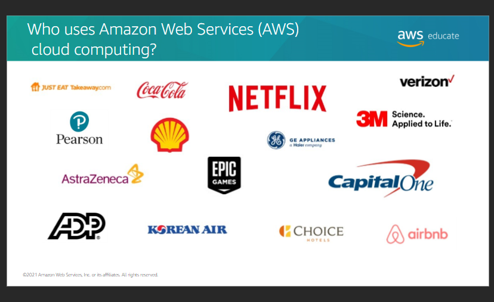

#####   History
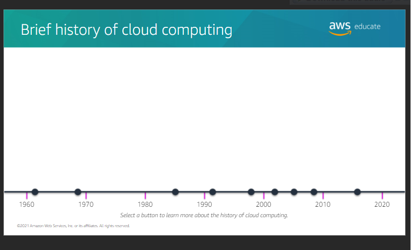

#####   Client Server model
Model computing is based on the client-server model
+   A client can be web browser or desktop application that a person interacts with to make requests to computer servers.
+   A server can be services such as Amazon Elastic Compute Cloud(Amazon EC2), a type of virtual server.

##### Six benefis of cloud computing

1. Trade upfront expense for variable expense
2. Stop spending money to run and maintain data centers
3. Stop guessing capacity
4. Benefit from massice economies of scale
5. Increase speed and agility
6. Go global in minutes
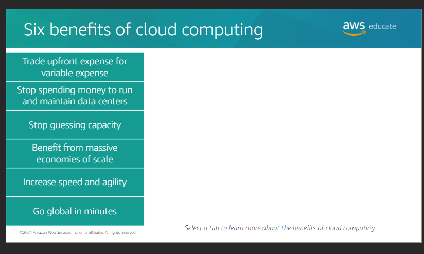

#####   Deploying to the cloud
Cloud service and deployment methods provide different levels of control, flexibility and management.

Deployment method include
+   `Infrastructure as a service (IaaS)`: IaaS contains the basic building blocks for cloud IT. It typically provides access to networking features, computers(Virtual or on dedicated hardware), and data storage space. Infrastructure as a servive provides the highest levl of flexibility and management cinrol over your IT resources.
+   `Platform as a service (Paas)`: Itremoves the need for organizations to manage the underlying infrastructure. They can focus on the deployment and management of applications. These tools give developers the ability to be more efficient because they dont need to worry about resource procurement, capacity planing, software maintenance, and patching

+   `Software as a service(Saas)`: It is a completed software product that the service provider runs and manages. With a SaaS offering, you donot have to think about how the service is maintained or how the underlying infrastructure is managed. Yu only must think about how you wil use that particular piece of software.

Deplyoment(models) strategies include
+   <u>Cloud</u>: you can migrate existing applications to the cloud, or you can design and build new application in the cloud. You can build hose application on low-level infrastructure that requires your IT staff to manage them. Alternatively, you can build them by using higher-level services tha reduce the management, architecting, and scaling requirements of the core infrastructure.

+   <u>Hybrid</u>: In this, cloud-based resources are conneced to on-premises infrastructure. You can integrate cloud-based resources wih legacy IT application. You migh want to use this approach in a number of situations. For example, you have legacy appliacations that are better maintained on premises, or goverment regulations require your bussiness o keep certain records on premises.
+  <u> On-premises</u>: It is also known as private cloud deployment. In this model, resources are deployed on premises by using virualization and resource management tools, Increase resource utilization by using application management and virtualizatuon technologies.

#### End of module2

### Module3
<u>Objectives</u>
1.  Discuss the history of AWS cloud computing
2.  Describe the AWS global infrastructure
3.  Discuss the customer and AWS parts of the shared responsibility model
4.  Describe the Well-Architected Framework and discuss how to apply the pillars
5.  Define the total cost of ownership and billing considerations

####    AWS offerings

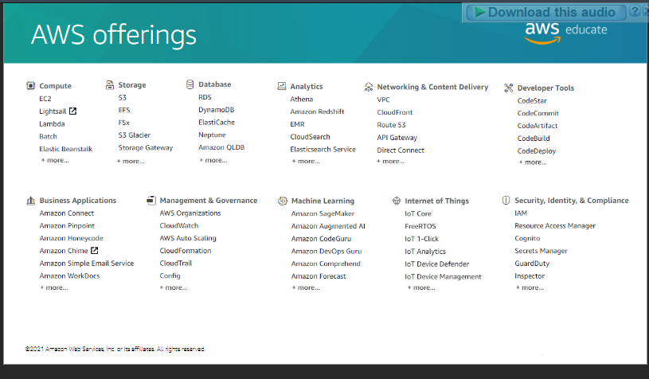

#### AWS benefits
+   On-demand access to over 175 services cloud-based services
+   pay-as-you-go pricing
+   No upfront capital expenses or commitements
    +   The ability to try a lo of experiments
    +   Not having to live with the collateral damage of failed experiments.
+   Tool box of high-end services

####    Brief history of AWS
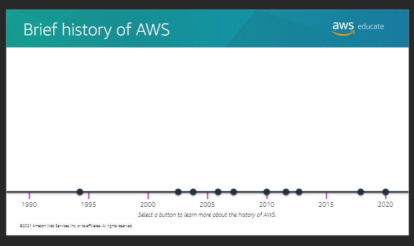

####    AWS is the leader of cloud computing
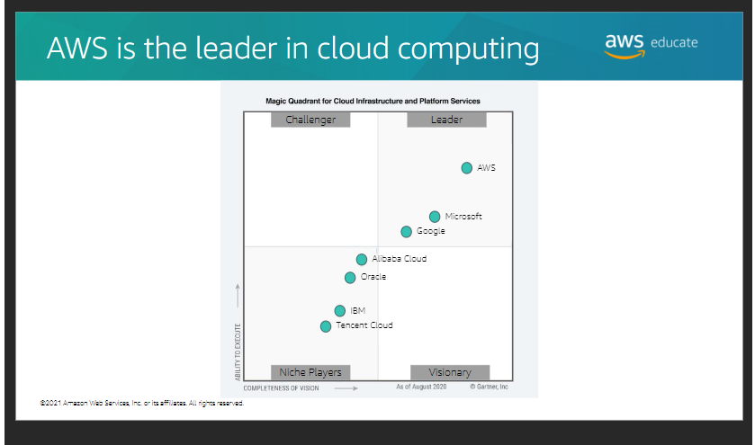

####    AWS Global Infrastructure

`components`: Regions, Availability zones and Edge Location

####    Planning for failure
+   Storage : When a file is stored in Amazon S3, the file is reduntantly copied into every Availability Zone in that Region. If one Availability Zone goes down, you still have two copies of that available for you to use.

+   Compute : It is a best practice to spread out your computing resources across multiple Availability Zones to guarentee high availability. So if one Avaialability Zones goes down, your architecture is still up and running.
+   Databases : You can configure your database for Multi-AZ deplyoment. If your Availability Zone wih your primary database fails, one of he standby databases in a healthy Availability Zpne automatically becomes your new primary database. Therefore, your architecture is still functioning.

####    AWS Global Infrastructure benefits

1. `Performance` :  AWS Global Infrastructure Offers high-performing, low-latency cloud infrastructure with virtually unlimited capacity, which provides high availability.
2.  `Availability` : Availability zones are designed for physical redundancy and to provide resilience. They provide uninterrupted performance, even in the event of power outages, internet downtime, floods, and other natural disasters.
3.  `Security` : The infrastructure is monitored 24/7 to help ensure the confidentiality, integrity, and available of AWS customers data. Customers can build on the most secure global infrastructure and know that they always own theit data. They can encrypt their data, move it, ad manage retention.
4.  `Relability` : AWS gloabl infrastructure is designed and built for redundancy and reliability, from regions to networking links to load balancers to routers to filmware.
5.  `Scalability` : With the AWS Global Infrastructure, companies can be flexible and take adavantage of the conceptually infinite scalabililty of the cloud. Companies can quickly get resources as they need them, deployinf hundreds or even thousands of servers in minutes.
6. ` Low Cost `: It provides the industry's most extensice data center footprint. As a result, more customers can benefits from cloud economics and reduce the Total Cost of Ownership (TCP) of their overall IT infrastructure.

####    Shared Responsibility
- protect cloud environment
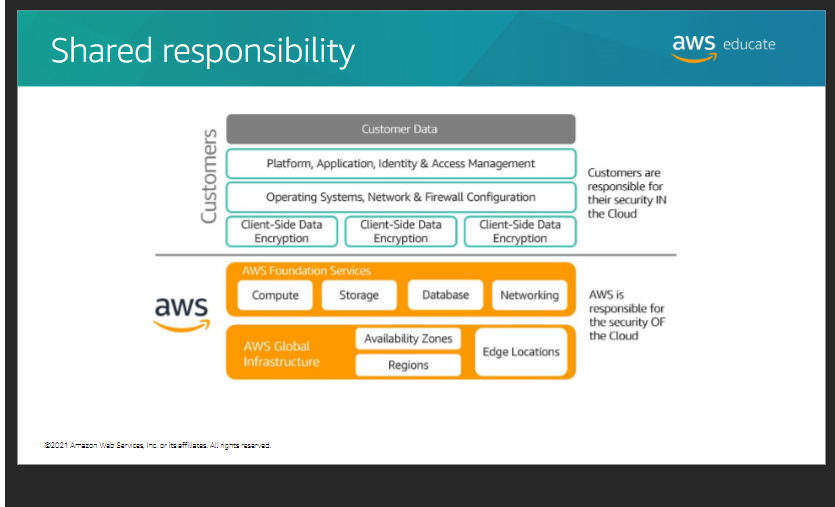

####    AWS Well-Architeced tool

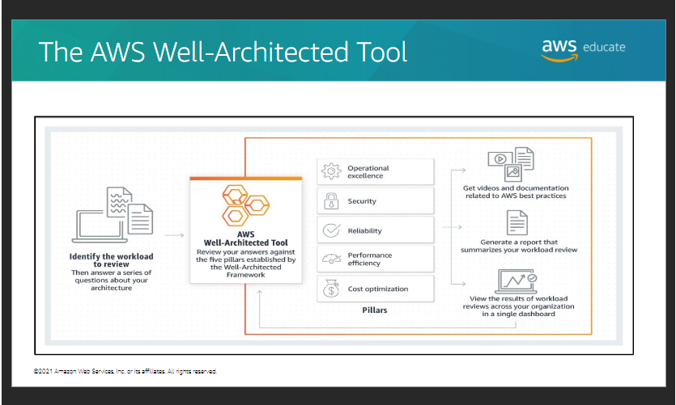

The Total Cost of Ownership(TCO) is a financial metric that is used to estimate and compare direct and indirect costs of a product or service. It typically includes the actual costs of:
+   Procurement
+   Management
+   Maintenance
+   Decommissioning of hardware resources

####    Total Cost of Ownership
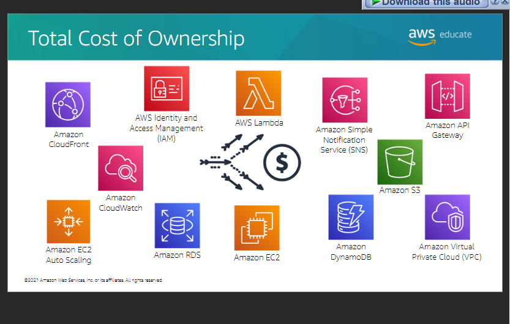

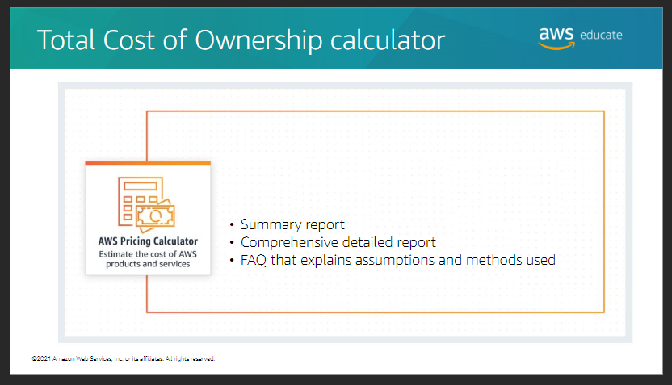

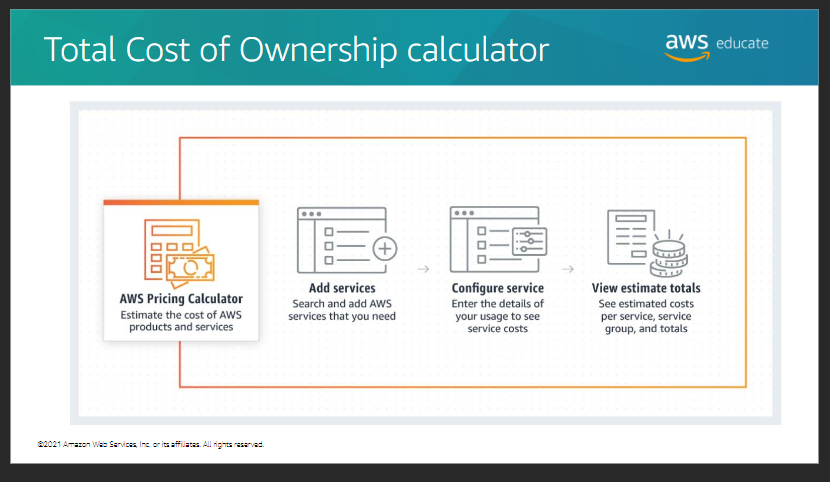

####    AWS pricing model
+   Pay-as-you-go 
+   Save when you reserve
+   Pay less by using more

####    AWS Free Tier
Save money as you learn and experiment with AWS Free Tier

+   Always free : donot expire and are available to all AWS customers.
+   12 months free : access to some service for only 12 months.
+   Trials : start from date we activate a particular service and last specific time.

####    AWS Billing Dashboard

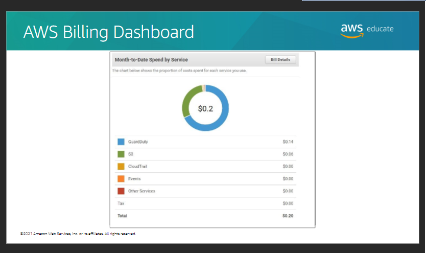

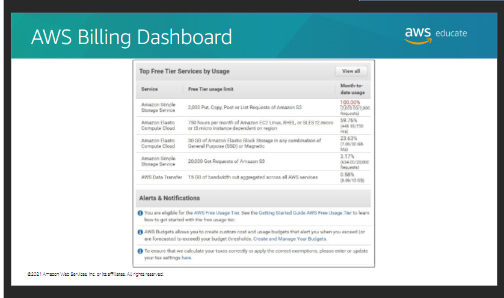

`Billing example` : 
Amazon EC2 : 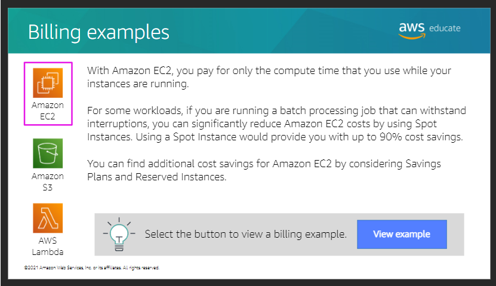
Amazon S3 :  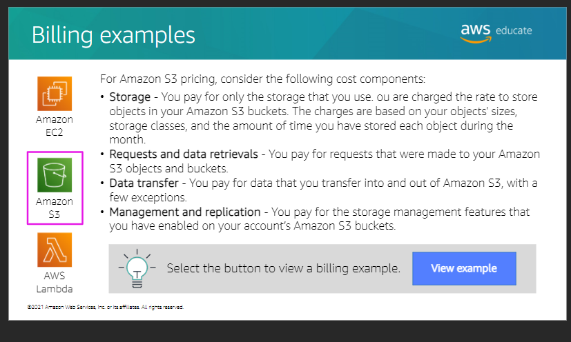
AWSLambda :
 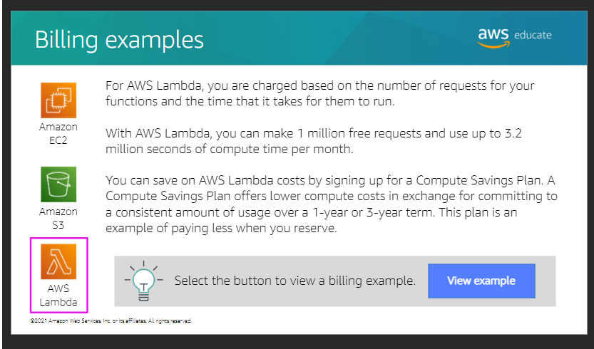

` End of module3`

### Module4
#####   AWS Core Services

Lets discuss the objective of module4
+   Define the different types of services
+   Identify the main categories of services as par of an architecture
+   Describe each service, its use, features, and benefits.

#####   Monilithic architecture

Application:
+   Transmit data
+   Fulfill request
+   Application code

Components:
+   Server
+   Databases
+   User interface
+   Bussiness logic

In this architecture if a single component is failed, it failed then other application also fails. It is also possible the whole component to be failed.

#####   To maintain application availability if single component fails, we can use Microservices archiecture

In this, component are lossely couple. If single component fails other doesnot stop functioning.

#####   Types of services
1. <i>Managed services</i>: A managed services is a way to describe the services that require you to manage infrastructure managemen tasks like patching, backup, and repair. These services gran you virtual access to the underlying operating sysem and services. With the managed services, you are responsible for scaling and building for high availability.

2. <i>Fully managed services</i> : It is a way to describe the services that automate infrastructure management tasks that AWS handles,like patching, backup, and repair. These services dono grant you any virtual access to he underlying operating system or servers. With a fully managed service, you are still responsible for scaling and building for high availability.

3.  <i>Serverless services </i>: It is a way to describe the services, practices, and srategies that you can use to build more agile applications. In this way, you can innovate and response to change faster. With serverless services, AWS handles infrastructure management tasks like capacity provisioning and patching so that you can focus on building applications ha serve your customers. Serverless services come with automatic scaling, built in high availability, and pay-for-value biling model.

####    Core service architecture

+   Browser
+   Amazon VPC(virtual private cloud): 
    1. What does Amazon VPC do?
    It is a service tha you use to launch AWS resources in a logically solated virtual nework that you define. As a foundational AWS services, Amazon VPC makes it easy to customize your VPC's network configuration. You can create a public-facing subne for your web servers that have access to the internet. You can also use Amazon VPC to place your backend systems, such as daabases or applicatuon servers, in a private-facing subnet with no internet access. With Amazon VPC, you can use multiple layers of security to help control access to Amazon EC2 instances in each subnet. These layers include security groups and nework access control lists(network ACLs).

    2.  What problem does Amazon VPC solve?
        It provides features that you can use to increase and monitor the security for your VPC on demand. Therefore, you can create a data center as you need it and terminate it when you no longer need it.

    3.  Benefits of Amazon VPC
    +   It provides advanced security features that you can use to perform inbound and outbound filtering at the instance and subnets levels.

    +   With simple setup of Amazon VPC, you spend less time setting up, managing, and validating. Therefore, you can concenrate on building applications that run in your VPCs.
    +    It helps you control your virtual networking environment. By using Amazon VPC, you can choose your own IP Address range, create your own subnets, and configure routr tables to any available gateways.

    4. How can I architect a cloud solution using Amazon VPC?
       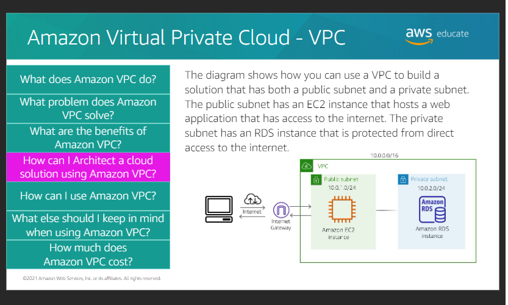

    5.    How can I use Amazon VPC?

    +    Host a simple website
    +  Host multi-tier web applications
    +    Back up and recover
    +    Extend your corporate network   

    6.   What else should I keep in mind when using Amazon VPC?

    When you creae a new Amazon VPC, you can have the option to create one by using a template or create one from scratch.
    When you create one from scratch, auomatically it will create a route table, a network ACL, and a security group. Then you configure them according to your needs.
    If you must delete a VPC, be sure to first terminate any EC2 or RDS instances that you have provisioned in the VPC.

    7.    How much does Amazon VPC costs?
 
 
+   Amazon Elastic Compute Cloud EC2 : Public subnet

    1. What does Amazon EC2 do?
    
 It is a web service that provides secure, resizable compute capacity in the cloud. It is designed to make web-scale cloud compuing easier for developers. You can use the simple web interface of Amzaon EC2 to obtain and configure capacity with minimal fricion. It provides you with complete contol of your computing resources, and you can run it on the proven computing environment of amazon.
 

    2. What problem does Amazon EC2 solve?
    It solves the problem of predicting upfront needs. Therefore, you dpnt need to know how much compute capacity or how much hard drive volume you will need when you set up your architecture. You can 
    scaleup and down as you need to.   

    3.   What are the benefits of Amazon EC2?
    +   You can provision an EC2 instance in as little as 5 minutes. It gives you the options to select the right CPU,storage, and operating system for your specific needs.

    +   With Amazon EC2, you can cgange the volume size and the instance type without terminating the insance.  

    +   You can use Amazon EC2,you can change the volume size and the instance type without terminating the instance.

    +   You can use Amazon EC2 to scaleup and scaledown to meet seasonal needs. You dont need to have extra servers on hand that are used for only a few months out of the year.

4.  How can I use Amazon EC2?
    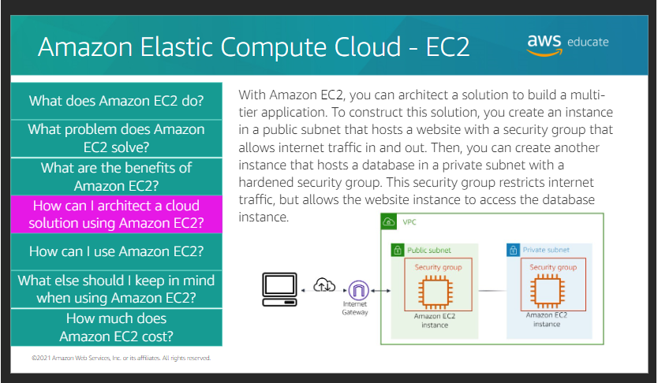

5.  How can I use Amaazon EC2?
    1.  Host multi-tier applications
    2.  Backup and disaster recovery
    3.  On-demand computing
    4.  Host databses

 6. What else should I keep in mind when using Amazon EC2?
 
   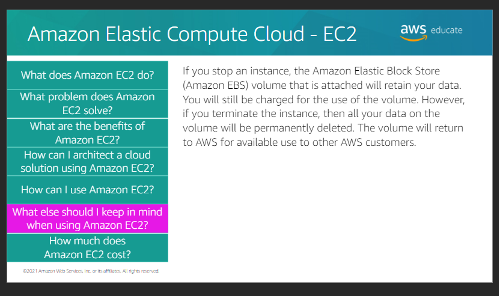 

7.  How much does Amazon EC2 costs?
    1.  On-demand instances
    2.  spot instances
    3.  Reserved Instances

+   Amazon RDS :Private subnet    