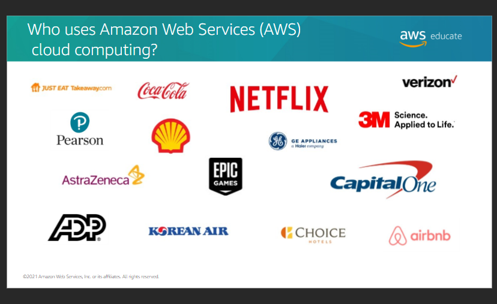
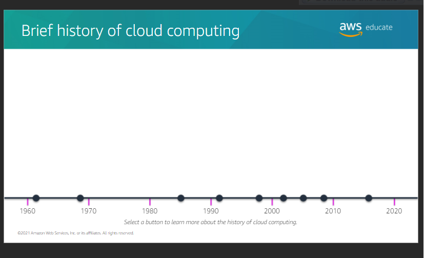
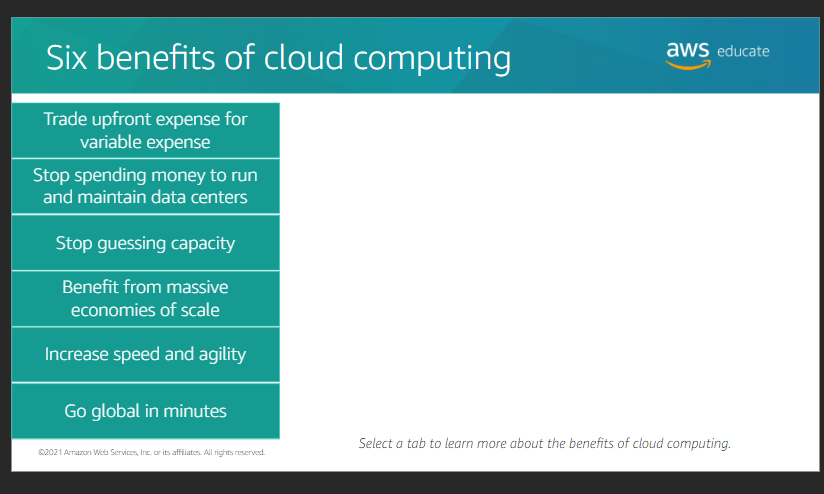

##  Introduction to Cloud 101

### Module 1
#####   Why learn about the cloud

+   Demand for cloud skills is increasing
+   Cloud computing skills are relevant for all IT professionals
+   Cloud certification validates knowledge and skills

### Module2
#####   Objectives
+   Define cloud computing
+   Describe the basics of cloud computing
+   Discuss the benefits of cloud computing
+   Identify cloud service models and cloud deployment models

#####   Why cloud computing?
+   It assests as programmatic resources to quickly set up and tear doen resources
+  Access resources dynamically for agility and flexibility to meet customer needs
+   Pay-as-you-go to test and use the system without being fully commited 

#####   Who uses AWS?

#####   History

#####   Client Server model
Model computing is based on the client-server model
+   A client can be web browser or desktop application that a person interacts with to make requests to computer servers.
+   A server can be services such as Amazon Elastic Compute Cloud(Amazon EC2), a type of virtual server.

##### Six benefis of cloud computing

1. Trade upfront expense for variable expense
2. Stop spending money to run and maintain data centers
3. Stop guessing capacity
4. Benefit from massice economies of scale
5. Increase speed and agility
6. Go global in minutes

#####   Deploying to the cloud
