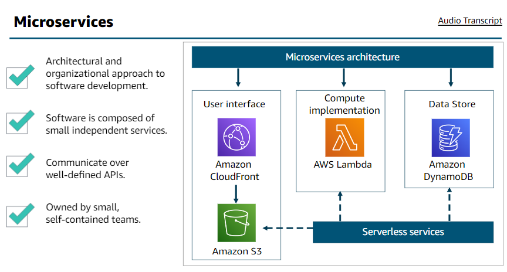
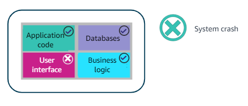
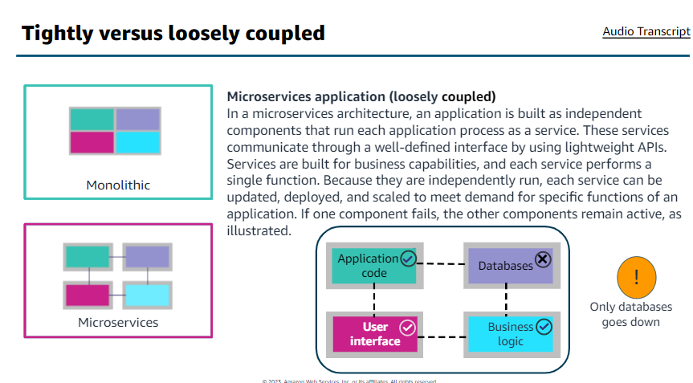

### Introduction to Serverless

+       Microservices
    +   Architectural and organizational approach to software development
    +   Software is composed of small independent services.
    +   Communicate over well-defined APIs.
    +   Owned by small, self-contained teams.

    

#####   Tightly versus loosely coupled
1.      Monolithic
    +   Tightly coupled
    +   In this application, if one piece were to fail, the entire application would crash, as this example illustrates. If there is a spike in demand, the entire architecture must be scaled. Adding features to a monolithic application becomes more complex as time goes on. Pieces of the code base must work with each other to sync properly.

    

2.      Microservices
 

#####   Benefits of microservices
+   use public APIs
+   use the right tool for the job
+   secure your services
+   be a good citizen
+   company transformation
+   automate everything

+       Serverless  

+       Event driven architectures
+       Hybrid methods