### Introduction to Serverless

+       Microservices
    +   Architectural and organizational approach to software development
    +   Software is composed of small independent services.
    +   Communicate over well-defined APIs.
    +   Owned by small, self-contained teams.

    

#####   Tightly versus loosely coupled
1.      Monolithic
    +   Tightly coupled
    +   In this application, if one piece were to fail, the entire application would crash, as this example illustrates. If there is a spike in demand, the entire architecture must be scaled. Adding features to a monolithic application becomes more complex as time goes on. Pieces of the code base must work with each other to sync properly.

    

2.      Microservices
 

#####   Benefits of microservices
+   use public APIs

+   use the right tool for the job

+   secure your services

+   be a good citizen

+   company transformation

+   automate everything
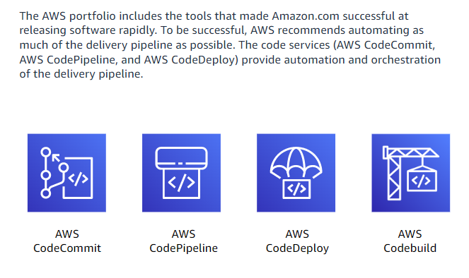

#####   Downside of monoliths
All processes are tightly coupled and run as a single service.
Adding or improving a monilithic application's features becomes more complex as the code base grows.
Dependent and tightly coupled processes increase the impact of a single process failure.

+       Serverless  
Build and run applications and services without thinking about servers.
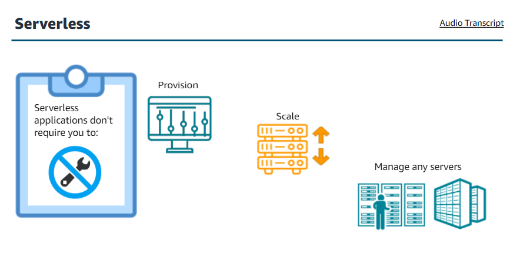

We can build them for nearly any type of application or backend service, and everything required to run and scale your application with high availability is handled for you.
Developers can focus on their core product. 
Not worrying about managing and operating servers or runtimes.

#####   Benefits
1.   No server management
AWS founded the concept of serverless on the following principles:
When adapting a serverless service for building a serverless architecture, these ideals are fundamental to serverless strategy.

2.   Pay-for-value services
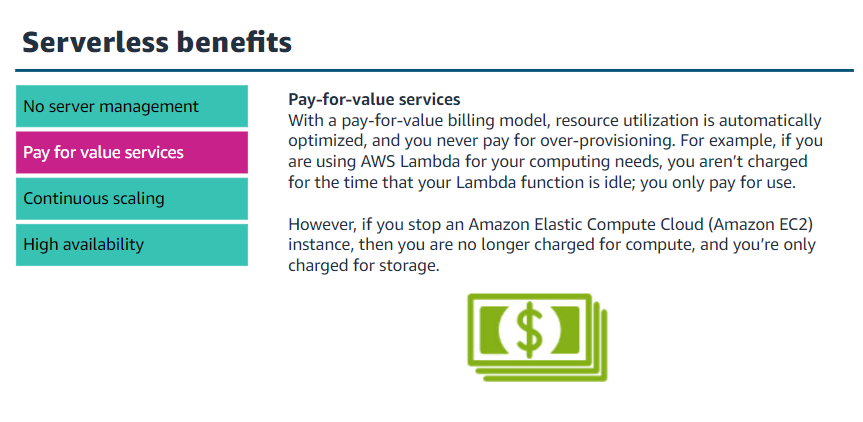

3.   Continuous scaling
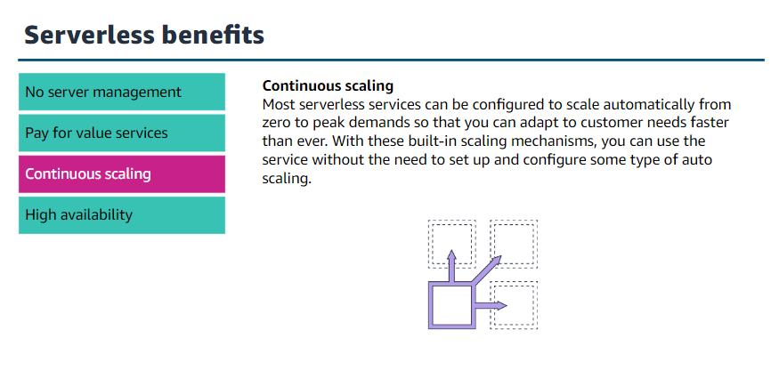

4.   High availability
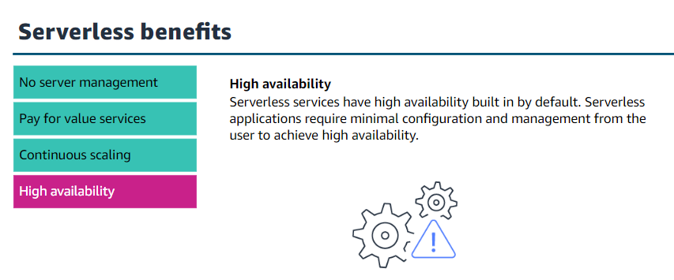

5.       Event driven architectures

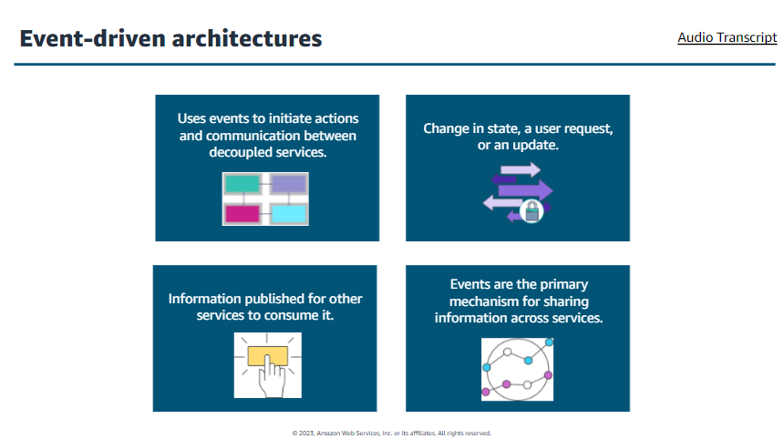

##### Benefits
+       Scale and fail independently
    By decoupling your services, they are only aware of the event router, not each other. This means that your services are interoperable, but if one service has a failure, the rest will keep running. The event router acts as an elastic buffer that accommodates surges in workloads.
+       Audit with ease
    An event router acts as a centralized location to audit your application and define policies. These policies can restrict who can publish and subscribe to a router and control which users and resources have permission to access your data. You can also encrypt your events.
+       Develop with agility
    

+       Cut costs
 

##### Serverless and non-serverless services work together
 

6.       Hybrid methods

### Introduction to Lambda
 

#####   Function configuration elements
+   Name
+   Description
+   Memory
+   Ephemeral Storage

#####   Some Lambda function triggers
+   S3 events
+   Amazon EventBridge
+   Amazon CloudWatch alarms
+   Other lambda functions

#####   AWS lambda function

#####   AWS lambda core components

#####   Lambda function invoking

#####   Types of invocation
+   Synchronous

+   Asynchronous

+   Polling
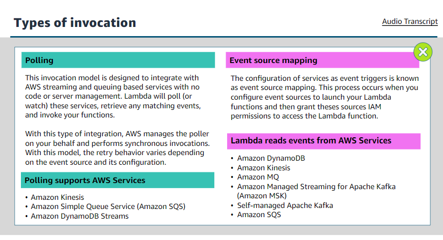

### Execution environment lifecycle

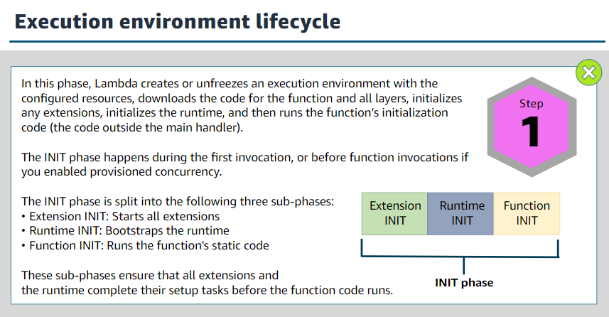

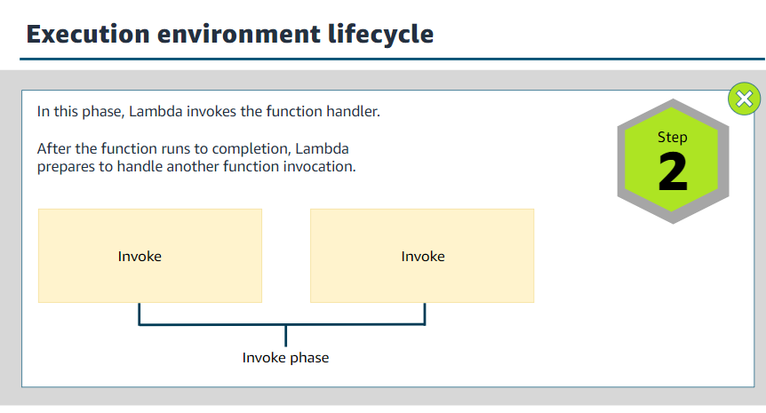

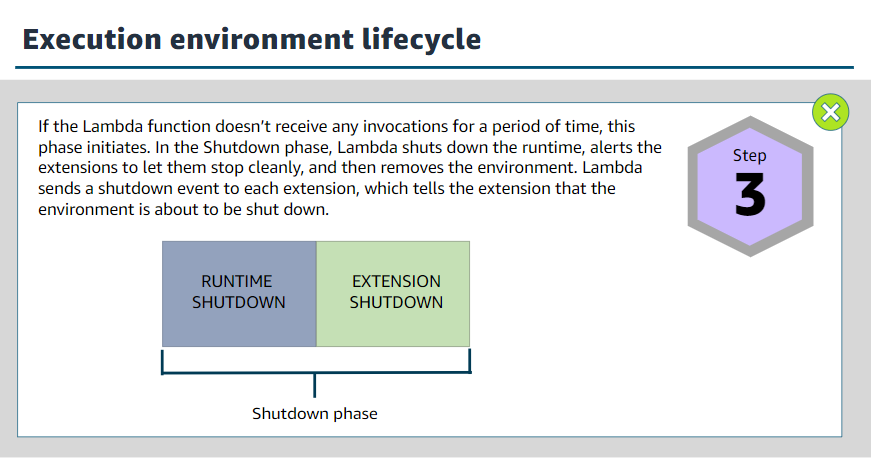

### Cold and warm starts

#####   Event source

#####   AWS lambda permission

### Identifying limits

+   memory
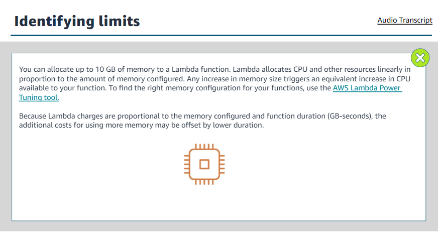

+   timeout
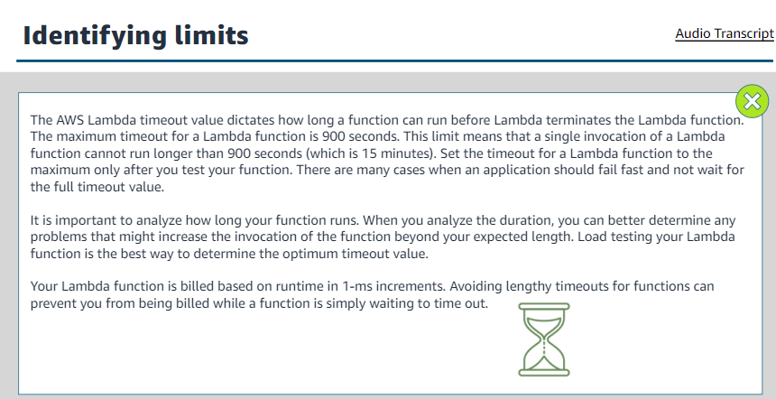

+   Concurrency

#####   AWS lambda use cases
+   Web applications
    It includes
    +   static websites
    +   Complex web applications
    +   packages for flask and express
    +   built-in-https endpoints for single-function microservices

+   Backends: includes applications and services, mobile, IOT

+   Data processing: includes real-time processing, MapReduce

+   Chatbots: An example of chatbot use case would be powering chatbot logic.

+   Amazon Alexa: includes powering voice-activated application, alexa skills kit

+   IT automation: Policy engines, extending AWS services, Infrastructure management

#####   Pricing
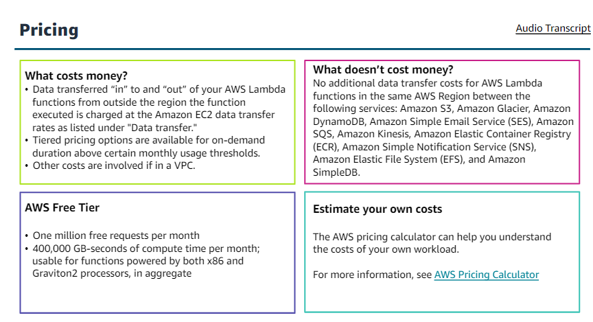

### Preparing to work with Lambda
Coding experience and expertise in the following domains.
+   Linux OS and commands
+   Security services and concepts
+   Cloud concepts and IP networking
+   Distributed computing concepts.

#####   Three ways to build an AWS Lambda function

#####   Function basic information

#####   Handler method

1.      Event handler

#####   Design best practices
+   Separate bussiness logic
Separate your core bussiness logic from the handler event.
This makes your code more portable, and you can target unit tests on your code without worrying about the configuration of the function.

+   Modular functions
It will reduce the amount of time that it takes for your deployment package to download and unpack before invocation. Instead of having one function tha does compression, thumbnailing, and indexing, consider having three different functions that each serve a single purpose. 
Follow same principles you would apply to developing microservies.

+   Treat function as stateless

+   Only include wha you 

#####   Best practices of writing code
+   Include logging statements

+   Use return coding

+   Provide environment variables

+   Add secrets and reference data

+   Avoid reccursive code

+   Gather metrics with Amazon CloudWatch

+   Reuse execution context

#####   Configuration memory and timeout
