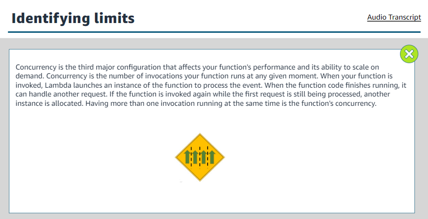

### Introduction to Serverless

+       Microservices
    +   Architectural and organizational approach to software development
    +   Software is composed of small independent services.
    +   Communicate over well-defined APIs.
    +   Owned by small, self-contained teams.

    

#####   Tightly versus loosely coupled
1.      Monolithic
    +   Tightly coupled
    +   In this application, if one piece were to fail, the entire application would crash, as this example illustrates. If there is a spike in demand, the entire architecture must be scaled. Adding features to a monolithic application becomes more complex as time goes on. Pieces of the code base must work with each other to sync properly.

    

2.      Microservices
 

#####   Benefits of microservices
+   use public APIs

+   use the right tool for the job

+   secure your services

+   be a good citizen

+   company transformation

+   automate everything

#####   Downside of monoliths
All processes are tightly coupled and run as a single service.
Adding or improving a monilithic application's features becomes more complex as the code base grows.
Dependent and tightly coupled processes increase the impact of a single process failure.

+       Serverless  
Build and run applications and services without thinking about servers.

We can build them for nearly any type of application or backend service, and everything required to run and scale your application with high availability is handled for you.
Developers can focus on their core product. 
Not worrying about managing and operating servers or runtimes.

#####   Benefits
1.   No server management
AWS founded the concept of serverless on the following principles:
When adapting a serverless service for building a serverless architecture, these ideals are fundamental to serverless strategy.

2.   Pay-for-value services

3.   Continuous scaling

4.   High availability

5.       Event driven architectures

##### Benefits
+       Scale and fail independently
    By decoupling your services, they are only aware of the event router, not each other. This means that your services are interoperable, but if one service has a failure, the rest will keep running. The event router acts as an elastic buffer that accommodates surges in workloads.
+       Audit with ease
    An event router acts as a centralized location to audit your application and define policies. These policies can restrict who can publish and subscribe to a router and control which users and resources have permission to access your data. You can also encrypt your events.
+       Develop with agility
    

+       Cut costs
 

##### Serverless and non-serverless services work together
 

6.       Hybrid methods

### Introduction to Lambda
 

#####   Function configuration elements
+   Name
+   Description
+   Memory
+   Ephemeral Storage

#####   Some Lambda function triggers
+   S3 events
+   Amazon EventBridge
+   Amazon CloudWatch alarms
+   Other lambda functions

#####   AWS lambda function

#####   AWS lambda core components

#####   Lambda function invoking

#####   Types of invocation
+   Synchronous

+   Asynchronous

+   Polling

### Execution environment lifecycle

### Cold and warm starts

#####   Event source

#####   AWS lambda permission

### Identifying limits

+   memory

+   timeout

+   Concurrency

#####   AWS lambda use cases
+   Web applications
    It includes
    +   static websites
    +   Complex web applications
    +   packages for flask and express
    +   built-in-https endpoints for single-function microservices

+   Backends: includes applications and services, mobile, IOT

+   Data processing: includes real-time processing, MapReduce

+   Chatbots: An example of chatbot use case would be powering chatbot logic.

+   Amazon Alexa: includes powering voice-activated application, alexa skills kit

+   IT automation: Policy engines, extending AWS services, Infrastructure management

#####   Pricing

### Preparing to work with Lambda
Coding experience and expertise in the following domains.
+   Linux OS and commands
+   Security services and concepts
+   Cloud concepts and IP networking
+   Distributed computing concepts.

#####   Three ways to build an AWS Lambda function

#####   Function basic information

#####   Handler method

1.      Event handler

2. Context object

#####   Design best practices
+   Separate business logic
Separate your core business logic from the handler event.
This makes your code more portable, and you can target unit tests on your code without worrying about the configuration of the function.

+   Modular functions
It will reduce the amount of time that it takes for your deployment package to download and unpack before invocation. Instead of having one function tha does compression, thumbnailing, and indexing, consider having three different functions that each serve a single purpose. 
Follow same principles you would apply to developing microservies.

+   Treat function as stateless

+   Only include what you 

#####   Best practices of writing code
+   Include logging statements

+   Use return coding

+   Provide environment variables

+   Add secrets and reference data

+   Avoid recursive code

+   Gather metrics with Amazon CloudWatch

+   Reuse execution context

#####   Configuration memory and timeout

#####   Configuring timeout

#####   Configuring concurrency and scaling

1.  Reserved concurrency
It guarantees the maximum number of concurrent instances for the function. When a function has reserved concurrency, no other function can use that concurrency. There is no charge for configuring reserved concurrency for a function.

2.  Provisioned
It initializes a requested number of execution environments so that they are prepared to respond immediately to your function's invocations. Note that configuring provisioned concurrency incurs charges to your AWS account.

#####   Destination and types
+   A destination can send records of asynchronous invocations to other services.
+   Configure separate destinations for events that fail processing and for events that process successfully.
+   Configure destinations on a function, a version, or an alias.
+   Address errors and successes without needing to write more code.

1.  Success

2.  Failure

### Types of monitoring graphs
1.  Invocations
This graph includes the number of times that your function code is run, including successful runs and runs that result in a function error. If the invocation request is throttled or otherwise resulted in an invocation error, invocations aren't recorded.

2.  Duration
This shows the amount of time that your function code spends processing an event. The billed duration for an invocation is the value of duration rounded up to the nearest millisecond.

3.  Errors
This includes number of invocations that result in a function error. Function errors include exceptions thrown by your code and exceptions thrown by the Lambda runtime. The runtime returns errors for issues such as timeouts and configuration errors.

4.  Throttles
This shows number of times that a process failed because of concurrency limits. When all function instances are processing requests and no concurrency is available to scale up, Lambda rejects additional requests.

5.  IteratorAge
This pertains to event source mappings that read from streams. This shows the age of the last record in the event. The age is the amount of time between when the stream receives the record and when the event source mapping sends the events to the function.

6.  DeadLetterErrors
For asynchronous invocation, this is the number of times Lambda attempts to send an event to a dead-letter queue but fails.

7.  Concurrent Executions

### Amazon CloudWatch Lambda Insights

### Lambda Insights Dashboard

### Monitoring using AWS X-Ray

### AWS Serverless Service

#####   Amazon SQS benefits
+   Fully managed messaging queue
+   Loosely coupled
+   High volume capabilities
+   Fault tolerance

#####   Achieving loose coupling with Amazon SQS
+   Use asynchronous processing to get your responses from each step quickly.
+   Handle performance and service requirements by increasing the number of job instance.
+   Exception or transaction failure, the order processing can be retried.

#####   Amazon SQS queue types
+   Standard

+   FIFO

#####   Amazon SQS use cases

#####   Amazon Simple Notification Service (Amazon SNS)

#####   Amazon SNS subscription types
1.  Email
Messages are sent to registered addresses as email.
Email-JSON sends notifications as a JSON objects, while email sends text-based email.

2.  Mobile text messaging(SMS)
Messages are sent to registered phone number as SMS text messages.

3.  HTTP/HTTPS
Subscribers specify a URL as part of the subscription registration. Notifications will be delivered through an HTTPS POST to the specified URL.

4.  Amazon SQS
Users can specify an SQS standard queue as the endpoint. Amazon SNS will enqueue a notification message to the specified queue.
Note that FIFO queues are not currently supported.

5.  AWS Lambda
Messages can also be delivered to AWS Lambda functions for handling message customizations, enabling message persistence or communicating with other AWS service.

### Amazon SNS characteristics

+   Single published message
All notification message contain a single published message. Amazon SNS attempts to deliver messages from the publisher in the order they were published into the topic. However, network issues could potentially result in out-of-order messages at the subscriber end.

+   No recall options
When a message is delivered successfully, there is no way to recall it.

+   HTTP or HTTPS retry

+   Order and delivery not guaranteed

### Amazon SNS use cases

### Amazon SNS and Amazon SQS differences

### Serverless characteristics of S3
1.  Pay for value

2.  Elastic storage

3.  Continuous scaling

4.  Fault tolerance

5.  No server management

### Lambda@Edge

### Amazon API Gateway

### API Gateway use case

### AWS Fargate

### Container
