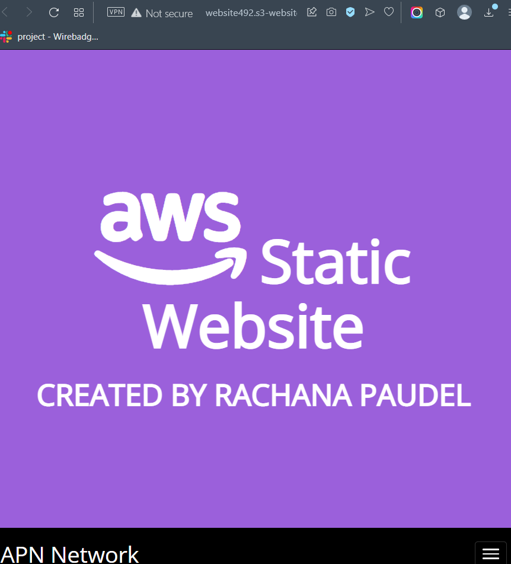
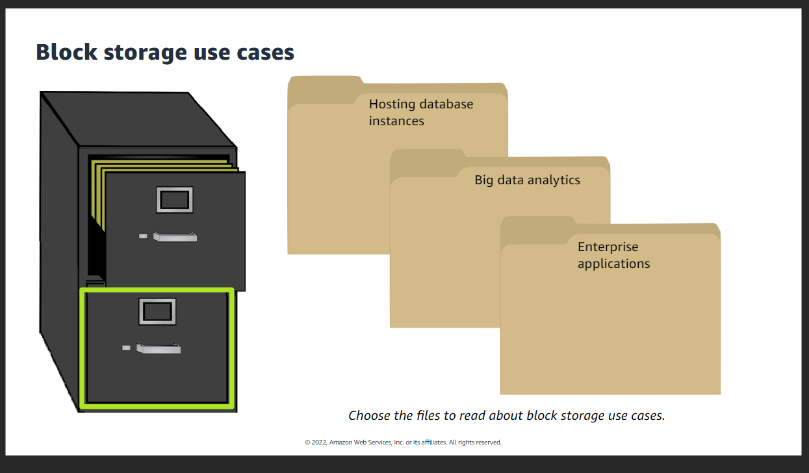

## Getting started with cloud storage.

+ In this module we learn about basic storage domain and AWS course storage services.
+   It is broken into four following sections.
Click [Getting Started with Cloud Storage](https://awseducate.instructure.com/courses/815) to start learning.

#### Starting here with Amazon Simple Storage Service (Amazon S3) 

##### After completing this lab, I will be able to do the following:

+   Create a bucket in Amazon S3.
+   Configure a bucket to host a    static website.

+   Upload content to a bucket.

+   Allow Enable public access to bucket objects.

+   Securely share a bucket object by using a presigned URL.

+ Secure a bucket by using a bucket policy.

+ Update the website.

+ View object versions in the Amazon S3 console.

## Getting Started learning pathway

### 1. Accessing the AWS Management Console
+    At the top of these instructions, choose `Start Lab` to launch your lab.
[Getting Started with Cloud storage](https://awseducate.instructure.com/courses/815/modules/items/14096) to start learning.

+   At the top of these instructions, choose `AWS`

+   Arrange the AWS Management Console tab so that it displays along side these instructions. Ideally, you will be able to see both browser tabs at the same time so that you can follow the lab steps.

## Creating a bucket in Amazon S3

+   In this task, I create an S3 bucket and configure it for static website hosting.[`click to learn`](https://awseducate.instructure.com/courses/815/modules/items/14096)

## 2.Configuring a static website on Amazon S3
##### configure the bucket for static website hosting.

+   Scroll to the <b>Static website hosting</b> panel.

+ Choose `Edit`.

+ Configure the following settings:

    +   Static web hosting: Choose `Enable`.
    +   Hosting type: Choose `Host a static website`.
    +   Index document: Enter `index.html`
    +   Error document: Enter `error.html`
##### Note: You must enter index.html and error.html even though they are already displayed.

+ Choose `Save changes`

+ In the Static website hosting panel under Bucket website endpoint, choose the link.

You receive a 403 Forbidden message because you have not yet configured the bucket permissions. Keep this tab open in your web browser so that you can return to it later.

You have configured your bucket to host a static website.

## 3. Uploading content to your bucket
+   In this task, upload the static files to your bucket.
[`Learn to upload`](https://awseducate.instructure.com/courses/815/modules/items/14096)

## 4. Turning on public access to the objects
+   Objects that are stored in Amazon S3 are private by default. This setting helps keep your organization's data secure.

In this task, you make the uploaded objects publicly accessible so users can view your website.

First, confirm that the objects are currently private.

[`Learn more`](https://awseducate.instructure.com/courses/815/modules/items/14096)

## 5. Securely sharing an object using a presigned URL

######    When you need to temporarily and securely share an object with a person or group of people, you can create a presigned URL. When you create the URL, you must configure how long the URL will be valid. Then, you can share this URL with the users who should have access to the object.

[`Learn more`](https://awseducate.instructure.com/courses/815/modules/items/14096)

##  6. Using a bucket policy to secure your bucket

###### You want to protect your website files and make sure that no one can delete them. To do this, you apply a bucket policy that denies delete privileges on your website files.

+   Return to the Amazon S3 console, and choose the `Permissions` tab.
+ Under Bucket policy, choose `Edit`
+ Copy the following policy text. In the Policy text editor, replace the existing policy text with this text:
<i>[`code`](https://awseducate.instructure.com/courses/815/modules/items/14096)</i>
Note: Your bucket name will be different. Be sure to use the name of the bucket that you created.

+   Choose `Save changes`

+   Return to the  the Object tab

+ Select  index.html.

+ Choose `Delete`.

+ In the Delete objects panel, enter delete to confirm that you want to remove this file.

+ Choose `Delete objects`

+ Notice that the index.html file is listed in the `Failed to delete` pane. This confirms that your policy is working and preventing the website's files from being deleted.

+   Choose `Close` to return to the `Objects` tab.

##  7. Updating the website

[`Learn`](https://awseducate.instructure.com/courses/815/modules/items/14096)

## 8. Exploring file versions

### AWS Educate's Cloud Challenges!
   Here is some information about Cloud storage, regions,availability and redundancy.

+ Click to [learn](https://awseducate.instructure.com/courses/543
)

+   Types of Data in the Cloud

+   Working of Simple Storage Service(S3) with users data and assesment.

+   Assessement

##  Intoduction to Storage

+ Benefits of Cloud Storage

+ Types of Cloud storage

+ choosing right storage

+ Storage use cases
  + block storage and object storage
  

+ AWS core storage services
  + Amazon Elasic Block Store
  + Amazon Elastic File System
  + lsAmazon Simple Storage Service

## Introduction to Amazon S3

+ Basic S3 workflow
  + move data into Amazon S3
  + Store data as objectsin Amazon S3
  + Use data in applicaions
+ Object level storage
+ Active and archive storage

+ Amazon storage S3 storage class

+ Amazon S3 storage classes use cases

+ Amazon S3 costs

##   Create a bucket
+ create a bucket
+ configure the bucket
  + choose a reason
  + object ownershio and access
  + bucket versioning
  + tags

+ upload objects
   + unlimited data
    + 5 TB object limit
    + 160 GB upload limit from the console
+  upload objects-multipart upload  

+ work with objects

+ delete objects and buckets

+ Additional features
  + lifecycle rules
  
  + replication rules 
  

   

  + security

### Moving large amount of data into Amazon S3
+ S3 Transfer Acceleration
+ AWS Snowcone
+ AWS Snowball
+ AWS Snowmobile

### `End of Cloud storage.`