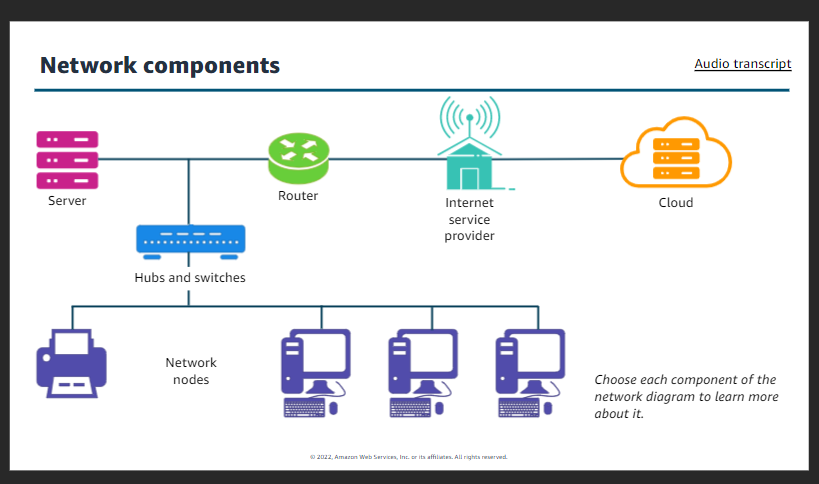
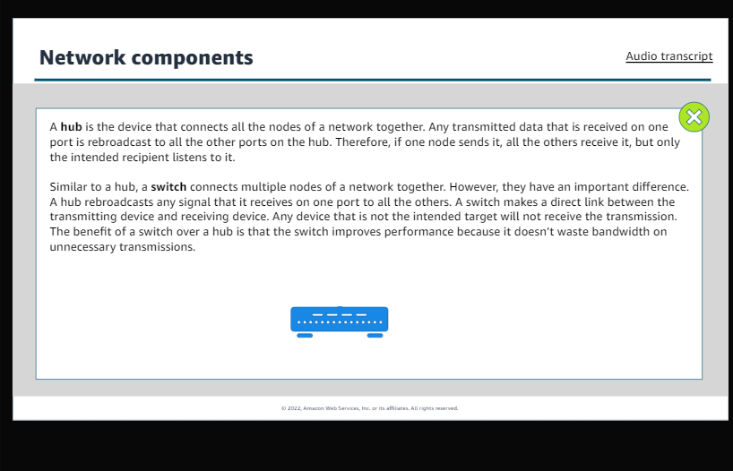
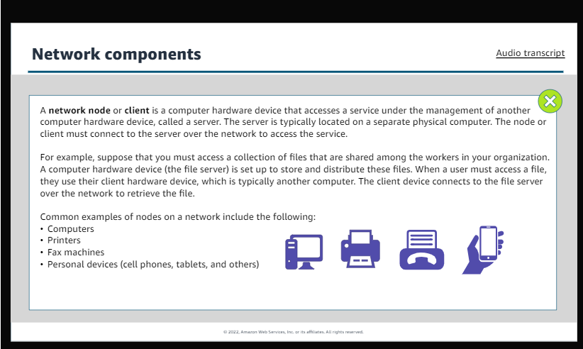

### Getting started with Networking
####	1.	Beginining Scenes
i.	Introduction to networking
+	Network basics
+	OSI model
+	IP Address
+	VPCs

ii.	Introduction to Amazon Virtual Private Cloud(Amazon VPC)
+	Key concepts
+	Architecture
+	Use cases
+	VPC pricing

iii.	Using Amazon VPC
+	Subnets
+	Network gateaways
+	Route tables
+	Firewalls

iv.	Managing your network
+	Using additional VPC features 
+	AWS VPN
+	AWS Direct Connect
+	Other AWS networking services

####	2.	Keyboard Shortcuts
i.	Windows keys
Play/Pause	Ctrl+Alt+P
Previous slide	Ctrl+Alt+,(Comma)
Next slide	Ctrl+Alt+.(period)
All shortcuts	Shift+?

ii.	Mac keys
Play/Pause	Ctrl+Option+P
Previous slide	Ctrl+Option+,(Comma)
Next slide	Ctrl+Option+.(period)
All shortcuts	Shift+?

####	3.	Introduction to Networking
Computer network is two or more devices connected together to share resources. 
Devices on network are called nodes. Nodes on network are divided into two categories are
i.	Host node
Centralized node that shares files, applications, and resources with other nodes on the network
Examples:
+	File Servers
+	Email Servers
+	Web Servers

ii.	Client node
Nodes that depend on the host node for files, applications, and resources
Examples
+	Computers
+	Printers
+	Mobile devices

####    Network Components

+       Server
    A sever is a physical computer that runs software services that other computer devices or software can access. Servers are distinguished by the service that they provide. Common use cases for servers include the following:
    +   Web servers: stores and distributes web pages and other web content by using HTTP
    +   File server:    Stores and distributes files
    +   Database server: Stores databases and manages access to the databases
    +   Print server: Controls and manages one or more remote printers on the network
    +   Mail server: Stores and delivers email, like a digital post office
    +   Proxy server: Improves security by acting as an intermediary ror requests from clients that are seeking resources

    
+       Router
    A router is a network device that connects multiple network segments into one network. It is located at any gateway. The router connects multiple switched and their respective networks to enable communication between the different networks. It acts as a switch between neworks and can also filter the data tha flows through it. As soon as the router is connected, it can make intelligent decisions about how best to get network data to its destination. It bases these decisions on network performance data that it gathers from the network itself.

+       Internet services provider
    It is an organization that provides internet access to its customers. Without the services that an ISP offers, you would no be able to access other networks on the internet.

+       Cloud
    It is on-demand delievery of IT resources over the internet. You don't need to buy, own, and maintain physical data centers and servers. Instead, you can access technology services, such as servers, storage, and databases, on an as-needed basis from cloud provider like AWS.

+       Hubs and Switches
    

+   Network nodes

    

### OSI Model
It is a suite of protocols, or rules, to govern how computers communicate with one another.
The layers are:

1.      Physical layer:
    It defines standards for transmitting raw data(bits) over transmission media to connect network nodes. The physical layer provides an electrical, mechanical, and procedural interface to the transmission medium.

2.      Data link layer:
    It defines standards for transferring data between adjacent network nodes in a wide area network(WAN) or between nodes on the same local area network(LAN) segment. This layer can provide the means to detect and possibly correct errors that might occur in the physical layer.

3.      Network layer:
    It is responsible for communication across different networks. It provides the means of transferring variable-length network packets from a source to a destination host through one or more networks.

4.      Transport layer:
    It provides transport transfer of data between users, and it provides reliable data transfer services to the upper layers. The transport layer controls the reliability of a given link through flow control, segmenation and desegmentation, and error control. This layer also provides the acknowledgement of a successful data transmission and sends the next data if no errors occured.

5.      Session layer:
    It provides the mechanism for opening, closing, and managing a session between user application processes. Communication sessions consist of requests and responses that occur between applications.

6.      Presentation layer:
    It is responsible for formatting and delivering information to the application layer for further processing or display. It translates data bases on that the application accepts.

7.      Application layer:
    It is closet to the user, which means that both the OSI application layer and the user interact directly with the software application. The function typically include identifying communication partners, determining resource availability, and synchronizing communication.

### Network Models

1.      Peer-peers model: 
    It is a computer system connected to each other for the purpose of distributing workloads. They could also be used for sharing resources such as files, printers, and storage.
    In this network model,each node has is own daa and application and is responsible for its own management and security. Peers are equally privileged participants in the architecture.
    For example, files can be shared directly between systems on the network without the need for a central server,

Use cases:
+   Users are responsible for backing up each node.
+   Securiy requirements are not restrictive.
+   A limited number of peers are used.

2.      Client-server model: 
    In this model, the data management and application hosting are centralized at the server and distributed to the clients. All clients on the network must use the designated server to access shared files and information that are stored on the serving computer.
    If the server goes down, no client is able to access the network until the server is restored.
    The following are examples:
    +   File server and desktop clients.
    +   Print server and desktop clients.

    Use case: Most business networking architecture.

