### Getting started with Security

####    In this module
+   Introduction to security
+   Introduction to AWS IAM
+   Using IAM
+   Additional AWS Security Services

####    IT security

####    Principle of least privilege

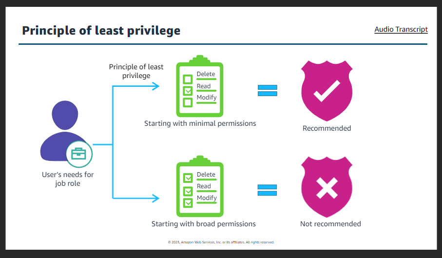

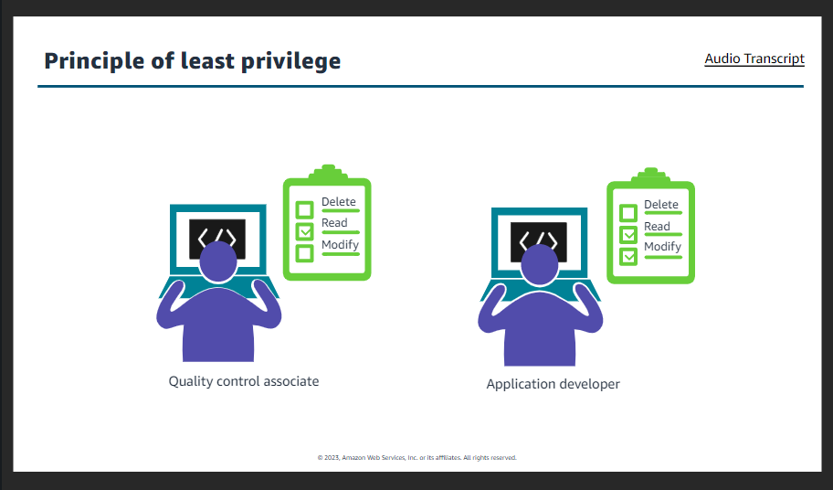

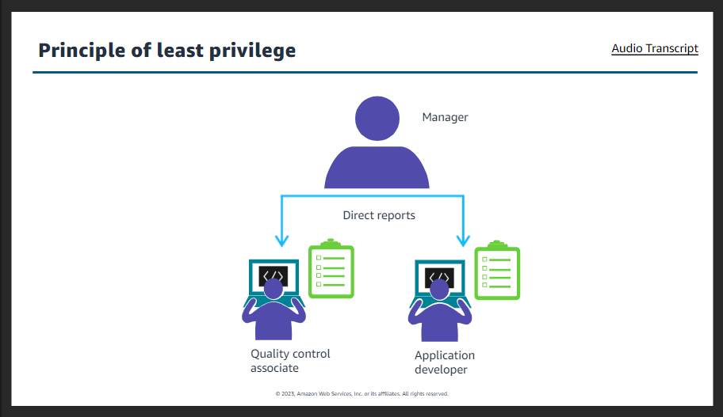
 
####    Identity and access management
   working sessions can have thousands of users that will need different level of permissions, therefore this need to be carefully managed.

   To do this organization should use IAM.
   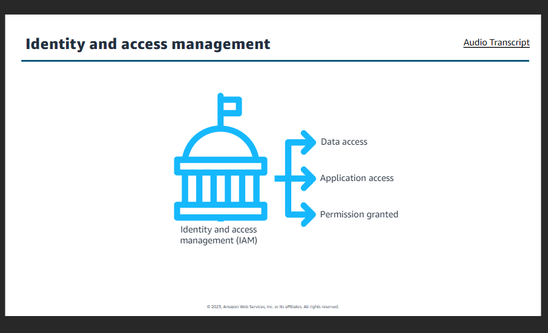

####    Authentication and authorization
1.      Authentication
    It is a basic computer security concept: a user or system must first prove their identity. Consider how you authenticate yourself when you go to the airport and you want to get through airport security so that you can catch your flight. In this situation, you must present some form of identification to the security official to prove who you are before you can enter a restricted area. A similar concept applies for gaining access to IT resources.

2.      Authorization
    It is the process of determining what permissions a user should be granted. After a user has been authenticated, they must be authorized to access the IT resource or data that they are requesting.    

<b> Authentication and authorization together</b>

    First, user enter username and password. The username and password are verified by database. If the entered password or username does not match then user return to login again. If entered information matches authentication is completed. After this the authorization process determine permission the user has to the applications.

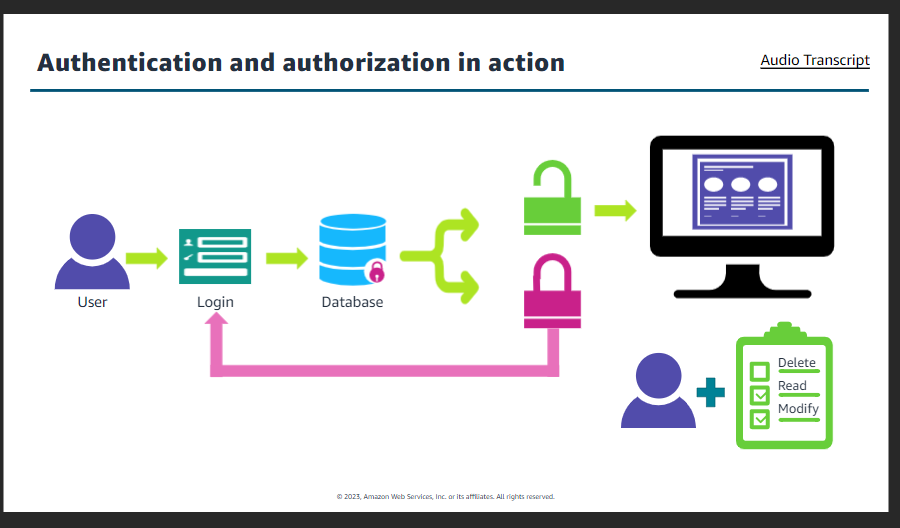

### Layers of security
IT security starts with protecting physical data center then actual data files. The forming layer of IT security are:
+   Perimeter layer
    +   Building:  
    Aws data centers are housed in nondescript, undisclosed facilities. They are protected by a number of security features such as security guards, fencing, security feeds, and other security measures.

    +   Surveillance:
    Professional security staff use video surveillance, intrusion detection, access log monitoring systems and other electronic means. Entrances are secured with devices that sound alarms if a door is forced or held open.

    +   Employee scrutinization:
    Only AWS employees who routinely need access are given permissions to relevant areas of the facility based on job function. If an employee doesn't have an ongoing bussiness need to be at a data center, they have to go through the visitor process and have an escort assigned throughout the duration of their visit.

    +   Principle of least privilege:
    AWS limits access to  pre-approved areas and only provides data center access to employees and contractors who have a legitimate business need for such privileges.

+       Environment layer
    +   Mitigate environmental risks:
    AWS carefully chooses their data center locations to mitigate environmenal risks like flooding, extreme weather, and seismic activity.

    +   High availability and performance:
    Customers requiring high availability and performance can deploy their applications across multiple Availability Zones in the same region. This provides lower latency, reduced costs and data compliance, while opening up the potential to engineer for fault tolerance.

    +   AWS bussiness continuity testing
    To mitigate and prepare for the unexpected, AWS tests their business Continuity Plan regularly with drills that simulate different scenarios.

    +   Energy saving:
    Companies generally use 77% fewer servers, 84% less power, and tap into a 28% cleaner mix of solar and wind power in the AWS Cloud versus their own traditional data centers.

+       Infrastructure layer
    +   Fire detection:
    Automatic fire detection and suppression equipment reduces the risk of fire-related accidents. Smoke detection sensors are in all data center environments, mechanical and electrical spaces, chiller rooms and generator equipment rooms.

    +   Monitoring:
    AWS monitors electrical, mechanical and life support systems. Preventive maintenance is regularly performed.

    +   Climate control:
    It is uded to maintain a constant operating temperature for servers and other hardware. This prevents overheating and reduces the possibility of service outages.

    +   Power:
    Electrical systems are fully redundant and maintainable without impact power for critical and essential loads and generators provide backup power for the entire facility.

+   Data layer

    
####    AWS Shared Responsibility

Examples

####    Intoduction to Amazon S3

#####   Getting started with AWS Identity and Access Management(IAM)

#####       IAM credentials types
User is given access to <b>AWS Management Console<b> and <b>Programmatic access</b>
For AWS Managemen Console user is given username and password and for programmatic access user is given access key.

1.      AWS Management Console:

2.      Programmatic access:

####    Multi-factor authentication(MFA)
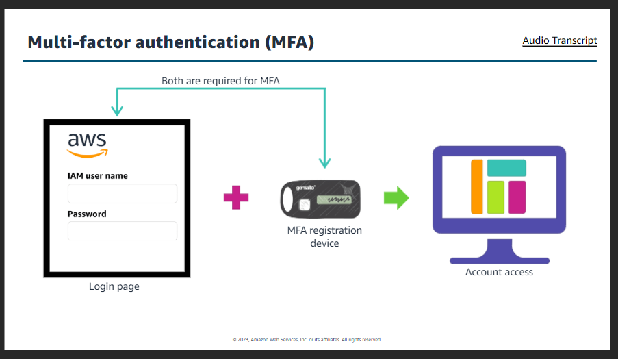

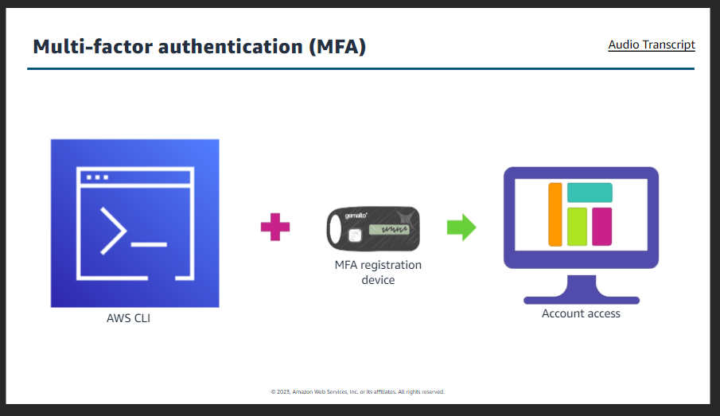

To create, modify or delete an easy to instance we need IAM users credential that has necessary information to perform those functions.
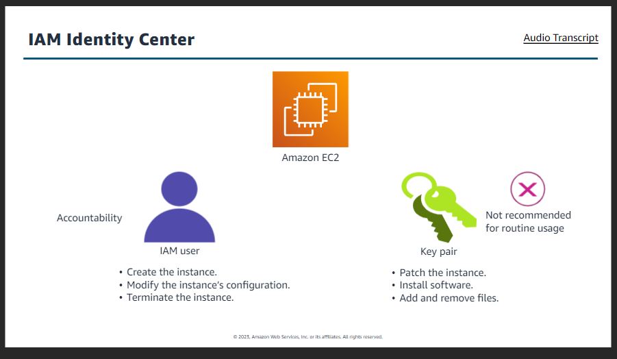

IAM Identity Center:
+   Securely create or connect your workforce identities
+   Manage their access centrally across AWS accounts and applications.

#####   IAM use cases
1.      Apply detailed permissions
    AWS IAM lets you create and apply permissions based on user attributes-such as department, job role, and team name-by using attribute-based access control.
    +   Application developer
    +   Application tester

2.      Manage per-account and application access
    With AWS IAM, you can manage per-account identities. This means that you can provide multi-account access and application assignments across AWS.

3.      Establish organization-wide guardrails on AWS
    AWS IAM provides you with the ability to establish organization-wide and preventative guardrails on AWS. You can do this by using services control policies to establish permissions guardrails for IAM users and roles, and implement a data perimeter around your accounts in AWS Organizations.

4.      Set, verify and right-size permissions.
    AWS IAM is built to help you set, verify, and right-size user permissions in accordance with the least privilege principle policy. You can streamline permissions management and use cross-accoun findings as you set, verify and refine policies on the journey toward least privilege.

#####   IAM costs

#####   Option for using IAM
1.      AWS Management Console:
    The AWS Management Console is a graphical user interface that you can use to launch, configure, and manage AWS services from.

2.      AWS Command Line Interface(CLI):
    The AWS Command Line Interface(CLI) is a unified tool to manage your AWS services. With just one tool to download and configure, you can provision and control multiple AWS services from the command line and automate them through scripts.

3.      AWS Software Development kit(SDK):
    SDKs take the complexity out of coding by providing languages-specific APIs for AWS services. With AWS SDKs, you can launch AWS services, like EC2 instances, using a variety of codes, such as JavaScript, Python, Java, .NET, C++ and more.

#####   Root user
Root user have key access to the following:

<b>To ensure the safety of root user follow these practices:</b>

+   Choose a strong password.
+   Enable multi-factor authentication.
+   Never share your root user password or access keys.
+   Disable or delete root user access keys.
+   Create a power IAM user (with full access to your AWS account, except for building) for administrative tasks.

#####       IAM policies
Policies can be attached to any IAM entity such as user groups or role.
#####   IAM policies :
    Affects when a user requests access to resources
    what actions allowed
    which resources to allow the actions on

 

<b>Single statement</b>
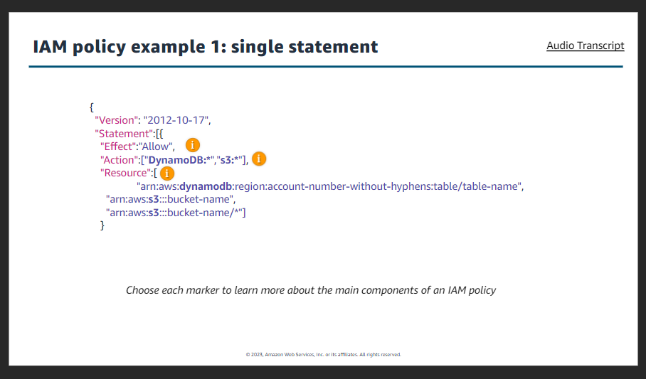

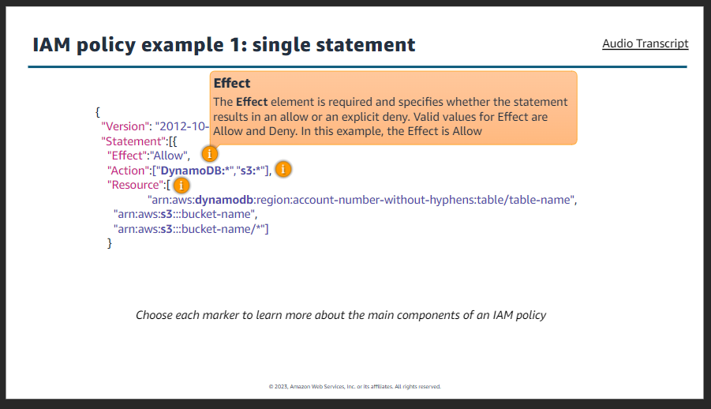

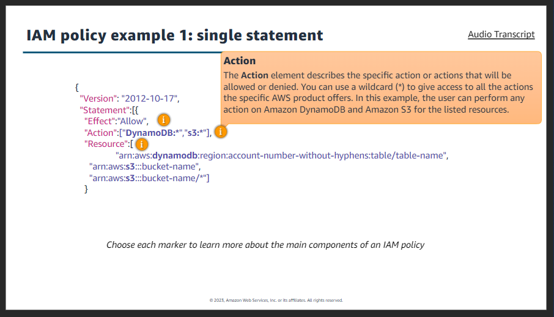

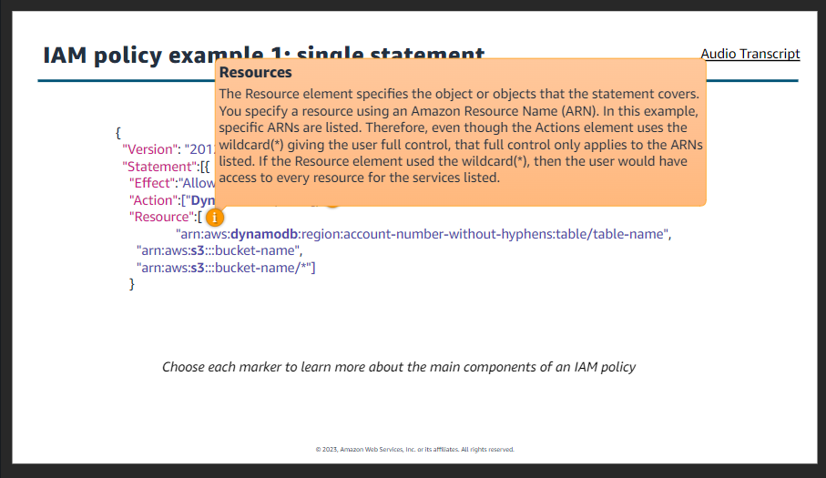

<b>Multiple statement</b>

#####   Identity based policies
1.      AWS-managed policies
    AWS managed policies are managed policies that are created and managed by AWs. If you are new to using policies, we recommend that you start by using AWS managed policies. IAM has a library of over 1,000 AWS managed policies.

2.      Customer-managed policies
    It is managed policies that you create and manage in your AWS account. Customer managed policies provide more precise control over your policies than AWS managed policies. You can create and edit an IAM policy in the visual editor or by creating the JSON policy document directly.

3.      Inline policies
    It is policies that you create and manage and that are embedded directly into a single user, group or role. Using inline policies to grant permissions to users is high maintenance and not recommended.    

#####   Resource based policies

#####   Resource and Identity compared
  

#####   Conflicting policies

######  IAM groups

#####   IAM roles

#####   IAM roles trust policy

#####   Use case for roles
1.      Roles for IAM user
    With roles, you don't have to share long-term security credentials for each user that requires access to a resource. This eliminates the need to create multiple accounts for individual users. Therefore, roles can make managing permissions easier and more secure.

2.      Roles for AWS services
    Some AWS services can also assume an IAM role to perform actions in your AWS account on your behalf. When you are configuring such services, you need to define the role for the services to assume. The role needs to include to all the permissions required so that the service assuming the role has the proper permissions. These roles are referred to as services linked roles. You will commonly see them associate with Amazon EC2 and AWS Lambda.

3.      Roles for external users
    If you already manage user identities outside of AWS, you can use IAM roles to grant users access to AWS. Imagine that you have a bussiness with 5,000 employees that must access an AWS account. You already have an idenetity provider in place that allows your employeed to log in to their work laptops. Instead of creating 5,000 IAM accounts, you can use IAM roles to grant access to AWS through existing identities from your enterprise user directory, known as federated users.

#####   IAM Access Analyzer
        

1.      Set detailed permissions
    Policy generation with IAM Access Analyzer generates a detailed policy based on the access activity  that is captured in your logs. This means that after you build and run an application, you can generate policies that grant only the required permissions to operate the application.
    Policy validation with IAM Access Analyzer guides you to author and validate secure and functional policies with more than 100 policy checks. You can use these checks while creating new policies or to validate existing policies.

2.      Verify Intended permission
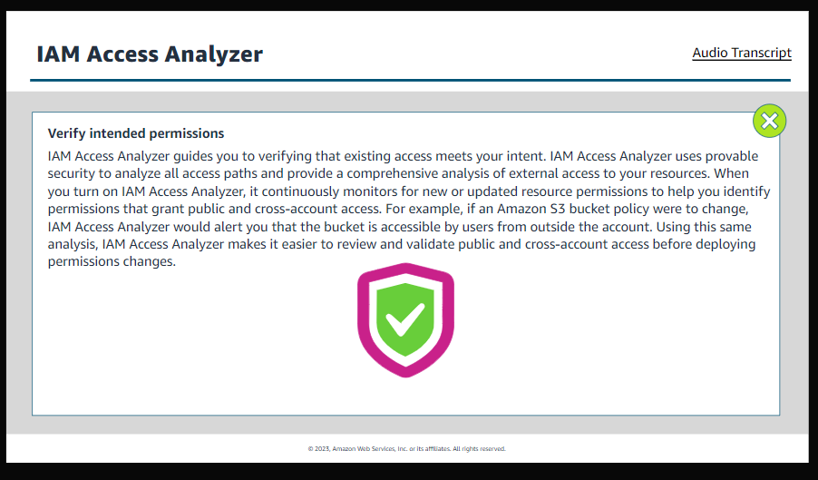     

3.      Refine permissions by removing unused access
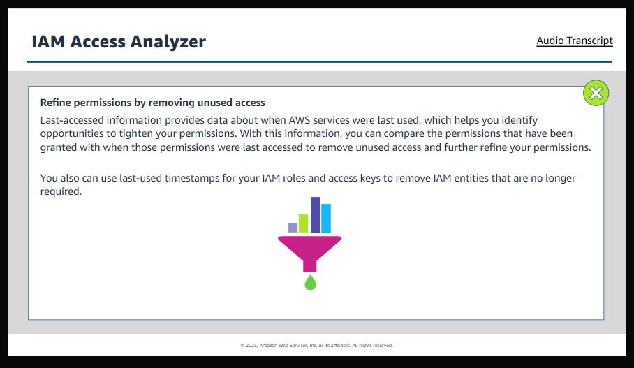 

#####   IAM credential reports
    Lists all users in your account

    Details the status of their various credentials:
+   Passwords
+   Access keys
+   MFA devices
+   And more   

You can use to credentials reports to assist you in auditing and compliance efforts.
You can use report already effects of credential lifecycle requirement.
provide report to the external auditor.

#####   IAM Scenario
1.      Scenario:
    You opened a new AWS account. The account consists of five teams of 10 developers. Your firs tasks are the following:
    +   You need to create 50 users. 40 of them are developers, five are managers, and five are administrators. The 40 developers will have the same permissions, the fice managers will have the same permissions, the five administrators will have the same permissions.
    +   If possible, the developers should have access to Amazon EC2 without security credentials tied to their IAM user.
    +   Amazon EC2 instances will need access to Amazon S3.
    +   You need a way to audit so that credential lifecycle requirements are compliant.
    +   You need a way to manage IAM user permissions.
    +   You need to apply strong security measures to protect the AWS account.

2.          IAM setup:
    <b>Requirements:</b>
    +   You need to apply strong security measure to protect the AWS account.

    <b>Solution</b>
    Secure your root user credentials and don't use them for everyday tasks. Configure the root user to require MFA to log in. Only use the root user to complete the tasks hat only the root user can perform. Create a new user that can conduct everyday admin tasks and assign it the appropriate permissions.
    Create a strong password policy that will be enforced for all IAM users in this account. The policy should require users to create their own password when they first login.

3.      IAM users
    <b>Requirements:</b>    
    +   You need to create 50 users. 40 of them are developers, five are managers and five are administrators. The 40 developers will have the same permissios, the five managers will have the same permissions, the five administrators will have the same permissions.
    +   You need to apply strong security measures to protect the AWS account.    

4.      IAM groups
    <b>Requirements:</b>
    +   You need to create 50 users. 40 of them are developers, five are managers and five area administrators. The 40 developers will have the same permissions, the five managers will have the same permissions, the five administrators will have the same permissions.
    <b>Solution:</b>
    Create a group for the developers, a group for the managers, and a group for the administrators. Place the appropriate users in the group that aligns with their job function.    
    <b>IAM group: Administrators</b>
    <b>IAM group: Managers</b>
    <b>IAM group: Developers</b>

5.     IAM policies
    <b>Requirements:</b>
    +   You need to create 50 users. 40 of them are developers, five are managers and five are administrators. The 40 developers will have the same permissions, the five managers will have the same permissions, the five administrators will have same permissions.
    <b>Solution:</b>
    Create a policy for each of the groups(developers, managers, and administrators). The policy should follow the principle of least privilege. Attach the policy to the group. This will provide each user in the groups with the appropriate permissions. If any user in a group need special permissions, that the other users in the group don't need, then create an additional IAM policy with the permissions needed and attach it to the specific user and not the group.

6.      Roles
    <b>Requirements:</b>
    +   If possible, the developers should have access to Amazon EC2 without security credentials tied to their IAM user.
    +   Amazon EC2 instances will need access to Amazon S3.    
    <b>Solution:</b>
    Create a role with permission that lets a user access Amazon EC2. Make the principle of the trust policy to be the users in the developer group.
    Create another role for the EC2 instances, so that they can access Amazon S3. In the trust policy, make sure that Amazon EC2 is the trusted principle.

7.      AWS Access Analyzer:
    <b>Requirements:</b>
    +   You need a way to manage IAM user permissions.
    +   You need to apply strong measure to protect the AWS account.
    <b>Solution:</b>
    Turn on IAM Access Analyzer. It continuously monitors for new or updated resource permissions to help you identify permissions that grant public and cross- account access. Update permission to groups and users as needed. Refining your users permissions, based on evolving need is a security best practice.  

    Set, or grant your detailed permissions.
    Verify who can access what.
    Refine by removing overly broad access.  

8.      IAM Credential Report
    <b>Requirements:</b>
    +   You need a way to audit so that credential lifecycle requirements are compliant.
    +   You need to apply strong security measure to protect the AWS account.
    <b>Solution</b>
    Run IAM credential reports as often as needed to verify that credential lifecycle requirements are compliant. Auditing your user credentials is a good way to help protect your AWS Account.    
    Lists all users in your account.
    Details the status of their various credentials.

#####   Additional AWS Security Services
        Amazon Cognito provides Authentication and Authorization for web and mobile apps

#####   Amazon Cognito Components

+   User pools

+   Identity pools

#####   Amazon Cognito workflow

#####   AWS Key Management Service(KMS)
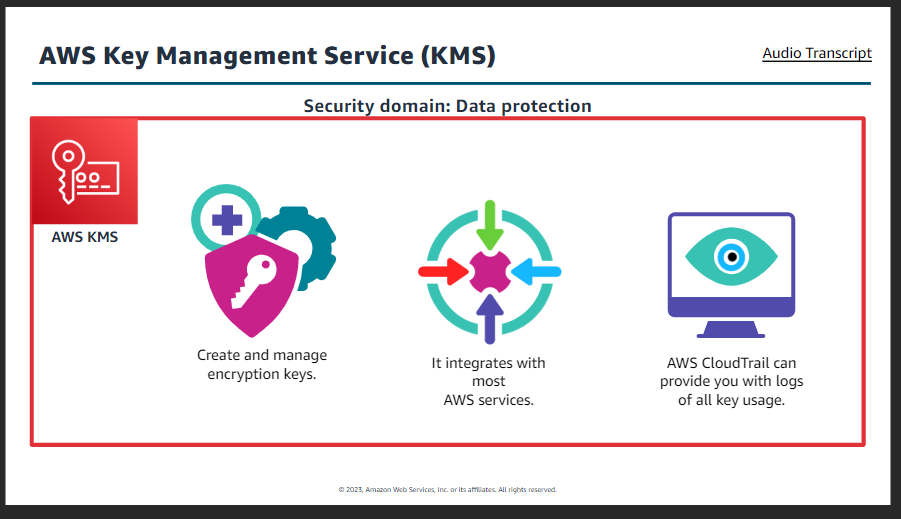

#####   AWS KMS key types
+       AWS-owned keys
    They are a collection of KMS keys that an AWS service owns and manages for use with multiple AWS accounts. Although AWS-owned keys aren't in your account, an AWS service can use an AWS-owned key to protect the resources in your account. In general, unless you are required to audit or control the encryption key that protects your resources, an AWS-owned key is a good choice.
+       AWS-managed keys
    They are KMS keys in your account that are created, managed, and used on your behalf by an AWS Service integrated with AWS KMS. In general, unless you are required to control the encryption key that protects your resources, an AWS-managed key is a good choice. You don't have to maintain or create the key or its key policy, and there's never a monthly fee for an AWS-managed key.
+       Customer-managed keys

#####   Customer managed key types
1.      Symmetric key:
    A single key used for encrypting and decrypting data.

2.      Asymmetric key:
    A public and private key pair used for encrypting and decrypting data.    

#####   Defining AWS KMS permissions
    Customer managed key also require to define permissions. First you need to configure the main components which are:
+       Key administrator:
    A   key administrator is one or more IAM users that manage the key.

+       Key policy:
    A key policy is a JSON document that contains the permissions for what the key can be used to do.

+       Key user:
    Users that can use the key to perform the actions that are listed in the key policy.        

    

#####   AWS Secret Manager
    designed to centrally manage secrets used to access resources on:
+   AWS
+   Third-party
+   On-premises

<b>Secrets can be:</b>

+   Database credentials
+   Passwords
+   Third-party API keys
+   Arbitrary text