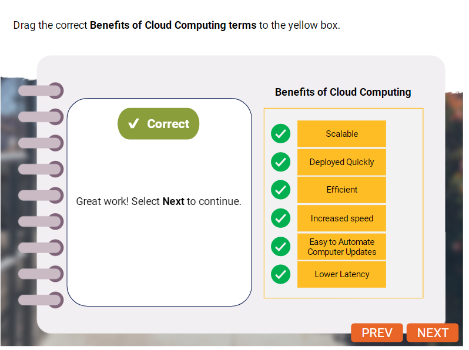

### Hardware
Computer hardware consists of the physical components that make up a computer system.

### Software
Computer software consists of the computer programs and related data that provide the instructions for telling the computer hardware and software.

Hardware and software have a special relationship with each other. For a computer to produce useful output, its hardware and software must work together. Nothing useful can be produced with the hardware on its own, and the software cannot be used without hardware to support it. 
Computer Hardware includes many types of peripherals. They can be internal or external, and they can be input or output devices. All of these components help the users, software and hardware interact with each other.

+       Peripheral
    Any auxiliary devices that connect to and work with the computer to put information into it or to get information out of it.

    +       External
    External peripherals are computer hardware components that are located outside a computer. For example, the computer monitor, keyboard, and mouse are external peripherals.

    +       Internal
    Internal peripherals are computer hardware components that are located within a computer. For eg, the computer's optical drive video cards, and hard drives are internal peripherals.

    +       Output
    Output devices are hardware that allow you to send information from a computer. For eg, a monitor and a printer are both output devices.

    +       Input
        Input devices are hardware that allow you to input information into a computer. For eg, a keyboard and mouse are input devices.

### Different parts of system software
+       System Software
    Example include a computer's operating system, firmware, and drivers.

+       Programming Software
    Example include editors, linkers, debuggers, and compilers/interpreters.

+       Application Software
    Example of application software include word processing programs, spreadsheet software, presentation software, multimedia design programs, and image editors.

### Network
It link computer together so they can share access to data communicate with one another.
The internet is a global system, of computer networks that uses TCP/IP to link devices worldwide.

### Benefits of Cloud Computing

### Virtual Machine
It is software that emulated a computer system. It allows you to run other, virtual operating systems within your current operating system. Sometimes this is needed if you want to run an application that is not supported by the native OS on the computer or sserver that you are currently using.

A cloud provider may not dedicate an entire server to one use. Instead, a server may be divided into several virtual machines. Cloud computing takes advantage of the virtual machine's ability to act as an interface between different hardware and software systems that are accessed over the Internet.