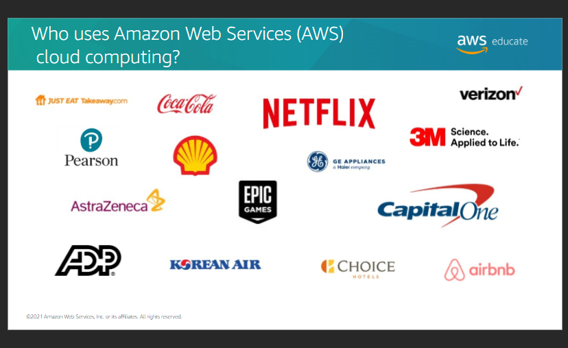

##  Introduction to Cloud 101

### Module 1
#####   Why learn about the cloud

+   Demand for cloud skills is increasing
+   Cloud computing skills are relevant for all IT professionals
+   Cloud certification validates knowledge and skills

### Module2
#####   Objectives
+   Define cloud computing
+   Describe the basics of cloud computing
+   Discuss the benefits of cloud computing
+   Identify cloud service models and cloud deployment models

#####   Why cloud computing?
+   It assests as programmatic resources to quickly set up and tear doen resources
+  Access resources dynamically for agility and flexibility to meet customer needs
+   Pay-as-you-go to test and use the system without being fully commited 

#####   Who uses AWS?
