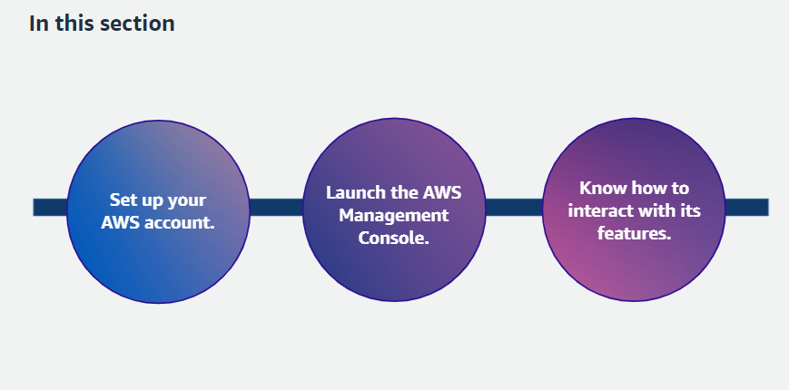
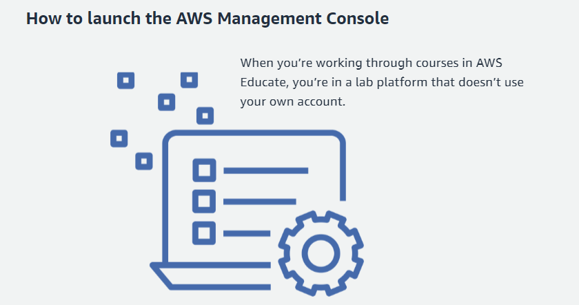
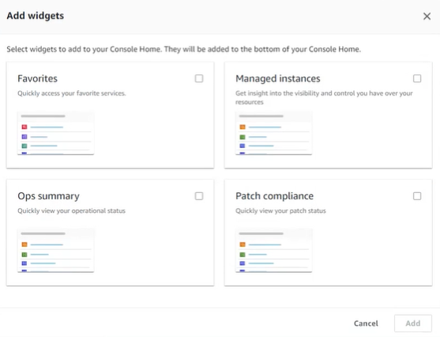
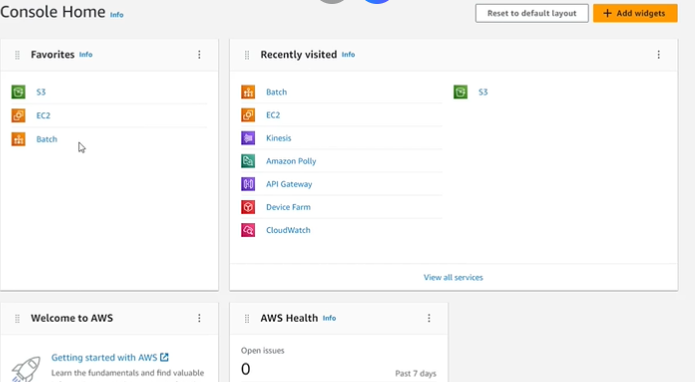

### In this module
+   Navigating the AWS Management Console
+   Billing consideration
+   Hands-on practice

### Navigating the AWS Management Console

### How to launch the AWS Management Console

### Setting up an AWS account

### Widgets

### Finding Services

### How to Add Favorites Widgets

### Navigation the AWS Management Console
