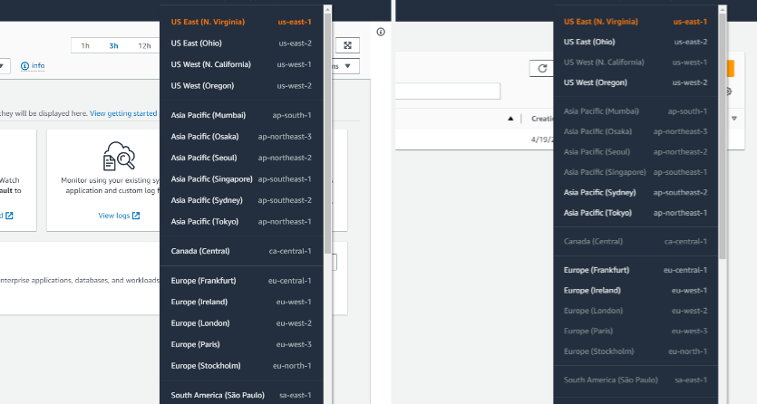

### In this module
+   Navigating the AWS Management Console
+   Billing consideration
+   Hands-on practice

### Navigating the AWS Management Console

### How to launch the AWS Management Console

### Setting up an AWS account

### Widgets

### Finding Services

### How to Add Favorites Widgets

### Navigation the AWS Management Console

### Billing consideration
In this section:

### AWS global infrastructure

### Map of AWS Regions

### Regions

### Availability Zones

### AWS payment models

+   Pay-as-you-go

+   save when you commit

+   pay less by using more

### AWS Free Tier

### Service cost factors
