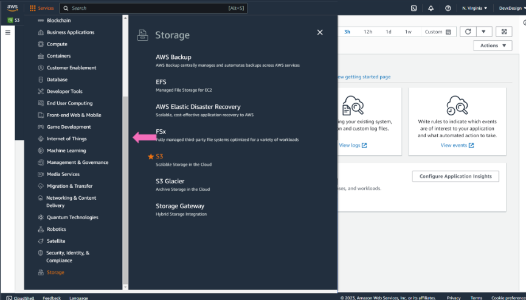
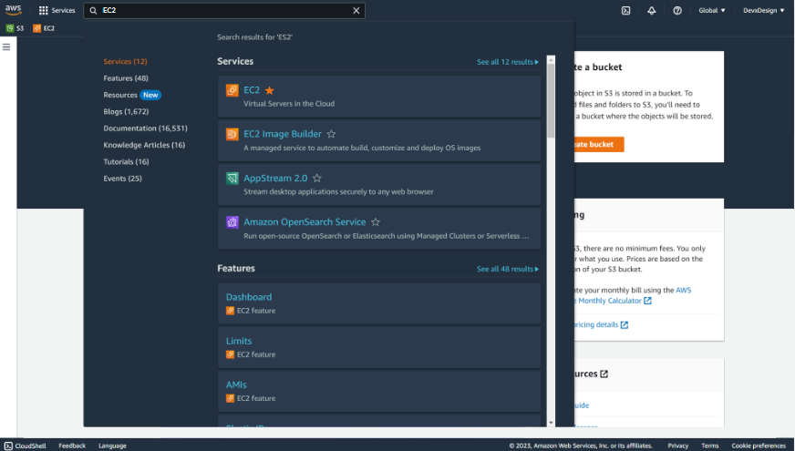
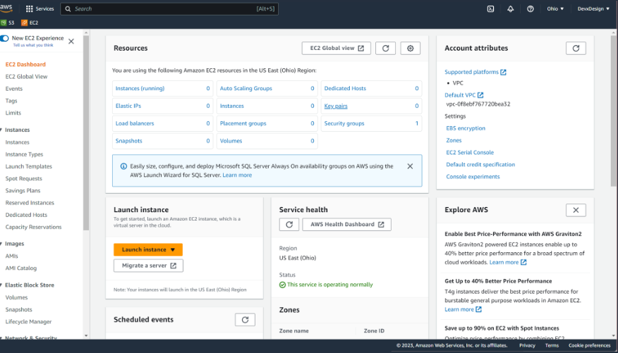

### In this module
+   Navigating the AWS Management Console
+   Billing consideration
+   Hands-on practice

### Navigating the AWS Management Console

### How to launch the AWS Management Console

### Setting up an AWS account

### Widgets

### Finding Services

### How to Add Favorites Widgets

### Navigation the AWS Management Console

### Billing consideration
In this section:

### AWS global infrastructure

### Map of AWS Regions

### Regions

### Availability Zones

### AWS payment models

+   Pay-as-you-go

+   save when you commit

+   pay less by using more

### AWS Free Tier

### Service cost factors

### AWS pricing varies by Region and Service

### Billing considerations summary

### Hands on Practice Introduction
#### Accessing AWS Services

#### Service links

### Services categories

### Favorites designation

### Select S3

### Select Favorites

### Global link

### Global service

### Searching service

### Search bar

### EC2 marked as favorite

### EC2
It is a regional service  and you are currently in the higher region. All the data you are seeing here is such as running instances and load bouncer are the resources that your provision in your higher region.

### EC2 Global
Instances show how many instances in region.

### Use service menu to find RDS

