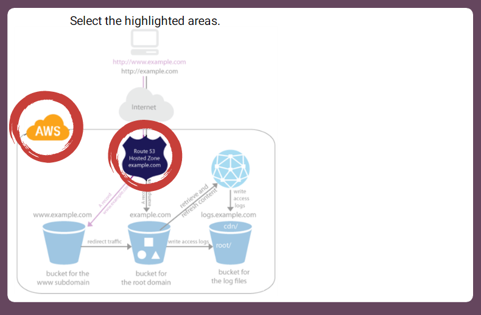

### Static site

### Dynamic site

### We can build a site with any of these free, worldwide tools
+   WordPress
    It is an online website creation tool. It is the fastest-growing content management system(CMS) and is one of the most user friendly. It is easy to use: it includes design themes, is responsive to mobile devices, and has a built-in blog.

+   Wix
    Wix is a cloud-based website development tool that allows users to create HTML5 websites. It has multiple cloud-based tools to edit website, including an Artificial Design Intelligence (ADI) interface to help build a personalized website.

+   Amazon S3
    Amazon Simple Storage Service is an object storage service that can be used to host your own HTML.

+   Drupal
    It is another web-publishing CMS, provides built-in themes and is used professionally by many major corporations. The product is available in 100 languages.

+   Joomla!
    It is the second most popular CMS on the Web, has a core package of applications for websites to support data reporting, e-commerce and communications, among other things.

+   Weebly
    Weebly is a web-hosting services specifically geared toward creating online stores. It provides a very good drag- and-drop graphical interface.

###         
+       AWS
    Use a web service to create buckets, upload a sample website page, and configure permissions so that everyone can see the content, then configure the buckets for website hosting. This is where Aman is going to load his web page.